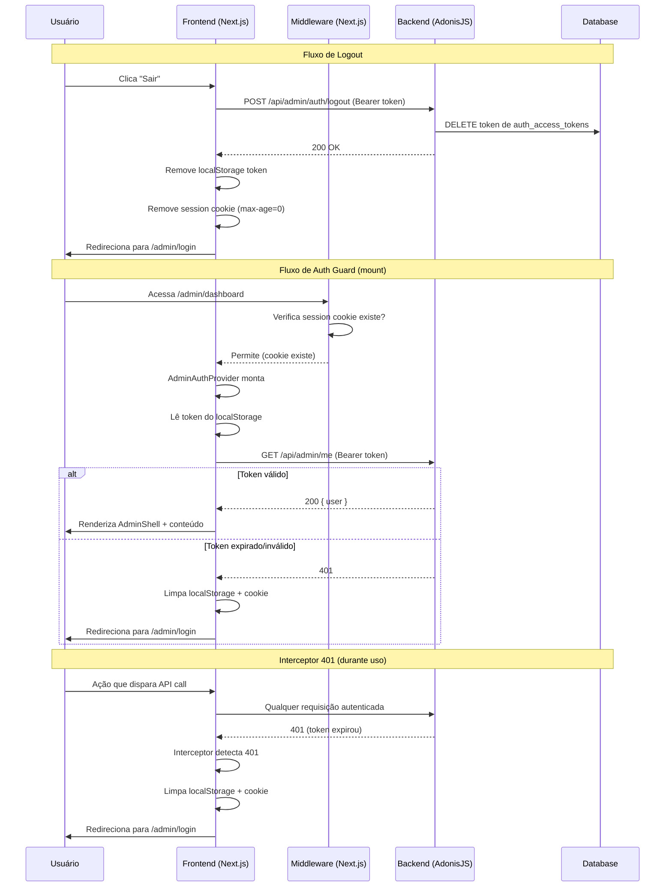

# Design: Correção de Autenticação e Segurança do Admin

## Visão Geral

Este design resolve três vulnerabilidades críticas no painel admin BouCheck:
1. Ausência de endpoint de logout (token nunca é invalidado no servidor)
2. Interface admin visível sem autenticação confirmada (AdminShell renderiza sidebar sem checar auth)
3. Sessões fantasma (cookie persiste após expiração do token, middleware deixa passar)

A solução implementa invalidação server-side de tokens, um auth guard client-side que bloqueia renderização até validação, e um interceptor global que limpa a sessão ao receber 401.

## Arquitetura



## Componentes e Interfaces

### 1. Backend — Endpoint de Logout

**Arquivo:** `backend/app/controllers/auth_controller.ts`

Novo método `logout` adicionado ao `AuthController` existente:

```typescript
/**
 * POST /api/admin/auth/logout
 * 
 * Invalidates the current access token, ending the session server-side.
 * Requires authenticated user (inside protected route group).
 */
async logout({ auth, response }: HttpContext) {
  const user = auth.user!
  // Delete the current token used for this request
  await AdminUser.accessTokens.delete(user, user.currentAccessToken.identifier)
  return response.ok({ message: 'Logged out' })
}
```

**Arquivo:** `backend/start/routes.ts`

Nova rota dentro do grupo protegido:
```typescript
router.post('/auth/logout', [AuthController, 'logout'])
```

### 2. Frontend — Função de Logout Completa

**Arquivo:** `frontend/lib/admin/api.ts`

Nova função no módulo authApi:
```typescript
export const authApi = {
  // ... existentes ...
  logout: () =>
    apiFetch<{ message: string }>('/auth/logout', { method: 'POST' }),
}
```

Nova função helper para limpar cookie:
```typescript
export function clearSessionCookie(): void {
  document.cookie = 'boucheck_admin_session=; path=/; max-age=0; samesite=lax'
}
```

### 3. Frontend — Auth Guard no AdminAuthProvider

**Arquivo:** `frontend/lib/admin/auth-context.tsx`

O `AdminAuthProvider` passa a validar o token no mount via GET /me:

```typescript
useEffect(() => {
  const token = getToken()
  if (!token) {
    clearSessionCookie()
    setState({ token: null, user: null, isLoading: false })
    return
  }
  
  // Valida token no backend
  meApi.getProfile()
    .then((user) => {
      setState({ token, user, isLoading: false })
    })
    .catch(() => {
      // Token inválido — limpar tudo
      clearToken()
      clearSessionCookie()
      setState({ token: null, user: null, isLoading: false })
    })
}, [])
```

A função `logout` passa a chamar o backend:

```typescript
const logout = useCallback(async () => {
  try {
    await authApi.logout()
  } catch {
    // Ignora erro — limpa local de qualquer forma
  } finally {
    clearToken()
    clearSessionCookie()
    setState({ token: null, user: null, isLoading: false })
    window.location.href = '/admin/login'
  }
}, [])
```

### 4. Frontend — AdminShell com Auth Guard

**Arquivo:** `frontend/components/admin/admin-shell.tsx`

O `AdminShell` consome o auth state e bloqueia renderização:

```typescript
export function AdminShell({ children }: { children: ReactNode }) {
  const pathname = usePathname()
  const { isLoading, token } = useAdminAuth()
  const isLoginPage = pathname === '/admin/login'

  if (isLoginPage) {
    return <>{children}</>
  }

  // Enquanto verifica auth, mostra loading
  if (isLoading) {
    return <LoadingScreen />
  }

  // Sem token validado, não renderiza nada (redirect acontece no provider)
  if (!token) {
    return null
  }

  return (
    <div className="flex min-h-screen bg-gray-100 dark:bg-gray-900 transition-colors">
      <AdminSidebar />
      <main className="flex-1 overflow-auto dark:text-gray-100">
        {children}
      </main>
    </div>
  )
}
```

### 5. Frontend — Interceptor Global 401

**Arquivo:** `frontend/lib/admin/api.ts`

Modificação na função `apiFetch` para interceptar 401:

```typescript
async function apiFetch<T>(
  path: string,
  options: RequestInit = {},
  authenticated = true
): Promise<T> {
  // ... headers setup existente ...

  const res = await fetch(`${API_URL}/api/admin${path}`, { ...options, headers })

  if (res.status === 204) return undefined as T

  const data = await res.json().catch(() => ({}))

  if (!res.ok) {
    // Interceptor 401: limpa sessão e redireciona
    if (res.status === 401 && authenticated && path !== '/auth/logout') {
      clearToken()
      clearSessionCookie()
      if (typeof window !== 'undefined' && !window.location.pathname.includes('/admin/login')) {
        window.location.href = '/admin/login'
      }
    }
    throw new AdminApiError(res.status, data)
  }

  return data as T
}
```

## Modelos de Dados

Não há alteração em modelos de dados. A solução utiliza a tabela `auth_access_tokens` já existente do AdonisJS auth package para exclusão do token no logout.

**Tabela existente utilizada:**
```
auth_access_tokens
├── id (PK)
├── tokenable_id (FK → admin_users.id)
├── type ('auth_token')
├── name (nullable)
├── hash (token hash)
├── abilities (JSON)
├── created_at
├── updated_at
├── last_used_at
└── expires_at
```

O endpoint de logout executa `DELETE FROM auth_access_tokens WHERE id = <current_token_id>`.


## Propriedades de Corretude

*Uma propriedade é uma característica ou comportamento que deve ser verdadeiro em todas as execuções válidas de um sistema — essencialmente, uma declaração formal sobre o que o sistema deve fazer. Propriedades servem como ponte entre especificações legíveis por humanos e garantias de corretude verificáveis por máquina.*

### Propriedade 1: Invalidação de Token no Logout

*Para qualquer* token de acesso válido emitido pelo sistema, após a execução do endpoint de logout usando esse token, qualquer requisição subsequente ao backend usando o mesmo token deve retornar HTTP 401.

**Valida: Requisitos 1.1, 1.3**

### Propriedade 2: Interceptor 401 Limpa Sessão Completa

*Para qualquer* caminho de API autenticado e qualquer método HTTP, quando a resposta é HTTP 401, o interceptor do API_Client deve remover o Access_Token do localStorage, remover o Session_Cookie, e redirecionar o navegador para /admin/login (exceto quando o próprio path é /auth/logout ou quando o usuário já está na página de login).

**Valida: Requisitos 4.1, 4.2, 4.3**

## Tratamento de Erros

| Cenário | Componente | Comportamento |
|---------|-----------|---------------|
| Chamada de logout falha (rede, 401, 500) | auth-context.tsx | Ignora erro, executa limpeza local (localStorage + cookie) e redireciona para login |
| GET /me falha no mount (401) | auth-context.tsx | Limpa token + cookie, define isLoading=false com token=null, AdminShell não renderiza |
| GET /me falha no mount (rede/500) | auth-context.tsx | Trata como falha de auth — limpa sessão e redireciona (fail-safe) |
| 401 em qualquer API call durante uso | api.ts (apiFetch) | Interceptor limpa sessão e redireciona, lança AdminApiError normalmente |
| 401 no endpoint de logout | api.ts (apiFetch) | Interceptor NÃO redireciona (path === '/auth/logout'), apenas lança erro |
| Cookie existe mas token não está no localStorage | auth-context.tsx | Remove cookie no mount, define estado sem auth |

## Estratégia de Testes

### Testes Unitários (exemplo-based)

1. **Backend — AuthController.logout**
   - Criar token, chamar logout, verificar resposta 200
   - Chamar logout sem token, verificar 401
   - Após logout, chamar GET /me com mesmo token, verificar 401

2. **Frontend — auth-context.tsx (logout)**
   - Mockar authApi.logout sucesso → verificar limpeza de localStorage, cookie e redirect
   - Mockar authApi.logout rejeição → verificar que limpeza ainda acontece
   - Verificar ordem: API call antes de limpeza local

3. **Frontend — auth-context.tsx (mount validation)**
   - Token no localStorage + GET /me sucesso → estado authenticated
   - Token no localStorage + GET /me 401 → limpeza completa
   - Sem token no localStorage → limpeza de cookie, estado unauthenticated

4. **Frontend — AdminShell (guard)**
   - isLoading=true → renderiza loading, não renderiza sidebar
   - isLoading=false + token=null → não renderiza nada (redirect no provider)
   - isLoading=false + token presente → renderiza sidebar + conteúdo

5. **Frontend — api.ts (interceptor 401)**
   - Resposta 401 em path qualquer → limpa localStorage + cookie + redireciona
   - Resposta 401 em /auth/logout → não redireciona
   - Resposta 401 quando já está em /admin/login → não redireciona
   - Resposta 200/403/500 → não aciona interceptor

### Testes Property-Based

Os testes property-based utilizam a biblioteca **fast-check** (já compatível com o ecossistema TypeScript/Vitest do projeto).

**Configuração**: Mínimo 100 iterações por propriedade.

- **Property 1**: Gerar tokens aleatórios (via setup), executar logout, verificar que qualquer requisição subsequente com o mesmo token retorna 401. Usa banco de teste real.
  - Tag: `Feature: admin-auth-security-fix, Property 1: Token invalidation on logout`

- **Property 2**: Gerar paths de API aleatórios (strings válidas de URL), métodos HTTP aleatórios, e simular resposta 401 via mock de fetch. Verificar que para todos os casos (exceto /auth/logout e estando em /admin/login), a sessão é limpa e redirecionamento ocorre.
  - Tag: `Feature: admin-auth-security-fix, Property 2: 401 interceptor session cleanup`
