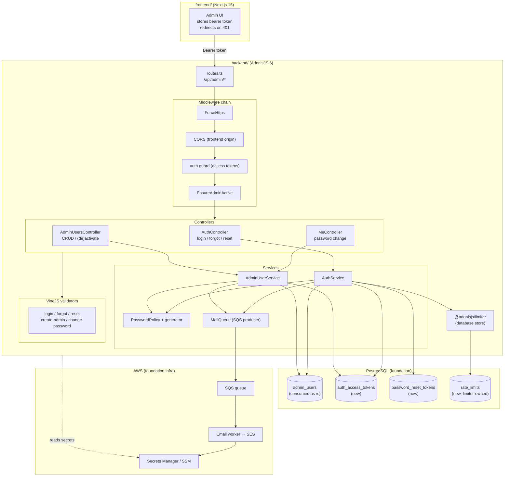
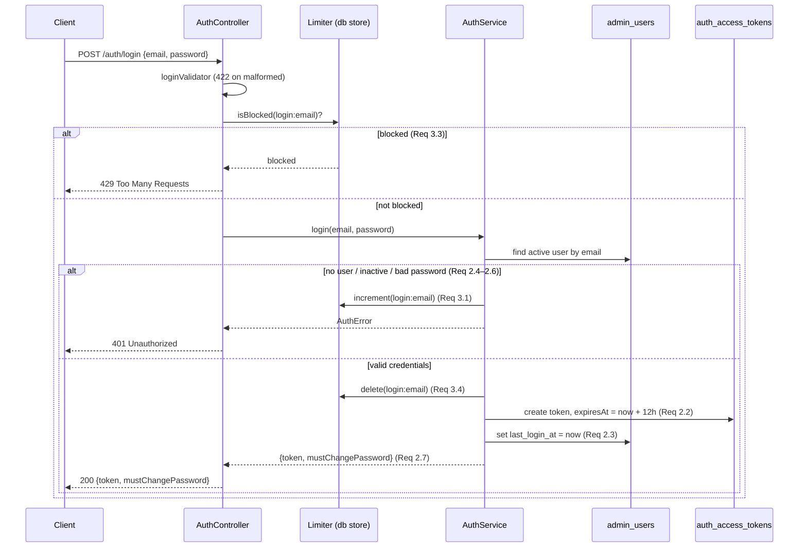
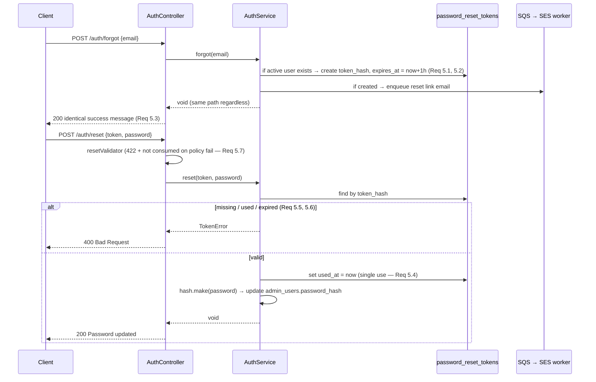
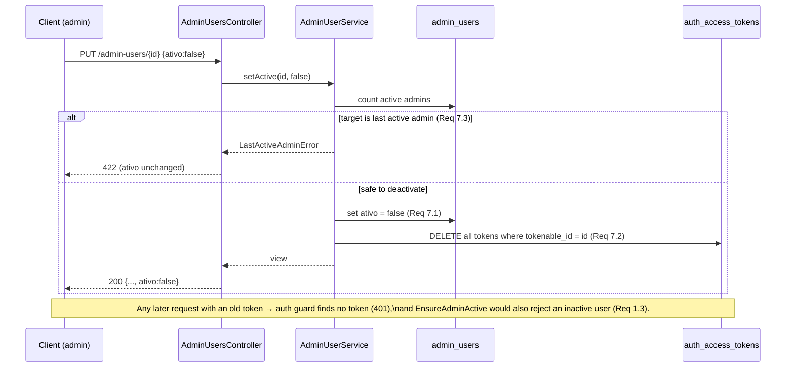

# Design Document

## Overview

This design specifies administrator authentication and administrator user management for the BouCheck administrative area (spec 2 of 7). It realizes master requirements **REQ-ADM-001** (administrator authentication) and **REQ-ADM-009** (administrator user management), the section 9 admin authentication and admin-user API contracts, and the authentication-relevant subset of **REQ-NFR-002** (security).

This spec **consumes** the `foundation-data-model` spec (spec 1 of 7). The `admin_users` table and the `AdminUser` Lucid model are reused **as-is and are not redefined here**. The foundation `admin_users` schema provides everything this spec needs at the user level: `id`, `nome`, `email` (UNIQUE), `password_hash`, `role` (default `admin`), `ativo` (default `true`), `must_change_password` (default `false`), `last_login_at` (nullable), `created_at`, `updated_at`.

Where this spec needs persistence the foundation does not provide, it is introduced here and clearly marked as **new persistence**:

- `auth_access_tokens` — storage for issued AdonisJS access tokens (needed to support server-side invalidation on deactivation).
- `password_reset_tokens` — single-use, time-limited reset tokens for the forgot/reset flow.
- Login-attempt tracking — held in the rate limiter's backing store (see the decision below), not in a bespoke domain table.

The foundation's `admin_users` table is untouched; the `AdminUser` model is only *extended* with the access-tokens provider mixin (a code-level capability that writes to the separate `auth_access_tokens` table).

Traceability to master requirement codes (REQ-ADM-001, REQ-ADM-009, REQ-NFR-002) is preserved via the `Requirement N.M` references throughout, which map back to `requirements.md`.

### Design goals

- Stateless-feeling bearer authentication with **server-side revocation**, so deactivating an administrator instantly invalidates their sessions (Req 7.2) rather than waiting for token expiry.
- A single, well-tested `Password_Policy` enforced identically everywhere a password enters the system (login-set, reset, create-admin temporary password, self-service change).
- Non-disclosure of account existence in the forgot flow (Req 5.3) and uniform 401s in login (Req 2.4–2.6) so the API leaks no oracle.
- Reuse of foundation infrastructure only: PostgreSQL for durable state, the existing SQS queue for outbound email, Secrets Manager/SSM for secrets. No new managed services are introduced.

### Key design decisions

| Decision | Choice | Rationale |
|---|---|---|
| Token mechanism | `@adonisjs/auth` **access tokens** (opaque bearer tokens) with `DbAccessTokensProvider`, stored in `auth_access_tokens` | Access tokens are persisted server-side, so deactivation can delete them for immediate invalidation (Req 7.2). A stateless JWT could not be revoked before expiry. |
| Token expiry | `expiresIn: '12 hours'` (Req 2.2) | Master contract fixes a 12h session. |
| Inactive-user rejection | Custom `EnsureAdminActive` middleware layered after the auth guard | The guard authenticates the token; the middleware re-checks `ativo` on every request so a token issued before deactivation, or a race with deactivation, still yields 401 (Req 1.3). |
| Login-attempt tracking | **`@adonisjs/limiter` with the database store** (no bespoke `login_attempts` table, no Redis) | Foundation provisions only PostgreSQL — no Redis/ElastiCache. The limiter's database store creates a `rate_limits` table and gives exactly the 5-attempts / 15-min-window / 15-min-block / 429 semantics required (Req 3.x) without hand-rolling attempt bookkeeping. Trade-off: DB writes per failed attempt; acceptable at admin-login volume. Documented so a later move to a Redis store is a config change only. |
| Reset token storage | Dedicated `password_reset_tokens` table storing a **hash** of the token, `expires_at`, and `used_at` | Single-use + expiry are domain invariants best modeled as rows (Req 5). Storing only the hash means a DB leak does not expose usable reset links. |
| Password hashing | AdonisJS `hash` facade with the **scrypt** driver (framework default) | Req 4.1 mandates scrypt; the framework default already is scrypt, so `hash.make`/`hash.verify` are used directly. |
| Outbound email | Enqueue a message to the **foundation SQS queue**; a worker (foundation infra) sends via **SES** | Req 5.1 / 6.2 say "enqueue an email". Keeps the request path fast and decouples SES from the HTTP transaction. Templating is kept light (subject + a couple of fields); the worker owns final rendering. |
| Validation | **VineJS** validators, one per endpoint | AdonisJS 6 native validation; the `Password_Policy` is a single shared rule reused across validators (Req 4.2). |
| Secrets | Read from Secrets Manager / SSM at runtime (Req 11.3) | Matches foundation's private-by-default posture; nothing sensitive in committed env. |

## Architecture



### Request lifecycle and middleware layering

Routes under `/api/admin` pass through, in order:

1. **ForceHttps** — rejects/redirects non-HTTPS requests (Req 11.1).
2. **CORS** — allows only `Frontend_Origin` (`boucheck.beonup.com.br`) for admin routes (Req 11.2).
3. **auth guard** (`@adonisjs/auth`, access-tokens guard) — resolves the bearer token to an `AdminUser`; missing/expired/unknown token → 401 (Req 1.1, 1.2).
4. **EnsureAdminActive** — asserts `auth.user.ativo === true`; otherwise 401 (Req 1.3).

The three unauthenticated auth endpoints (`/login`, `/forgot`, `/reset`) sit outside the auth guard + EnsureAdminActive pair but still behind ForceHttps and CORS.

### Layering

- **Controllers** parse/validate input (via VineJS), call a service, and shape the HTTP response. No business rules live here.
- **Services** (`AuthService`, `AdminUserService`) own all business logic and are the unit of property testing. They are pure with respect to their inputs except for explicit repository (Lucid) and queue (SQS) collaborators, which are injected/mockable.
- **PasswordPolicy** is a standalone module (pure function `validate(password): PolicyResult` + `generateCompliant(): string`) so it can be property-tested in isolation and reused by every validator and service.
- **MailQueue** is a thin SQS producer; it serializes a light message envelope and puts it on the foundation queue.

## Components and Interfaces

### Directory additions (within `backend/`)

```
backend/
├── app/
│   ├── controllers/
│   │   ├── auth_controller.ts          # login, forgot, reset
│   │   ├── me_controller.ts            # password change
│   │   └── admin_users_controller.ts   # index, show, store, update
│   ├── services/
│   │   ├── auth_service.ts
│   │   ├── admin_user_service.ts
│   │   └── mail_queue.ts               # SQS producer
│   ├── middleware/
│   │   ├── ensure_admin_active_middleware.ts
│   │   └── force_https_middleware.ts
│   ├── validators/
│   │   ├── auth_validators.ts          # login, forgot, reset
│   │   └── admin_user_validators.ts    # create-admin, change-password
│   ├── policies/
│   │   └── password_policy.ts          # validate() + generateCompliant()
│   └── models/
│       └── password_reset_token.ts     # new model (auth_access_tokens is framework-managed)
├── config/
│   ├── auth.ts                         # access-tokens guard, 12h expiry
│   ├── limiter.ts                      # database store config
│   └── cors.ts                         # frontend origin allowlist
└── database/migrations/
    ├── xxxx_create_auth_access_tokens_table.ts    # new persistence
    ├── xxxx_create_password_reset_tokens_table.ts # new persistence
    └── xxxx_create_rate_limits_table.ts           # new persistence (limiter)
```

### Auth configuration (`config/auth.ts`)

The access-tokens guard is configured against the reused `AdminUser` model with a 12-hour expiry (Req 2.2):

```ts
// config/auth.ts (relevant fragment)
const authConfig = defineConfig({
  default: 'api',
  guards: {
    api: tokensGuard({
      provider: tokensUserProvider({
        tokens: 'accessTokens',
        model: () => import('#models/admin_user'),
      }),
    }),
  },
})
```

The `AdminUser` model is extended (not redefined) with the tokens provider:

```ts
// app/models/admin_user.ts — ADDITIVE change only; admin_users table unchanged
import { DbAccessTokensProvider } from '@adonisjs/auth/access_tokens'

export default class AdminUser extends BaseModel {
  // ...existing foundation columns (nome, email, password_hash, role, ativo,
  //    must_change_password, last_login_at, ...) remain exactly as defined
  //    by foundation-data-model...

  static accessTokens = DbAccessTokensProvider.forModel(AdminUser, {
    expiresIn: '12 hours', // Req 2.2
    table: 'auth_access_tokens',
  })
}
```

### AuthService interface

```ts
interface LoginResult {
  token: { value: string; expiresAt: string }  // opaque bearer + ISO expiry
  mustChangePassword: boolean                   // Req 2.7
}

class AuthService {
  // Req 2, 3, 4 — throttling applied before verification (Req 3.3)
  login(email: string, password: string): Promise<LoginResult>        // 401 / 429 on failure
  // Req 5.1–5.3 — always the same outcome regardless of account existence
  forgot(email: string): Promise<void>
  // Req 5.4–5.7
  reset(rawToken: string, newPassword: string): Promise<void>         // 400 / 422 on failure
  // Req 7.2 — delete all tokens for a user
  invalidateAllTokens(user: AdminUser): Promise<void>
}
```

### AdminUserService interface

```ts
class AdminUserService {
  list(): Promise<AdminUserView[]>                                    // Req 10.1, 10.3
  get(id: number): Promise<AdminUserView>                             // Req 10.2, 10.4 (404)
  create(nome: string, email: string): Promise<AdminUserView>         // Req 6.1–6.3, 9.1
  setActive(id: number, ativo: boolean): Promise<AdminUserView>       // Req 7.1, 7.3, 7.4
  changeOwnPassword(user: AdminUser, current: string, next: string): Promise<void> // Req 6.4, 8
}
```

`AdminUserView` is the serialization used in every response; it is the projection `{ id, nome, email, role, ativo, last_login_at }` and **never** includes `password_hash` (Req 10.3). This is enforced structurally by the view type and by `serializeAs: null` on the model column.

### PasswordPolicy module

```ts
// app/policies/password_policy.ts
export interface PolicyResult { ok: boolean; unmet: PolicyCriterion[] }
export type PolicyCriterion = 'min_length' | 'has_letter' | 'has_number'

// Pure: at least 10 chars, ≥1 letter, ≥1 number (Req 4.2)
export function validate(password: string): PolicyResult

// Generates a random password guaranteed to satisfy validate() (Req 6.2)
export function generateCompliant(length?: number): string
```

`generateCompliant` composes from letters + digits and guarantees at least one of each, with cryptographically-random selection (`node:crypto`), so every generated `Temporary_Password` passes `validate` by construction.

### MailQueue (SQS producer)

```ts
type MailMessage =
  | { kind: 'password_reset'; to: string; resetLink: string }
  | { kind: 'temp_password'; to: string; nome: string; tempPassword: string }

class MailQueue {
  enqueue(msg: MailMessage): Promise<void> // puts JSON on the foundation SQS queue
}
```

Templating is intentionally light: the message carries only the fields the worker needs; the worker (foundation infra) renders and sends via SES. The queue URL and region come from configuration sourced from SSM/Secrets Manager (Req 11.3). Reset links and temporary passwords are payload data on the queue, never written to application logs (Req 11.5).

### VineJS validators

```ts
// Shared rule (Req 4.2): ≥10 chars, ≥1 letter, ≥1 number
const passwordRule = vine.string().minLength(10)
  .regex(/[A-Za-z]/).regex(/[0-9]/)

export const loginValidator = vine.compile(
  vine.object({ email: vine.string().email(), password: vine.string() })
)
export const forgotValidator = vine.compile(
  vine.object({ email: vine.string().email() })
)
export const resetValidator = vine.compile(
  vine.object({ token: vine.string(), password: passwordRule })
)
export const createAdminValidator = vine.compile(
  vine.object({ nome: vine.string().trim().minLength(1), email: vine.string().email() })
)
export const changePasswordValidator = vine.compile(
  vine.object({ current_password: vine.string(), new_password: passwordRule })
)
```

VineJS failures return HTTP 422 with the offending fields (Req 4.3, 5.7, 8.3). The password rule surfaces which criteria are unmet so the client can identify them (Req 4.3).

### Rate limiter (`config/limiter.ts`)

```ts
// Database store — no Redis dependency (foundation provisions PostgreSQL only)
const limiterConfig = defineConfig({
  default: 'db',
  stores: { db: stores.database({ tableName: 'rate_limits' }) },
})
```

In `AuthService.login`, throttling wraps verification and is keyed by email (Req 3.1–3.4):

```ts
const key = `login:${normalizedEmail}`
const limiter = limiterManager.use({ requests: 5, duration: '15 mins', blockDuration: '15 mins' })
// If already blocked → 429 without verifying (Req 3.3)
// On failed verification → limiter.increment(key) (Req 3.1); 5th within window blocks 15 min (Req 3.2)
// On success → limiter.delete(key) to clear the count (Req 3.4)
```

## Data Models

### auth_access_tokens (new persistence — framework-managed)

Created by the `@adonisjs/auth` access-tokens migration; shape is standard. Reference DDL:

```sql
CREATE TABLE auth_access_tokens (
  id              bigint GENERATED ALWAYS AS IDENTITY PRIMARY KEY,
  tokenable_id    bigint      NOT NULL REFERENCES admin_users(id) ON DELETE CASCADE,
  type            varchar(255) NOT NULL,
  name            varchar(255) NULL,
  hash            varchar(255) NOT NULL,
  abilities       text        NOT NULL,
  created_at      timestamptz NOT NULL,
  updated_at      timestamptz NOT NULL,
  last_used_at    timestamptz NULL,
  expires_at      timestamptz NULL          -- set to created_at + 12h at issuance (Req 2.2)
);
CREATE INDEX auth_access_tokens_tokenable_id_index ON auth_access_tokens (tokenable_id);
```

Only the token **hash** is stored; the plaintext value is returned once at login and never persisted. `ON DELETE CASCADE` plus explicit deletion on deactivation both support Req 7.2.

### password_reset_tokens (new persistence)

```sql
CREATE TABLE password_reset_tokens (
  id            bigint GENERATED ALWAYS AS IDENTITY PRIMARY KEY,
  admin_user_id bigint      NOT NULL REFERENCES admin_users(id) ON DELETE CASCADE,
  token_hash    varchar(255) NOT NULL,          -- SHA-256 of the raw token
  expires_at    timestamptz NOT NULL,           -- issued_at + 1 hour (Req 5.2)
  used_at       timestamptz NULL,               -- set when consumed (Req 5.4, 5.6)
  created_at    timestamptz NOT NULL DEFAULT now(),
  updated_at    timestamptz NOT NULL DEFAULT now(),
  CONSTRAINT password_reset_tokens_token_hash_unique UNIQUE (token_hash)
);
CREATE INDEX password_reset_tokens_admin_user_id_index ON password_reset_tokens (admin_user_id);
CREATE INDEX password_reset_tokens_token_hash_index    ON password_reset_tokens (token_hash);
```

A token is **valid** iff a row with the matching `token_hash` exists, `used_at IS NULL`, and `expires_at > now()`. Consuming it sets `used_at` in the same transaction as the password update (Req 5.4). Any presentation of a token that is expired, already `used_at`-stamped, or absent → 400 (Req 5.5, 5.6).

```ts
// app/models/password_reset_token.ts
export default class PasswordResetToken extends BaseModel {
  @column({ isPrimary: true }) declare id: number
  @column({ columnName: 'admin_user_id' }) declare adminUserId: number
  @column({ columnName: 'token_hash', serializeAs: null }) declare tokenHash: string
  @column.dateTime({ columnName: 'expires_at' }) declare expiresAt: DateTime
  @column.dateTime({ columnName: 'used_at' }) declare usedAt: DateTime | null
  @column.dateTime({ autoCreate: true }) declare createdAt: DateTime
  @column.dateTime({ autoCreate: true, autoUpdate: true }) declare updatedAt: DateTime

  @belongsTo(() => AdminUser, { foreignKey: 'adminUserId' })
  declare adminUser: BelongsTo<typeof AdminUser>

  get isValid(): boolean {
    return this.usedAt === null && this.expiresAt > DateTime.now()
  }
}
```

### rate_limits (new persistence — limiter-managed)

Created by the `@adonisjs/limiter` database-store migration; standard shape (`key`, `points`, `expire`). Not modeled as a domain Lucid model — the limiter manages it.

### admin_users (consumed as-is)

No migration or column change. The model gains only the `accessTokens` static provider (shown above) and `serializeAs: null` on `password_hash` (if not already set by the foundation) to guarantee exclusion from every response (Req 10.3). Password verification uses `hash.verify(user.passwordHash, plaintext)`; the plaintext is never stored or logged (Req 4.4).

## API Endpoints

All paths are under `/api/admin`. `password_hash` never appears in any response (Req 10.3). All routes require HTTPS (Req 11.1) and are CORS-restricted to the frontend origin (Req 11.2).

| Method | Path | Auth | Purpose | Success | Failure |
|---|---|---|---|---|---|
| POST | `/auth/login` | none | Login, issue token | 200 | 401, 422, 429 |
| POST | `/auth/forgot` | none | Request reset email | 200 | 422 |
| POST | `/auth/reset` | none | Reset with token | 200 | 400, 422 |
| PUT | `/me/password` | token + active | Change own password | 204 | 401, 422 |
| GET | `/admin-users` | token + active | List admins | 200 | 401 |
| GET | `/admin-users/{id}` | token + active | Get one admin | 200 | 401, 404 |
| POST | `/admin-users` | token + active | Create admin | 201 | 401, 422 |
| PUT | `/admin-users/{id}` | token + active | (De/Re)activate | 200 | 401, 422 |

### Request / response shapes

**POST `/auth/login`**
```jsonc
// request
{ "email": "ana@beonup.com.br", "password": "s3cret-value-1" }
// 200
{ "token": { "value": "oat_...", "expiresAt": "2025-01-02T12:00:00.000Z" },
  "mustChangePassword": false }
// 401 { "error": "Invalid credentials" }         (Req 2.4, 2.5, 2.6 — uniform)
// 429 { "error": "Too many attempts", "retryAfter": 900 }  (Req 3.3)
```

**POST `/auth/forgot`**
```jsonc
// request  { "email": "ana@beonup.com.br" }
// 200      { "message": "If the account exists, a reset email has been sent." }  (Req 5.3 — identical for any email)
```

**POST `/auth/reset`**
```jsonc
// request  { "token": "raw-reset-token", "password": "new-passw0rd" }
// 200      { "message": "Password updated." }
// 400      { "error": "Invalid or expired token" }   (Req 5.5, 5.6)
// 422      { "errors": [{ "field": "password", "unmet": ["min_length","has_number"] }] }  (Req 5.7)
```

**PUT `/me/password`**
```jsonc
// request  { "current_password": "old-passw0rd", "new_password": "new-passw0rd" }
// 204      (no content)   (Req 8.1; also clears must_change_password — Req 6.4)
// 422      { "error": "Current password incorrect" }  (Req 8.2)  or policy errors (Req 8.3)
```

**POST `/admin-users`**
```jsonc
// request  { "nome": "Bruno", "email": "bruno@beonup.com.br" }
// 201      { "id": 7, "nome": "Bruno", "email": "bruno@beonup.com.br",
//            "role": "admin", "ativo": true, "last_login_at": null }  (Req 6.1, 9.1; temp password emailed — Req 6.2)
// 422      { "error": "Email already in use" }   (Req 6.3)
```

**GET `/admin-users`** → `200` array of `{ id, nome, email, role, ativo, last_login_at }` (Req 10.1).
**GET `/admin-users/{id}`** → `200` one such object (Req 10.2) or `404` (Req 10.4).

**PUT `/admin-users/{id}`**
```jsonc
// request  { "ativo": false }
// 200      { "id": 7, ..., "ativo": false }        (Req 7.1; tokens invalidated — Req 7.2)
// 422      { "error": "Cannot deactivate the last active administrator" }  (Req 7.3)
// request  { "ativo": true } → 200 reactivated      (Req 7.4)
```

## Sequence Diagrams

### Login (with rate limiting and forced-change flag)



### Forgot / Reset



### Deactivation with immediate token invalidation



## Security

- **HTTPS enforcement (Req 11.1):** `ForceHttps` middleware inspects `X-Forwarded-Proto`/request protocol and rejects non-HTTPS admin traffic (redirect for browsers, 403/400 for API clients). TLS terminates at the load balancer; the app trusts the proxy header per AdonisJS `trustProxy` config.
- **CORS (Req 11.2):** `config/cors.ts` sets `origin: ['https://boucheck.beonup.com.br']` for `/api/admin/*`; credentials allowed, methods limited to those in the endpoint table. No wildcard origin.
- **Secrets (Req 11.3):** DB credentials, SQS queue URL, SES/region config, and the app key are resolved from Secrets Manager / SSM at boot. Nothing sensitive is committed; `.env` stays git-ignored (consistent with foundation Req 13.5).
- **PII masking (Req 11.4):** a log-serializer transform masks email addresses (e.g. `a***@beonup.com.br`) anywhere they would be written to application logs.
- **Secret exclusion from logs (Req 11.5):** passwords, `password_hash`, access-token values, and reset tokens are redacted by the same log-serializer allow/deny list and are never passed to `logger` calls. Request-body logging for auth routes drops the `password`, `new_password`, `current_password`, and `token` fields.
- **Uniform failure responses:** login returns an indistinguishable 401 for unknown-email, wrong-password, and inactive-user (Req 2.4–2.6); forgot returns an identical 200 regardless of account existence (Req 5.3). This avoids account-enumeration oracles.
- **Role field (Req 9):** every admin is created with `role = 'admin'` (Req 9.1); v1 grants all active admins full access without differentiating by role (Req 9.2). The field exists for future RBAC without a schema change.

## Correctness Properties

*A property is a characteristic or behavior that should hold true across all valid executions of a system — essentially, a formal statement about what the system should do. Properties serve as the bridge between human-readable specifications and machine-verifiable correctness guarantees.*

This spec is a strong fit for property-based testing because its core is input-varying logic: password-policy validation over arbitrary strings, token lifecycle over arbitrary time/use states, rate-limit thresholds over arbitrary attempt sequences, and domain invariants over arbitrary sets of administrators. Transport/config criteria (HTTPS enforcement, CORS allowlist, scrypt driver selection, secrets sourcing) do not vary with input and are covered by example and smoke tests in the Testing Strategy. The prework consolidated the testable criteria into the fourteen non-redundant properties below.

### Property 1: Password policy validation

*For any* string `s`, `PasswordPolicy.validate(s)` returns `ok = true` if and only if `s` has length ≥ 10 **and** contains at least one letter **and** contains at least one digit; and when `ok = false`, the returned `unmet` set is exactly the subset of `{min_length, has_letter, has_number}` that `s` fails.

**Validates: Requirements 4.2, 4.3**

### Property 2: Generated temporary passwords are always compliant

*For any* invocation of `PasswordPolicy.generateCompliant()`, the returned password satisfies `validate()` (`ok = true`).

**Validates: Requirements 6.2**

### Property 3: Access token expiration is exactly 12 hours

*For any* access token issued during a successful login, the token's `expiresAt` equals its issuance timestamp plus 12 hours.

**Validates: Requirements 2.2**

### Property 4: Successful login issues a token and reflects forced-change

*For any* active Admin_User with a known password, a login with the correct email and password issues a usable Access_Token, sets `last_login_at` to the login timestamp, and returns `mustChangePassword` equal to that user's stored `must_change_password`.

**Validates: Requirements 2.1, 2.3, 2.7**

### Property 5: Uniform login failure

*For any* login request that either references an email matching no Admin_User, presents a password that does not match the stored `password_hash`, or presents correct credentials for an Admin_User whose `ativo` is `false`, the Auth_Service returns an HTTP 401 response that is indistinguishable across the three cases and issues no token.

**Validates: Requirements 2.4, 2.5, 2.6**

### Property 6: Login rate-limit threshold

*For any* email and *any* sequence of failed login attempts within a 15-minute window, the first four failures are processed (verified and rejected), the fifth failure triggers a 15-minute block, and while blocked every login request for that email — including one with correct credentials — is rejected with HTTP 429 without performing credential verification; and a successful login before the fifth failure clears the accumulated failure count.

**Validates: Requirements 3.1, 3.2, 3.3, 3.4**

### Property 7: Reset token single-use, expiry, and non-consumption on invalid input

*For any* generated Reset_Token, its `expires_at` equals its issuance time plus 1 hour; a reset presenting a token that is unexpired, unused, and matched, together with a policy-compliant new password, updates the associated `password_hash` and marks the token used exactly once; any subsequent presentation of that same token, or presentation of an expired or unrecognized token, is rejected with HTTP 400; and a reset presenting an otherwise-valid token with a non-compliant new password is rejected with HTTP 422 while leaving the token unused (still valid).

**Validates: Requirements 5.2, 5.4, 5.5, 5.6, 5.7**

### Property 8: Forgot-password non-disclosure

*For any* email address, whether or not it matches an active Admin_User, the `POST /api/admin/auth/forgot` response has an identical status and body, so account existence cannot be inferred from the response.

**Validates: Requirements 5.1, 5.3**

### Property 9: Administrator creation invariants

*For any* create request with a valid name and a not-yet-used email, the new Admin_User is persisted with `ativo = true`, `must_change_password = true`, and `role = 'admin'`, a Temporary_Password satisfying the Password_Policy is generated and stored only as a hash (never plaintext), and exactly one email is enqueued to the new address; *for any* create request whose email already matches an existing Admin_User, the request is rejected with HTTP 422 and no new row is created.

**Validates: Requirements 6.1, 6.2, 6.3, 9.1**

### Property 10: Self-service password change

*For any* authenticated Admin_User, a change request whose current password matches the stored `password_hash` and whose new password satisfies the Password_Policy updates the `password_hash` (the old password no longer verifies, the new one does) and sets `must_change_password` to `false`; and a change request whose current password does not match, or whose new password violates the Password_Policy, is rejected with HTTP 422 and leaves `password_hash` unchanged.

**Validates: Requirements 6.4, 8.1, 8.2, 8.3**

### Property 11: Last-active-admin invariant across (de)activation

*For any* set of Admin_Users, deactivating an Admin_User that is not the sole active one sets its `ativo` to `false`, reactivating a deactivated Admin_User sets its `ativo` to `true`, and any deactivation request that would reduce the number of active Admin_Users to zero is rejected with HTTP 422 while leaving that user's `ativo` unchanged — so the count of active Admin_Users is never driven below one by a deactivation.

**Validates: Requirements 7.1, 7.3, 7.4**

### Property 12: Deactivation revokes all tokens

*For any* Admin_User holding any number of Access_Tokens, deactivating that user removes all of their tokens so that a subsequent request bearing a previously-valid token for that user is rejected with HTTP 401.

**Validates: Requirements 1.3, 7.2**

### Property 13: Admin-user responses never expose password_hash

*For any* Admin_User returned by any admin-user endpoint (list, retrieve, create, or update), the serialized response contains exactly the fields `id`, `nome`, `email`, `role`, `ativo`, and `last_login_at`, and never contains `password_hash`.

**Validates: Requirements 10.1, 10.2, 10.3**

### Property 14: Log masking of PII and secrets

*For any* log payload, the application log serializer masks any email address (obscuring the local part) and redacts the values of `password`, `new_password`, `current_password`, `password_hash`, access-token, and reset-token fields, so no unmasked PII or secret is written to application logs.

**Validates: Requirements 11.4, 11.5**

## Error Handling

### HTTP status mapping

| Condition | Status | Requirement |
|---|---|---|
| Missing / expired / unknown token; inactive user; bad login credentials | 401 | 1.1, 1.2, 1.3, 2.4, 2.5, 2.6 |
| Reset token expired / used / unrecognized | 400 | 5.5, 5.6 |
| Admin-user id not found | 404 | 10.4 |
| Validation failure (malformed body, policy violation, duplicate email, wrong current password, last-active-admin) | 422 | 4.3, 5.7, 6.3, 7.3, 8.2, 8.3 |
| Rate-limit block active | 429 | 3.3 |
| Non-HTTPS admin request | rejected (redirect/403) | 11.1 |

A single exception-handling layer maps domain errors to these statuses. Domain services throw typed errors (`AuthError`, `TokenError`, `PolicyError`, `DuplicateEmailError`, `LastActiveAdminError`, `NotFoundError`); the controller/exception handler translates them, ensuring the login path always emits the same opaque 401 (Property 5) and never leaks which sub-condition failed.

### Transactional integrity

- **Reset:** marking the token `used_at` and updating `password_hash` occur in one database transaction, so a token can never be consumed without the password actually changing, nor the password changed while leaving the token reusable (supports Property 7).
- **Deactivation:** setting `ativo = false`, the last-active-admin guard (a `SELECT ... FOR UPDATE`/count within the transaction), and deleting the user's tokens run in one transaction, so the invariant in Property 11 holds even under concurrent deactivations, and token deletion (Property 12) is atomic with deactivation.
- **Rate limiter:** the increment-on-failure and clear-on-success operations are issued through the limiter's atomic store operations; a login handler failure after a successful verification does not leave a stale block (the clear happens before token issuance side effects that could fail independently are retried idempotently).

### External failure modes

- **SQS enqueue failure (email):** the forgot and create flows treat enqueue failure as a server error for create (the admin is not committed if the email cannot be enqueued — create wraps persistence + enqueue in a transaction/outbox); for forgot, enqueue failure is logged (masked) and still returns the uniform success response to preserve non-disclosure (Property 8). Message delivery/SES rendering is the worker's responsibility (foundation infra) and out of scope here.
- **Secrets unavailable at boot:** the app fails fast with a clear, secret-free error if a required secret cannot be resolved from Secrets Manager/SSM (Req 11.3).
- **Malformed/oversized token strings on reset:** hashed and looked up like any other; a non-match yields the same 400 as an expired/used token, giving no distinguishing signal.

## Testing Strategy

A dual approach: property-based tests for the input-varying logic (Properties 1–14) and example / smoke tests for transport, configuration, and UI-adjacent criteria.

### Property-based tests

- **Library:** `fast-check` with the backend test runner (Japa), matching the foundation spec's convention. Do not hand-roll generators.
- **Iterations:** each property test runs a minimum of 100 iterations (`fc.assert(..., { numRuns: 100 })`).
- **Tagging:** each property test carries a comment referencing its design property:
  `// Feature: admin-auth-users, Property {number}: {property_text}`
- **Isolation & backends:** properties touching persistence (tokens, reset tokens, admin rows, rate limits) run against a real PostgreSQL 16 test database (matching foundation), each iteration in a rolled-back transaction or with truncation between runs. Pure properties (1, 2, 14) run in-memory with no database. Time-sensitive properties (3, 7 expiry) use a controllable clock so "12 hours" / "1 hour" and expiry can be asserted deterministically. The SQS producer is mocked in tests (Properties 8, 9) to assert enqueue calls without hitting AWS.
- **Coverage mapping:**
  - Property 1 → policy validation test (arbitrary strings, including whitespace/unicode edge cases).
  - Property 2 → generator-compliance test (generate many, all pass `validate`).
  - Property 3 → token-expiry arithmetic test (controllable clock).
  - Property 4 → successful-login test (generated active users + known passwords).
  - Property 5 → uniform-failure test (three failure kinds produce identical 401).
  - Property 6 → rate-limit threshold test (arbitrary attempt sequences, controllable clock).
  - Property 7 → reset-token lifecycle test (valid/expired/used/policy-fail branches).
  - Property 8 → forgot non-disclosure test (matching vs non-matching emails, identical response).
  - Property 9 → create-admin test (defaults, hashed temp password, one enqueue, duplicate 422).
  - Property 10 → change-password test (correct/wrong current, compliant/non-compliant new).
  - Property 11 → last-active-admin invariant test (arbitrary admin sets, de/reactivation).
  - Property 12 → token-revocation test (arbitrary token counts, post-deactivation 401).
  - Property 13 → serialization test (arbitrary admin sets across all four endpoints).
  - Property 14 → log-masking test (arbitrary payloads with emails/secrets).

### Example and edge-case tests

- Missing-token and expired-token requests to an admin route → 401 (Req 1.1, 1.2).
- Frontend: a 401 from an admin route redirects to the login screen (Req 1.4) — frontend example test.
- Both of two active admins can reach a protected route (no role differentiation in v1, Req 9.2).
- Non-HTTPS admin request is rejected (Req 11.1).
- CORS preflight from `https://boucheck.beonup.com.br` is allowed; a different origin is denied (Req 11.2).
- Verify-without-logging: a login run produces no log line containing the plaintext password (Req 4.4) — complements Property 14.

### Smoke tests

- Configured hash driver is scrypt and a stored hash is not equal to the plaintext (Req 4.1).
- The three new migrations (`auth_access_tokens`, `password_reset_tokens`, `rate_limits`) run and create their tables; the `admin_users` table is unchanged from the foundation (Req consumed-as-is).
- Auth config resolves secrets (app key, DB creds, SQS URL) from Secrets Manager/SSM, with no committed secret values (Req 11.3).

### Requirements not covered by properties

Requirements 1.1, 1.2, 1.4, 4.1, 4.4, 9.2, 11.1, 11.2, 11.3 are configuration, transport, or UI behaviors whose outcome does not vary meaningfully with input; they are verified by the example and smoke tests above rather than property-based tests, per the classification in the prework.
