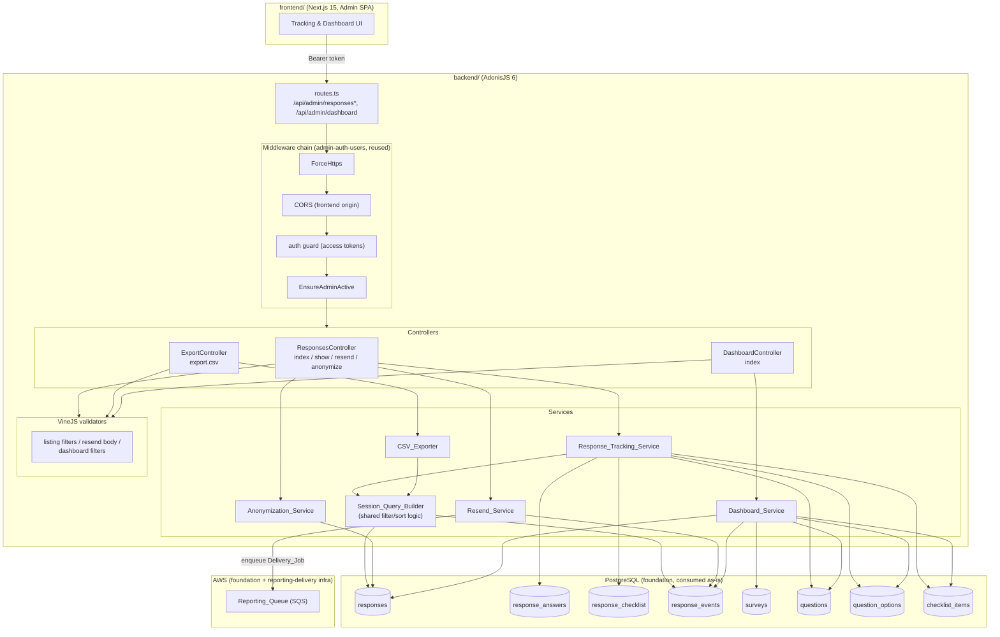

# Design Document

## Overview

This design specifies **admin-tracking-dashboard** (spec 7 of 7, the final spec) for the BouCheck platform. It realizes master requirements **REQ-ADM-007** (response tracking and traceability) and **REQ-ADM-008** (indicators dashboard), the section 9 admin API contracts (`GET /responses`, `GET /responses/{id}`, `POST /responses/{id}/resend`, `GET /responses/export.csv`, `GET /dashboard`), and the dashboard-relevant subset of **REQ-NFR-003** (performance/capacity — the 3-second/10,000-session target in REQ-NFR-003.3, realized here as Requirement 19).

This spec **consumes** three prior specs without redefining them:

- **foundation-data-model** (spec 1 of 7) — the `responses`, `response_answers`, `response_checklist`, `response_events`, `surveys`, `questions`, `question_options`, and `checklist_items` tables and their Lucid models, exactly as designed there (see the DDL and ORM layer in that spec's design). This spec is entirely read-oriented against these tables except for the narrow writes described in Requirements 8 and 9 (a new `response_events` row for a manual resend, and updates to six `responses` PII columns plus `anonimizado` for anonymization).
- **admin-auth-users** (spec 2 of 7) — the `/api/admin` middleware chain (`ForceHttps` → CORS → auth guard → `EnsureAdminActive`) and the controller/service/validator layering convention. Every route this spec defines is registered under that existing chain.
- **reporting-delivery** (spec 6 of 7) — the `Reporting_Queue` SQS resource, its message envelope (`ReportingQueueMessage`, a discriminated union keyed by `kind`), the `relatorio_envio_falhou` event shape (`payload: { canal: 'email' | 'whatsapp', motivo: string }`), and the `Email_Delivery_Worker` / `WhatsApp_Delivery_Worker` consumers that already handle `email_deliver` / `whatsapp_deliver` messages idempotently. This spec's Resend_Service re-enqueues messages of those exact same kinds; it does not add a new message kind or alter worker behavior.

Scope is the administrator-facing tracking and indicators surface only: listing/filtering/paginating Response_Sessions, session detail with full Event_Timeline and Per_Question_Time, CSV export, manual resend, LGPD anonymization, and the aggregated dashboard. Score calculation, report rendering, and automatic delivery remain owned by reporting-delivery; the public respondent flow remains owned by public-response-flow; administrator authentication remains owned by admin-auth-users.

### Design goals

- Read paths (listing, detail, CSV, dashboard) are pure query-and-project logic over foundation tables — no new tables are introduced for this spec's core read functionality, keeping the data model exactly as foundation-data-model defined it.
- Every list-shaping decision (filters, pagination, ordering, CSV serialization) lives in one place — a shared, reusable query builder — so the paginated listing, the unpaginated CSV export, and (where filters overlap) the dashboard's session-matching predicate never drift apart.
- The four write side effects this spec introduces (Manual_Resend_Event logging, PII anonymization) reuse existing columns/tables (`response_events`, the six PII columns already on `responses`, `responses.anonimizado`) rather than adding schema.
- Dashboard aggregation is pushed entirely into PostgreSQL (aggregate queries, CTEs, window functions) per Requirement 18, so the 3-second/10,000-session target (Requirement 19) is met by query design rather than in-application computation over row sets fetched into Node.

### Key design decisions

| Decision | Choice | Rationale |
|---|---|---|
| Filter/query architecture | A single `Session_Query_Builder` module that both `Response_Tracking_Service.list()` and `CSV_Exporter.export()` call, parameterized by `{ paginate: boolean }` | Requirement 7.1 mandates the CSV contains exactly what the same filters would produce in the *unpaginated* listing. Sharing one builder makes that a structural guarantee (same `WHERE`/`JOIN` clauses) rather than a convention two independent query paths must be kept in sync by hand. |
| Report_Indicator / Report_Action_Filter computation | Correlated `EXISTS` subqueries against `response_events`, one per event type, rather than joining and grouping | `response_events` is a high-cardinality child table (Req 4.8 of foundation indexes `(response_id, created_at)`, not `(response_id, tipo)`); `EXISTS (SELECT 1 FROM response_events WHERE response_id = responses.id AND tipo = ?)` lets PostgreSQL short-circuit per row and is index-friendly with the existing composite index (leading column `response_id`). A `GROUP BY` join would require deduplicating events before aggregation and is more expensive for a boolean existence check. |
| Per_Question_Time algorithm | In-application computation over one ordered fetch of `pergunta_respondida` events per session, not a SQL window function | Only exercised on the single-session detail endpoint (never across thousands of sessions at once, unlike dashboard aggregates), so the cost profile favors simplicity: one small ordered result set, a single pass with a "previous timestamp" accumulator. |
| CSV generation | Node.js streaming (`Readable` piped to the HTTP response) built row-by-row from the same unpaginated query cursor, not building the full CSV string in memory | The unpaginated export can cover the full 10,000-session scope (Requirement 19's stated volume); streaming avoids holding the entire serialized file in memory and starts the download promptly. |
| Delivery_Channel resolution | A pure function `resolveChannel(explicit, failedChannels: Set<Channel>): Resolution` returning a tagged union (`{ kind: 'resolved'; channel }` \| `{ kind: 'ambiguous' }` \| `{ kind: 'not_found' }`), called by `Resend_Service` before any enqueue | Isolates the branching decision table (Requirement 8.2–8.5) as a unit that is trivially property-tested without a database, independent of the enqueue/log side effects that follow a `'resolved'` outcome. |
| Anonymization write strategy | A single `UPDATE responses SET ... WHERE id = ?` statement covering all six PII columns plus `anonimizado`, wrapped so a column-level failure (Requirement 9.6) is simulated/handled by a **column-by-column fallback path**: if the single combined `UPDATE` fails, retry each of the six columns independently, persist whichever succeed, and still set `anonimizado = true` | A single-statement `UPDATE` is atomic by default (Postgres statement-level atomicity) and is the normal path; Requirement 9.6 explicitly describes a *partial* success outcome as a real, must-handle case (not merely "the transaction rolled back"), so the design provides an explicit degraded path that retries per-column when the all-columns statement raises, rather than treating 9.6 as unreachable. This keeps the common case simple (one statement) while still giving 9.6 a concrete, testable implementation. |
| Dashboard query strategy | One PostgreSQL query per metric group (top-line counts, funnel, avg fill time, highest-abandonment, distribution, time series, checklist tops), each an aggregate query (`COUNT`, `AVG`, conditional `COUNT(CASE WHEN ...)`, `EXISTS` subqueries) filtered by the same `survey_id`/period predicate, run in parallel (`Promise.all`) | Requirement 18.1 mandates aggregated PostgreSQL queries. Splitting by metric group (rather than one mega-query) keeps each query's `EXPLAIN` plan simple and independently indexable, and lets them execute concurrently against the connection pool rather than serially. |
| Materialized view | Not introduced in v1; the design documents the extension point (Requirement 18.2 permits, does not require, one) | At the stated 10,000-session ceiling (Requirement 19), well-indexed aggregate queries over `responses`/`response_events` are expected to meet the 3-second target (see Performance section) without the operational cost of a refresh schedule. If load testing during implementation shows otherwise, a `mv_dashboard_daily_counts`-style materialized view refreshed on a schedule is the documented fallback, not a redesign. |
| Daily time series generation | `generate_series(period_start, period_end, interval '1 day')` left-joined to a per-day `COUNT` subquery | This is the standard PostgreSQL idiom for zero-filling a date range (Requirement 15.2) without an application-side loop that risks timezone/off-by-one gaps. |
| Highest-abandonment tie-break | Deterministic: ties on count broken by lowest `question_id` | Requirement 13.2 only constrains that no lower-count question is returned; a tie-break rule must still be chosen for determinism. Lowest `question_id` is stable, requires no extra column, and is trivially expressed as `ORDER BY count DESC, question_id ASC LIMIT 1`. |

## Architecture



### Request lifecycle and middleware layering

Every route this spec defines (`GET /api/admin/responses`, `GET /api/admin/responses/{id}`, `POST /api/admin/responses/{id}/resend`, `GET /api/admin/responses/export.csv`, `POST /api/admin/responses/{id}/anonymize`, `GET /api/admin/dashboard`) is registered under the existing `/api/admin` router group and therefore passes through, unchanged from admin-auth-users:

1. **ForceHttps**
2. **CORS** (frontend origin allowlist)
3. **auth guard** (access tokens) — missing/expired/unknown token → 401 (Requirement 20.2)
4. **EnsureAdminActive** — inactive admin → 401

No new middleware is introduced. This satisfies Requirement 20 by construction: routing configuration, not new logic.

### Layering (reused convention from admin-auth-users)

- **Controllers** (`ResponsesController`, `ExportController`, `DashboardController`) parse/validate query params and request bodies via VineJS, call exactly one service method, and shape the HTTP response (including, for `ExportController`, streaming the CSV body and setting headers). No business rules live here.
- **Services** (`Response_Tracking_Service`, `CSV_Exporter`, `Resend_Service`, `Anonymization_Service`, `Dashboard_Service`) own all business logic and are the unit of property testing. `Session_Query_Builder` is a shared internal collaborator used by both `Response_Tracking_Service` and `CSV_Exporter`.
- **Validators** (VineJS) enforce required/optional shape of filter and body params before a controller calls a service — e.g., Requirement 17's mandatory `survey` + period params on the dashboard route are enforced here, returning 422 before `Dashboard_Service` is invoked at all.

## Components and Interfaces

### Directory additions (within `backend/`)

```
backend/
├── app/
│   ├── controllers/admin/
│   │   ├── responses_controller.ts       # index, show, resend, anonymize
│   │   ├── export_controller.ts          # export.csv
│   │   └── dashboard_controller.ts        # index
│   ├── services/
│   │   ├── session_query_builder.ts       # shared filter/sort/paginate query logic
│   │   ├── response_tracking_service.ts   # listing, detail, timeline, per-question time
│   │   ├── csv_exporter.ts                # streaming CSV serialization
│   │   ├── resend_service.ts              # Delivery_Channel resolution + re-enqueue
│   │   ├── anonymization_service.ts        # LGPD anonymization
│   │   └── dashboard_service.ts            # aggregated indicator queries
│   └── validators/
│       └── admin_tracking_validators.ts    # listing filters, resend body, dashboard filters
└── config/
    └── (no new config; reuses reporting-delivery's Reporting_Queue client and admin-auth-users' auth/cors config)
```

### Session_Query_Builder (shared filter/sort/paginate logic)

This module is the single place `Response_Tracking_Service.list()` and `CSV_Exporter.export()` both call, guaranteeing the CSV always reflects exactly what the same filters would produce in the unpaginated listing (Requirement 7.1).

```ts
// app/services/session_query_builder.ts
export type ReportActionFilter = 'visualizou' | 'recebeu' | 'solicitou_consultor' | 'envio_falhou'
export type SortOrder = 'started_at_asc' | 'started_at_desc'   // default: started_at_desc (Req 3.1)

export interface SessionListingFilters {
  surveyId?: number
  startDate?: string   // ISO date, inclusive
  endDate?: string      // ISO date, inclusive
  status?: 'iniciado' | 'completo'
  nomeContains?: string    // case-insensitive substring (Req 2.4)
  empresaContains?: string // case-insensitive substring (Req 2.5)
  reportAction?: ReportActionFilter
}

export interface PaginationParams {
  page: number       // 1-based
  perPage: number
}

export class SessionQueryBuilder {
  // Builds the base Lucid query with every active filter applied via AND (Req 2.7),
  // shared column selection, and the Report_Indicator EXISTS subqueries.
  // `paginate: undefined` returns the full matching set (used by CSV_Exporter, Req 7.1).
  build(filters: SessionListingFilters, sort: SortOrder, pagination?: PaginationParams): ModelQueryBuilderContract<typeof Response>

  // Returns the total count of Response_Sessions matching `filters`, independent of pagination (Req 3.2).
  count(filters: SessionListingFilters): Promise<number>
}
```

The four Report_Indicator flags and the `envio_falhou` Report_Action_Filter are computed via correlated `EXISTS` subqueries against `response_events`, one per event type:

```ts
// Report_Indicator projection (Req 1.1) — added as raw select expressions
const INDICATOR_EXPRESSIONS = {
  visualizou: existsEvent('relatorio_visualizado'),
  email_enviado: existsEvent('relatorio_email_enviado'),
  whatsapp_enviado: existsEvent('relatorio_whatsapp_enviado'),
  consultor_solicitado: existsEvent('consultor_solicitado'),
}

function existsEvent(tipo: string) {
  return db.raw(
    `EXISTS (SELECT 1 FROM response_events re WHERE re.response_id = responses.id AND re.tipo = ?)`,
    [tipo]
  )
}
```

The `Report_Action_Filter` (Requirement 2.6) maps to a `WHERE` clause built from the same `existsEvent` helper (or an OR of two for `recebeu`):

| Report_Action_Filter | Predicate |
|---|---|
| `visualizou` | `EXISTS` event `relatorio_visualizado` |
| `recebeu` | `EXISTS` event `relatorio_email_enviado` **OR** `EXISTS` event `relatorio_whatsapp_enviado` |
| `solicitou_consultor` | `EXISTS` event `consultor_solicitado` |
| `envio_falhou` | `EXISTS` event `relatorio_envio_falhou` |

Fill_Time and Progress_Percentage (Requirement 1.2, 1.3) are computed as SQL-level `CASE` expressions so the listing and CSV both get them without an extra round trip:

```sql
CASE WHEN responses.status = 'completo'
     THEN EXTRACT(EPOCH FROM (responses.completed_at - responses.started_at))
     ELSE NULL END AS fill_time_seconds,
CASE WHEN responses.status = 'iniciado'
     THEN <progress computation — see note below>
     ELSE NULL END AS progress_percentage
```

> **Note on Progress_Percentage:** the Glossary defines it as "the percentage of the survey's questions on the Response_Session's answered path that have a recorded answer." Because the answered path depends on the Navigation_Engine's conditional branching (owned by `public-response-flow`), `Response_Tracking_Service` computes it in application code per row as `answeredCount / estimatedPathLength * 100` using the same `computeEstimatedPath`-style logic already defined by public-response-flow's Navigation_Engine (reused, not redefined), rather than attempting the branching logic in SQL. This affects only `iniciado` rows, which are always a small minority of any page/export.

### Response_Tracking_Service

```ts
// app/services/response_tracking_service.ts
export interface SessionListingRow {
  id: string
  nome: string | null; empresa: string | null; email: string | null
  telefone: string | null; cargo: string | null; cidade: string | null
  surveyNome: string
  status: 'iniciado' | 'completo'
  startedAt: string | null; completedAt: string | null
  fillTimeSeconds: number | null
  progressPercentage: number | null
  indicators: { visualizou: boolean; emailEnviado: boolean; whatsappEnviado: boolean; consultorSolicitado: boolean }
}

export interface SessionDetail {
  session: SessionListingRow & { surveyId: number }
  answers: Array<{ questionId: number; questionText: string; optionText: string | null; textoLivre: string | null }>
  checklist: Array<{ checklistItemId: number; nome: string; grupo: string }>
  timeline: Array<{ tipo: string; createdAt: string; payload: unknown }>
  perQuestionTime: Array<{ questionId: number; seconds: number }>
}

export class ResponseTrackingService {
  // Req 1, 2, 3 — paginated listing
  list(filters: SessionListingFilters, sort: SortOrder, pagination: PaginationParams):
    Promise<{ rows: SessionListingRow[]; total: number }>

  // Req 4, 5, 6 — detail + timeline + per-question time; throws NotFoundException → 404 (Req 4.5)
  detail(id: string): Promise<SessionDetail>
}
```

#### Per_Question_Time algorithm (Requirement 6)

```ts
// Pure function — unit of property testing
export function computePerQuestionTime(
  startedAt: DateTime,
  perguntaRespondidaEvents: Array<{ questionId: number; createdAt: DateTime }>  // already ordered ascending by created_at
): Array<{ questionId: number; seconds: number }> {
  const result: Array<{ questionId: number; seconds: number }> = []
  let previous = startedAt
  for (const event of perguntaRespondidaEvents) {
    result.push({ questionId: event.questionId, seconds: event.createdAt.diff(previous, 'seconds').seconds })
    previous = event.createdAt
  }
  return result
}
```

- The first event's duration is measured from `startedAt` (Requirement 6.3) because `previous` is initialized to `startedAt` before the loop.
- Every subsequent event's duration is measured from the immediately preceding event (Requirement 6.2) because `previous` is reassigned each iteration.
- Zero events → the loop body never executes → `result` is `[]` (Requirement 6.4).
- `perguntaRespondidaEvents` is sourced by `ResponseTrackingService.detail()` as `response_events` rows of `tipo = 'pergunta_respondida'` for the session, ordered by `created_at` ascending, with `questionId` read from `payload` (the event's payload identifies the question, following the same payload convention public-response-flow uses when logging this event during answer save).

### CSV_Exporter

```ts
// app/services/csv_exporter.ts
export class CsvExporter {
  // Req 7 — streams a `;`-delimited, UTF-8-BOM CSV built from the unpaginated Session_Query_Builder result
  // for the same `filters` a listing request would use.
  export(filters: SessionListingFilters, sort: SortOrder): Readable
}
```

Implementation sketch:

```ts
export(filters: SessionListingFilters, sort: SortOrder): Readable {
  const stream = new Readable({ read() {} })
  stream.push(Buffer.from([0xEF, 0xBB, 0xBF]))              // UTF-8 BOM (Req 7.3)
  stream.push(HEADER_ROW.join(';') + '\r\n')                 // header uses the same `;` separator (Req 7.2)

  const cursor = this.queryBuilder.build(filters, sort /* no pagination — Req 7.1 */).cursor()
  ;(async () => {
    for await (const row of cursor) {
      stream.push(toCsvRow(row).join(';') + '\r\n')
    }
    stream.push(null)
  })()

  return stream
}

function csvEscape(field: string): string {
  // Quote any field containing the separator, a quote, or a newline; double embedded quotes.
  return /[;"\r\n]/.test(field) ? `"${field.replace(/"/g, '""')}"` : field
}
```

`csvEscape` is applied to every field before joining with `;`, so values that legitimately contain `;` (e.g., a company name) round-trip correctly through any standards-compliant CSV parser configured with `;` as the delimiter.

### Resend_Service

```ts
// app/services/resend_service.ts
export type DeliveryChannel = 'email' | 'whatsapp'
export type ChannelResolution =
  | { kind: 'resolved'; channel: DeliveryChannel }
  | { kind: 'ambiguous' }     // Req 8.4 → 422
  | { kind: 'not_found' }     // Req 8.5 → 422

// Pure — unit of property testing
export function resolveChannel(
  explicit: DeliveryChannel | undefined,
  failedChannels: Set<DeliveryChannel>    // distinct channels with >=1 relatorio_envio_falhou event for this session
): ChannelResolution {
  if (explicit !== undefined) {
    return failedChannels.has(explicit) ? { kind: 'resolved', channel: explicit } : { kind: 'not_found' }
  }
  if (failedChannels.size === 0) return { kind: 'not_found' }
  if (failedChannels.size === 1) return { kind: 'resolved', channel: [...failedChannels][0] }
  return { kind: 'ambiguous' }
}

export class ResendService {
  // Req 8 — throws NotFoundException (404) if the session doesn't exist;
  // throws AmbiguousChannelException / ChannelNotFoundException (422) per resolveChannel's outcome;
  // otherwise enqueues one Delivery_Job and logs one Manual_Resend_Event.
  resend(sessionId: string, explicitChannel?: DeliveryChannel, requestingAdminId?: number): Promise<{ channel: DeliveryChannel }>
}
```

Implementation sketch, reusing reporting-delivery's exact message contract and idempotency-safe worker behavior (no new message kind, no change to `Email_Delivery_Worker`/`WhatsApp_Delivery_Worker`):

```ts
async resend(sessionId: string, explicitChannel?: DeliveryChannel, requestingAdminId?: number) {
  const session = await Response.find(sessionId)
  if (!session) throw new NotFoundException()                              // Req 8.1

  const failedChannels = await this.loadFailedChannels(sessionId)           // distinct payload->>'canal' from relatorio_envio_falhou events
  const resolution = resolveChannel(explicitChannel, failedChannels)

  if (resolution.kind === 'ambiguous') throw new AmbiguousChannelException()  // Req 8.4 — 422, no enqueue
  if (resolution.kind === 'not_found') throw new ChannelNotFoundException()   // Req 8.5 — 422, no enqueue

  const { channel } = resolution
  await reportingQueueClient.enqueue(                                        // Req 8.6 — reuses reporting-delivery's contract
    channel === 'email'
      ? { kind: 'email_deliver', response_id: sessionId, to_email: session.email! }
      : { kind: 'whatsapp_deliver', response_id: sessionId, to_phone: session.telefone! }
  )
  await ResponseEvent.create({                                               // Req 8.7
    response_id: sessionId,
    tipo: 'relatorio_reenvio_solicitado',
    payload: { admin_user_id: requestingAdminId, canal: channel },
  })
  return { channel }
}
```

Because `Email_Delivery_Worker`/`WhatsApp_Delivery_Worker` (reporting-delivery) already guard against duplicate `relatorio_email_enviado`/`relatorio_whatsapp_enviado` events per delivery attempt and treat each queue message as an independent delivery attempt, re-enqueuing here is exactly the same operation reporting-delivery's own action endpoints perform — this spec adds no new worker-side logic.

### Anonymization_Service

```ts
// app/services/anonymization_service.ts
export const ANONYMIZED_PLACEHOLDERS = {
  nome: '[ANONIMIZADO]',
  email: 'anonimizado@boucheck.invalid',
  telefone: '[ANONIMIZADO]',
  empresa: '[ANONIMIZADO]',
  cargo: '[ANONIMIZADO]',
  cidade: '[ANONIMIZADO]',
} as const

export class AnonymizationService {
  // Req 9 — throws NotFoundException (404) if the session doesn't exist (Req 9.1);
  // idempotent (Req 9.5); best-effort column-by-column fallback on partial failure (Req 9.6).
  anonymize(sessionId: string): Promise<SessionListingRow>
}
```

Implementation sketch:

```ts
async anonymize(sessionId: string) {
  const session = await Response.find(sessionId)
  if (!session) throw new NotFoundException()                     // Req 9.1

  if (session.anonimizado) return this.toView(session)             // Req 9.5 — idempotent no-op, 200

  try {
    await session.merge({ ...ANONYMIZED_PLACEHOLDERS, anonimizado: true }).save()  // common path: one statement
  } catch {
    // Req 9.6 — best-effort column-by-column fallback
    for (const [column, value] of Object.entries(ANONYMIZED_PLACEHOLDERS)) {
      try { await Response.query().where('id', sessionId).update({ [column]: value }) }
      catch { /* leave this column in its prior form; continue with the rest */ }
    }
    await Response.query().where('id', sessionId).update({ anonimizado: true })     // always set, regardless of per-column outcomes
  }

  return this.toView(await session.refresh())
}
```

`response_answers`, `response_checklist`, `pontuacao`, and `faixa_id` are never referenced by this method — they are structurally untouched (Requirement 9.4) because the `UPDATE`/`merge` targets only the six PII columns and `anonimizado`.

### Dashboard_Service

```ts
// app/services/dashboard_service.ts
export interface DashboardFilters {
  surveyId: number | 'all'   // Req 17.4
  periodStart: string        // ISO date, inclusive
  periodEnd: string          // ISO date, inclusive
}

export interface DashboardResult {
  accessCount: number; startedCount: number; completedCount: number; completionRatePercent: number
  funnel: { accessed: number; identified: number; answeredFirstQuestion: number; completed: number
            viewedReport: number; requestedDelivery: number; requestedConsultant: number }
  averageFillTimeSeconds: number | null
  highestAbandonmentQuestion: { questionId: number; questionText: string; count: number } | null
  responseDistribution: Array<{ questionId: number; questionText: string
                                 options: Array<{ optionId: number; optionText: string; count: number }> }>
  dailyTimeSeries: Array<{ date: string; count: number }>
  topChecklistItems: Record<string, Array<{ checklistItemId: number; nome: string; count: number }>>  // keyed by grupo
}

export class DashboardService {
  // Req 10-17 — throws ValidationException (422) if surveyId or period is missing (enforced earlier by the
  // validator too, but the service re-asserts as a defensive invariant — Req 17.1-17.3)
  compute(filters: DashboardFilters): Promise<DashboardResult>
}
```

`compute` issues the following aggregate queries **in parallel** via `Promise.all`, each scoped by the same `surveyId`/period `WHERE` clause (or no `survey_id` predicate at all when `surveyId === 'all'`, per Requirement 17.4):

#### 1. Top-line counts and completion rate (Requirement 10)

```sql
SELECT
  (SELECT COUNT(*) FROM response_events re JOIN responses r ON r.id = re.response_id
     WHERE re.tipo = 'pagina_acessada' AND <survey+period predicate on r>)            AS access_count,
  COUNT(*)                                                                             AS started_count,
  COUNT(*) FILTER (WHERE status = 'completo')                                         AS completed_count
FROM responses r
WHERE <survey+period predicate>;
```

`completionRatePercent` is computed in application code as `startedCount === 0 ? 0 : (completedCount / startedCount) * 100` (Requirement 10.5's divide-by-zero guard is an application-level branch, not a SQL `NULLIF` trick, to keep the "return 0" contract explicit and independent of PostgreSQL's division semantics).

#### 2. Funnel (Requirement 11)

```sql
SELECT
  COUNT(*) FILTER (WHERE EXISTS (SELECT 1 FROM response_events e WHERE e.response_id = r.id AND e.tipo = 'pagina_acessada'))                                          AS accessed,
  COUNT(*) FILTER (WHERE EXISTS (SELECT 1 FROM response_events e WHERE e.response_id = r.id AND e.tipo = 'privacidade_aceita'))                                       AS identified,
  COUNT(*) FILTER (WHERE EXISTS (SELECT 1 FROM response_events e WHERE e.response_id = r.id AND e.tipo = 'pergunta_respondida'))                                      AS answered_first_question,
  COUNT(*) FILTER (WHERE r.status = 'completo')                                                                                                                        AS completed,
  COUNT(*) FILTER (WHERE EXISTS (SELECT 1 FROM response_events e WHERE e.response_id = r.id AND e.tipo = 'relatorio_visualizado'))                                    AS viewed_report,
  COUNT(*) FILTER (WHERE EXISTS (SELECT 1 FROM response_events e WHERE e.response_id = r.id AND e.tipo IN ('relatorio_email_solicitado','relatorio_whatsapp_solicitado'))) AS requested_delivery,
  COUNT(*) FILTER (WHERE EXISTS (SELECT 1 FROM response_events e WHERE e.response_id = r.id AND e.tipo = 'consultor_solicitado'))                                     AS requested_consultant
FROM responses r
WHERE <survey+period predicate>;
```

`completed` is defined identically to `completedCount` above (Requirement 11.5); the service asserts these two values are computed from the same `WHERE`-filtered `responses` set (they are — both queries share the identical predicate builder), so they are equal by construction rather than by a runtime reconciliation step.

#### 3. Average fill time (Requirement 12)

```sql
SELECT AVG(EXTRACT(EPOCH FROM (completed_at - started_at))) AS avg_fill_time_seconds
FROM responses r
WHERE r.status = 'completo' AND <survey+period predicate>;
```

PostgreSQL's `AVG` over zero rows returns `NULL` natively, which the ORM layer passes through as `null` (Requirement 12.3) with no additional guard needed.

#### 4. Highest-abandonment question (Requirement 13)

```sql
WITH last_answered AS (
  SELECT DISTINCT ON (e.response_id) e.response_id, (e.payload->>'question_id')::bigint AS question_id
  FROM response_events e
  JOIN responses r ON r.id = e.response_id
  WHERE e.tipo = 'pergunta_respondida' AND r.status = 'iniciado' AND <survey+period predicate on r>
  ORDER BY e.response_id, e.created_at DESC
)
SELECT question_id, COUNT(*) AS abandonment_count
FROM last_answered
GROUP BY question_id
ORDER BY abandonment_count DESC, question_id ASC   -- deterministic tie-break (lowest question_id)
LIMIT 1;
```

`DISTINCT ON (e.response_id) ... ORDER BY e.response_id, e.created_at DESC` is the per-session "most recent `pergunta_respondida` event" (Requirement 13.1); grouping and `ORDER BY abandonment_count DESC, question_id ASC LIMIT 1` implements the max-count selection with the documented deterministic tie-break (Requirement 13.2). Zero `iniciado` sessions ⇒ `last_answered` is empty ⇒ the outer query returns zero rows ⇒ the service maps that to `null` (Requirement 13.3).

#### 5. Response distribution per question (Requirement 14)

```sql
SELECT q.id AS question_id, o.id AS option_id, COUNT(ra.id) AS selection_count
FROM questions q
JOIN question_options o ON o.question_id = q.id
LEFT JOIN response_answers ra ON ra.question_option_id = o.id
  AND ra.response_id IN (SELECT r.id FROM responses r WHERE <survey+period predicate>)
WHERE q.tipo != 'aberta' AND q.survey_id = <survey or all surveys in period>
GROUP BY q.id, o.id
ORDER BY q.id, o.id;
```

The `LEFT JOIN` (not `INNER JOIN`) from `question_options` to `response_answers` guarantees every choice-type question/option pair appears with `selection_count = 0` when unanswered (Requirement 14.1's "including every such choice-type question regardless of whether it has any recorded answers"); `WHERE q.tipo != 'aberta'` excludes open questions (Requirement 14.2).

#### 6. Daily time series (Requirement 15)

```sql
SELECT d.day::date, COUNT(r.id) AS count
FROM generate_series(:periodStart::date, :periodEnd::date, interval '1 day') AS d(day)
LEFT JOIN responses r ON r.started_at::date = d.day AND <survey predicate (period already bounds generate_series)>
GROUP BY d.day
ORDER BY d.day;
```

`generate_series` produces one row per calendar day in `[periodStart, periodEnd]` regardless of whether any session started that day; the `LEFT JOIN` plus `COUNT` yields `0` for days with no matching sessions (Requirement 15.2) without an application-side gap-filling loop.

#### 7. Top checklist items by group (Requirement 16)

```sql
SELECT ci.grupo, ci.id AS checklist_item_id, ci.nome, COUNT(rc.id) AS selection_count
FROM checklist_items ci
LEFT JOIN response_checklist rc ON rc.checklist_item_id = ci.id
  AND rc.response_id IN (SELECT r.id FROM responses r WHERE <survey+period predicate>)
WHERE ci.survey_id = <survey or all surveys in period>
GROUP BY ci.grupo, ci.id, ci.nome
ORDER BY ci.grupo, selection_count DESC, ci.id ASC;
```

The service groups the flat result by `grupo` in application code to build the `Record<string, [...]>` shape; ordering within each group is already `selection_count DESC` from the query (Requirement 16.1).

### Materialized view extension point (Requirement 18.2)

If load testing during implementation shows the per-request aggregate queries above do not meet the 3-second/10,000-session target (Requirement 19), the documented fallback is a materialized view `mv_dashboard_session_facts` pre-computing the per-session boolean flags (`accessed`, `identified`, `answered_first_question`, `viewed_report`, `requested_delivery`, `requested_consultant`, plus `last_answered_question_id`) keyed by `response_id`, refreshed on a schedule (e.g., every 5 minutes via `pg_cron` or an application-triggered `REFRESH MATERIALIZED VIEW CONCURRENTLY`) or on demand from an admin action. `Dashboard_Service`'s queries would then read from the view instead of re-deriving the `EXISTS` subqueries per request. This is an internal optimization behind the same `DashboardService.compute()` interface — no API contract change — and is not implemented in v1 per the "Not introduced in v1" decision above.

## Data Models

This spec introduces **no new tables or columns**. It reads and writes exclusively through foundation-data-model's existing schema:

| Table | Read | Written by this spec |
|---|---|---|
| `responses` | all columns, every requirement | `nome`, `email`, `telefone`, `empresa`, `cargo`, `cidade`, `anonimizado` (Anonymization_Service only) |
| `response_answers` | Requirement 4.2, 14 | — |
| `response_checklist` | Requirement 4.3, 16 | — |
| `response_events` | Requirements 1, 2, 5, 6, 8, 10–13 | one row per manual resend: `tipo = 'relatorio_reenvio_solicitado'`, `payload = { admin_user_id, canal }` (Resend_Service only) |
| `surveys` | survey name (listing/detail), survey filter (all) | — |
| `questions` | Requirement 4.2, 6, 13, 14 | — |
| `question_options` | Requirement 4.2, 14 | — |
| `checklist_items` | Requirement 4.3, 16 | — |

`Manual_Resend_Event` (Requirement 8.7) is not a new table — it is the existing `response_events` table with `tipo = 'relatorio_reenvio_solicitado'`, following the exact same shape as every other event type in that table.

`Anonymized_Placeholder` values (Requirement 9.2) are fixed constants (see `ANONYMIZED_PLACEHOLDERS` above), not a new table or lookup — they are literal strings written into the existing PII columns.

The `Reporting_Queue` message kinds `email_deliver` / `whatsapp_deliver` (used by Resend_Service) are reporting-delivery's existing `ReportingQueueMessage` union members, reused verbatim; this spec adds no new message kind.

## Correctness Properties

*A property is a characteristic or behavior that should hold true across all valid executions of a system — essentially, a formal statement about what the system should do. Properties serve as the bridge between human-readable specifications and machine-verifiable correctness guarantees.*

This spec is a strong fit for property-based testing: filter/pagination logic, the per-question-time formula, CSV serialization, Delivery_Channel resolution, anonymization, and every dashboard aggregate are pure or near-pure functions of arbitrary, randomly-generated datasets, and their correctness is naturally expressed as "for all sessions/events/filters, the computed result equals a reference computation." Transport/config criteria (auth middleware wiring, response headers, materialized-view permissibility, 10,000-session latency) do not vary meaningfully with input and are covered by smoke/integration tests in the Testing Strategy instead. The prework consolidated the testable criteria into the sixteen non-redundant properties below.

### Property 1: Listing row shape, PII passthrough, and Fill_Time/Progress_Percentage mutual exclusivity

*For any* Response_Session with arbitrary stored values (including strings shaped like Anonymized_Placeholder values) in `nome`, `empresa`, `email`, `telefone`, `cargo`, `cidade`, and *any* combination of `status` and Report_Indicator-backing events, the Session_Listing row for that session SHALL contain those six fields exactly as stored (regardless of `anonimizado`), SHALL contain the survey name and `status`, SHALL have exactly one of `Fill_Time`/`Progress_Percentage` non-null (`Fill_Time` iff `status = 'completo'`, `Progress_Percentage` iff `status = 'iniciado'`), and SHALL have each of the four Report_Indicator flags equal to whether the corresponding Response_Event type exists for that session.

**Validates: Requirements 1.1, 1.2, 1.3, 1.4**

### Property 2: Individual filter predicate correctness

*For any* generated set of Response_Sessions and *any* single active filter (survey, inclusive date range, status, case-insensitive `nome` substring, case-insensitive `empresa` substring, or Report_Action_Filter), the Session_Listing SHALL include exactly the sessions satisfying that filter's predicate and SHALL exclude every session that does not.

**Validates: Requirements 2.1, 2.2, 2.3, 2.4, 2.5, 2.6**

### Property 3: Filter combination correctness

*For any* generated set of Response_Sessions and *any* subset of the filters in Property 2 applied simultaneously, the Session_Listing SHALL equal the set-intersection of applying each of those filters independently (AND semantics, not OR).

**Validates: Requirements 2.7**

### Property 4: Default ordering

*For any* generated set of Response_Sessions and a listing request specifying no explicit sort order, the returned Session_Listing SHALL be ordered by `started_at` descending.

**Validates: Requirements 3.1**

### Property 5: Pagination totals and page partitioning

*For any* generated, filtered set of Response_Sessions and *any* page size, the reported total count SHALL equal the number of sessions matching the active filters, and the pages SHALL be disjoint, correctly ordered, size-bounded slices whose union is exactly that filtered set.

**Validates: Requirements 3.2**

### Property 6: Pagination boundary behavior

*For any* generated, filtered set of Response_Sessions and *any* requested page number strictly greater than the last available page computed from the total matching count, the Response_Tracking_Service SHALL return HTTP 200 with an empty Session_Listing page.

**Validates: Requirements 3.3**

### Property 7: Session detail answer and checklist join completeness

*For any* Response_Session with an arbitrary set of `response_answers` rows (choice and open questions) and `response_checklist` rows, the Session_Detail SHALL include every such row exactly once, each paired with its correct question text and selected option text or free-text value (for answers) or its correct checklist item name and group (for checklist rows).

**Validates: Requirements 4.2, 4.3**

### Property 8: Session detail PII passthrough

*For any* Response_Session with `anonimizado = true` and arbitrary stored placeholder values in its six PII columns, the Session_Detail SHALL return those six fields exactly as stored.

**Validates: Requirements 4.4**

### Property 9: Event timeline completeness and ordering

*For any* Response_Session with an arbitrary set of Response_Events at arbitrary timestamps, the Event_Timeline SHALL contain every one of that session's Response_Events, each with its correct type, `created_at`, and `payload`, ordered by `created_at` ascending.

**Validates: Requirements 5.1, 5.2**

### Property 10: Per-question time calculation

*For any* Response_Session's `started_at` and *any* ordered sequence of `pergunta_respondida` Response_Events, the computed Per_Question_Time for the first event in the sequence SHALL equal the duration between that event's timestamp and `started_at`, and the computed Per_Question_Time for every subsequent event SHALL equal the duration between that event's timestamp and the immediately preceding event's timestamp.

**Validates: Requirements 6.1, 6.2, 6.3**

### Property 11: CSV content parity with the unpaginated listing

*For any* generated, filtered set of Response_Sessions, parsing the CSV_Exporter's output for those filters with a `;`-delimited CSV parser SHALL yield exactly the same set of rows and column values as the same filters applied to the unpaginated Session_Listing.

**Validates: Requirements 7.1**

### Property 12: CSV format correctness

*For any* generated set of Response_Sessions, including field values containing `;`, double quotes, or newlines, the CSV_Exporter's output SHALL begin with the UTF-8 BOM byte sequence, SHALL separate every field with `;`, and SHALL be parseable by a standards-compliant `;`-delimited CSV parser back into the original field values.

**Validates: Requirements 7.2, 7.3**

### Property 13: Delivery_Channel resolution logic

*For any* Response_Session with an arbitrary multiset of `relatorio_envio_falhou` events across `{email, whatsapp}` and *any* optional explicit Delivery_Channel request parameter, the Resend_Service SHALL: resolve to the explicit channel and enqueue one Delivery_Job plus log one Manual_Resend_Event when that channel has at least one matching failed event; respond 422 without enqueuing when an explicit channel has zero matching failed events; default to the single distinct failed channel and enqueue plus log when no explicit channel is given and exactly one distinct channel has failed events; respond 422 without enqueuing when no explicit channel is given and more than one distinct channel has failed events; and respond 422 without enqueuing when no explicit channel is given and zero channels have failed events.

**Validates: Requirements 8.2, 8.3, 8.4, 8.5, 8.6, 8.7**

### Property 14: Anonymization completeness and non-interference

*For any* Response_Session with arbitrary stored values in its six PII columns and arbitrary `response_answers`, `response_checklist`, `pontuacao`, and `faixa_id`, anonymizing that session SHALL result in all six PII columns equaling their respective Anonymized_Placeholder constants, `anonimizado` equal to `true`, and the session's `response_answers`, `response_checklist`, `pontuacao`, and `faixa_id` unchanged from their pre-anonymization values.

**Validates: Requirements 9.2, 9.3, 9.4**

### Property 15: Anonymization idempotency

*For any* Response_Session, anonymizing it once and then anonymizing it any number of additional times SHALL return HTTP 200 on every call and SHALL leave the six PII columns unchanged after the first successful anonymization.

**Validates: Requirements 9.5**

### Property 16: Anonymization partial-failure handling

*For any* Response_Session and *any* subset of the six PII column updates simulated to fail, the Anonymization_Service SHALL persist the successfully-updated columns to their Anonymized_Placeholder values, SHALL leave the failed columns in their prior form, and SHALL set `anonimizado` to `true` regardless of which columns succeeded.

**Validates: Requirements 9.6**

### Property 17: Top-line counts and completion rate

*For any* generated set of Response_Sessions and Response_Events and *any* survey/period filter, the Dashboard_Service's Access_Count, Started_Count, and Completed_Count SHALL equal the reference counts of matching `pagina_acessada` events, matching sessions of any status, and matching sessions with `status = 'completo'` respectively; and the completion rate SHALL equal `Completed_Count / Started_Count * 100` when `Started_Count > 0`, and SHALL equal `0` without dividing by zero when `Started_Count = 0`.

**Validates: Requirements 10.1, 10.2, 10.3, 10.4, 10.5**

### Property 18: Funnel stage counting correctness

*For any* generated set of Response_Sessions each with an arbitrary subset of `{pagina_acessada, privacidade_aceita, pergunta_respondida, relatorio_visualizado, relatorio_email_solicitado, relatorio_whatsapp_solicitado, consultor_solicitado}` events and *any* survey/period filter, each of the seven Funnel_Stage counts SHALL equal the reference count of matching sessions satisfying that stage's existence predicate, and the completed stage count SHALL equal the Completed_Count from Property 17 for the same filter.

**Validates: Requirements 11.1, 11.2, 11.3, 11.4, 11.5, 11.6, 11.7, 11.8**

### Property 19: Average fill time

*For any* generated set of Response_Sessions with arbitrary `status`, `started_at`, and `completed_at` values and *any* survey/period filter, the average Fill_Time SHALL equal the arithmetic mean of `completed_at - started_at` over matching sessions with `status = 'completo'` (ignoring `iniciado` sessions), and SHALL be `null` when zero matching sessions have `status = 'completo'`.

**Validates: Requirements 12.1, 12.2, 12.3**

### Property 20: Highest-abandonment question selection and tie-break

*For any* generated set of `iniciado` Response_Sessions each with an arbitrary ordered sequence of `pergunta_respondida` events and *any* survey/period filter, the Highest_Abandonment_Question SHALL be the last-answered question with a count greater than or equal to every other candidate question's count, ties SHALL be broken deterministically by lowest `question_id`, and the result SHALL be `null` when zero matching sessions have `status = 'iniciado'`.

**Validates: Requirements 13.1, 13.2, 13.3**

### Property 21: Response distribution completeness

*For any* survey's choice-type questions and options and *any* arbitrary (possibly empty) set of matching `response_answers`, the response distribution SHALL include every choice-type question/option pair with its correct selection count (including pairs with zero matching answers), and SHALL exclude every question with `tipo = 'aberta'`.

**Validates: Requirements 14.1, 14.2**

### Property 22: Daily time series zero-fill completeness

*For any* Dashboard_Period and *any* arbitrary (possibly sparse) set of matching Response_Sessions, the daily time series SHALL contain exactly one entry per calendar day in the period (no gaps, no out-of-period days), each equal to the reference count of matching sessions started on that day, including zero for days with none.

**Validates: Requirements 15.1, 15.2**

### Property 23: Top checklist items ordering

*For any* survey's checklist items across groups and *any* arbitrary set of matching `response_checklist` selections, the top-checklist-items result SHALL, for every group, list exactly that group's items with their correct selection counts in non-increasing count order.

**Validates: Requirements 16.1**

### Property 24: Required dashboard filters

*For any* dashboard request where the survey filter and/or the Dashboard_Period parameter is omitted, the Admin_API SHALL respond with HTTP 422 and SHALL NOT compute dashboard metrics; and computation SHALL proceed only when both are present.

**Validates: Requirements 17.1, 17.2, 17.3**

### Property 25: All-surveys scope equivalence

*For any* generated set of surveys each with an arbitrary set of Response_Sessions and *any* Dashboard_Period, every dashboard metric computed with the explicit "all surveys" filter value SHALL equal the same metric computed as the union across all of those surveys' matching sessions within that period.

**Validates: Requirements 17.4**

## Error Handling

| Scenario | Requirement | HTTP status | Response body |
|---|---|---|---|
| `GET /responses/{id}` — session doesn't exist | 4.5 | 404 | `{ "error": "Response session not found" }` |
| `GET /responses` — page beyond last page | 3.3 | 200 | `{ rows: [], total: <matching count> }` (not an error — explicit success case) |
| `POST /responses/{id}/resend` — session doesn't exist | 8.1 | 404 | `{ "error": "Response session not found" }` |
| `POST /responses/{id}/resend` — no channel given, >1 distinct failed channel | 8.4 | 422 | `{ "error": "Ambiguous delivery channel", "failedChannels": ["email","whatsapp"] }` |
| `POST /responses/{id}/resend` — resolved channel has 0 matching failed events | 8.5 | 422 | `{ "error": "No failed delivery found for the requested channel" }` |
| `POST /responses/{id}/anonymize` — session doesn't exist | 9.1 | 404 | `{ "error": "Response session not found" }` |
| `POST /responses/{id}/anonymize` — combined `UPDATE` fails | 9.6 | 200 (still succeeds via fallback) | session view with mixed original/placeholder PII columns, `anonimizado: true` |
| `GET /dashboard` — missing survey filter | 17.2 | 422 | `{ "error": "survey filter is required" }` |
| `GET /dashboard` — missing period | 17.3 | 422 | `{ "error": "period (start and end date) is required" }` |
| Any route in this spec — missing/invalid/expired bearer token | 20.2 | 401 | (uniform, reused from admin-auth-users) |
| Any route in this spec — token valid but admin inactive | 20.1 | 401 | (uniform, reused from admin-auth-users) |
| VineJS validation failure (malformed filter params, malformed resend body) | — | 422 | `{ "errors": [...] }` (standard VineJS shape, consistent with admin-auth-users) |
| Unexpected database/query error in any service | — | 500 | generic error response; logged with structured context (no PII in the log per REQ-NFR-002.6, reused convention) |

Design-level error-handling notes:

- **404 vs 422 discipline**: "resource doesn't exist" (session id, in Requirements 4.5/8.1/9.1) is always 404; "request is well-formed but semantically unresolvable" (ambiguous/absent Delivery_Channel in 8.4/8.5, missing required dashboard filters in 17.2/17.3) is always 422. Controllers map service-thrown exception types (`NotFoundException`, `AmbiguousChannelException`, `ChannelNotFoundException`, VineJS `ValidationException`) to these statuses via a shared exception-to-status mapping already established by admin-auth-users' controllers, extended with the three new exception types this spec introduces.
- **Resend and anonymize are not transactional across the whole operation by design**: `Resend_Service.resend()` performs the enqueue and the Manual_Resend_Event log as two sequential steps rather than one DB transaction, because the enqueue targets SQS (not PostgreSQL) and cannot participate in a PostgreSQL transaction. If the event-log write fails after a successful enqueue, the Delivery_Job still proceeds (the respondent still gets their resend); the failure is logged and surfaced as a 500, but is not retried automatically — an administrator can safely retry the resend request, since a duplicate enqueue is idempotent from the worker's perspective (reporting-delivery's existing idempotent redelivery guard, reused unchanged).
- **Anonymization's fallback path never leaves `anonimizado` unset**: even if every one of the six per-column `UPDATE` statements in the fallback path fails, Requirement 9.6 still requires `anonimizado` to be set `true` (the request "succeeded" from the administrator's perspective — the erasure was requested and recorded), so the final `UPDATE ... SET anonimizado = true` is unconditional and outside the per-column try/catch.
- **CSV export failure mid-stream**: if the underlying cursor throws partway through streaming (e.g., a connection drop), the response stream is destroyed and the HTTP connection is closed without a well-formed trailing CSV row; the client sees a truncated download. This is logged as an error; there is no partial-CSV recovery contract in Requirement 7 to satisfy, so truncation-on-failure is accepted rather than buffering the entire export to guarantee atomicity (which would defeat the streaming design decision).
- **Dashboard query failure**: because the seven metric-group queries run via `Promise.all`, a failure in any one query rejects the whole `compute()` call; the controller returns 500 for the entire `GET /dashboard` request rather than a partial result, since Requirement 11.1's "return a count for each of the seven Funnel_Stages" (and the analogous completeness requirements for other metric groups) implies the response is all-or-nothing.

## Testing Strategy

### Dual testing approach

- **Unit tests** cover specific examples, edge cases, and integration points: the 404/422 error-mapping table above, the CSV header row and `Content-Type`/`Content-Disposition` headers (Requirement 7.4), the auth-middleware wiring smoke check for every route in this spec (Requirement 20.1), and the reused-contract integration point with reporting-delivery's `Reporting_Queue` (asserting `Resend_Service` enqueues exactly the same message shape `Email_Delivery_Worker`/`WhatsApp_Delivery_Worker` already consume).
- **Property tests** (Correctness Properties 1–25 above) cover the universal, input-varying logic: filter/pagination correctness, per-question-time and dashboard-aggregate formulas, CSV round-tripping, Delivery_Channel resolution, and anonymization completeness/idempotency/partial-failure handling.
- Both are necessary: unit tests catch concrete regressions in fixed contracts (headers, status-code mapping, cross-spec message shape); property tests catch formula/edge-case bugs across the large input spaces (arbitrary event sets, arbitrary filter combinations, arbitrary PII values) that a handful of hand-picked examples would miss.

### Property test configuration

- Library: **fast-check** (the standard property-based testing library for TypeScript/Node, already idiomatic for an AdonisJS/Node 22 backend; no new testing framework is introduced beyond what Japa + fast-check's Japa integration provides).
- Each property test runs a minimum of **100 iterations** (`fc.assert(fc.property(...), { numRuns: 100 })` or higher where the input domain is large, e.g., Property 3's filter-subset combinations).
- Each property test is implemented as a **single property-based test** per design property, tagged with a comment referencing the property:
  ```ts
  // Feature: admin-tracking-dashboard, Property 10: Per-question time calculation
  test('per-question time is measured from started_at then from the preceding event', () => {
    fc.assert(fc.property(startedAtArb, orderedEventsArb, (startedAt, events) => {
      const result = computePerQuestionTime(startedAt, events)
      // ...assertions per Property 10's statement
    }), { numRuns: 100 })
  })
  ```
- Generators (`fc.arbitrary`) are built per domain concept and reused across properties: `responseSessionArb` (random PII strings, status, timestamps), `responseEventArb` (random `tipo` from the recognized set, random `payload`, random `created_at`), `filterArb` (random subset of `SessionListingFilters`), `deliveryChannelFailureArb` (random multiset over `{email, whatsapp}`).
- Where a property exercises SQL-level logic (dashboard aggregates, filter predicates), the test seeds a real (test-database) PostgreSQL instance with the generated dataset per run and compares the service's output against a reference computation performed in plain TypeScript over the same generated data — never against another SQL query, so the test does not simply duplicate the implementation's own query logic.

### Unit and integration test coverage (non-PBT)

| Area | Test type | What it covers |
|---|---|---|
| Route → middleware wiring | Smoke (example) | Every route this spec defines resolves through `ForceHttps → CORS → auth guard → EnsureAdminActive` (Requirement 20.1) |
| Missing bearer token | Integration (example) | One request per route without a token → 401 (Requirement 20.2) |
| CSV response headers | Unit (example) | `Content-Type` is a CSV media type, `Content-Disposition` is `attachment` with a filename (Requirement 7.4) |
| 404/422 error mapping | Unit (example) | Each service exception type maps to its documented HTTP status and body shape |
| Resend re-enqueue contract | Integration (example) | `Resend_Service` enqueues a message matching reporting-delivery's `ReportingQueueMessage` union exactly (`email_deliver` / `whatsapp_deliver` shape), and a subsequent worker run (or a mock of it) processes it without new/changed worker code |
| Dashboard load performance | Integration (example, 1–2 runs) | Seed ~10,000 matching Response_Sessions, issue a timed `GET /dashboard` request, assert wall-clock ≤ 3 seconds (Requirement 19.1) — not a property test per the PBT-applicability decision guide, since this tests latency at a fixed volume, not per-input logic correctness |
| Aggregated-query architecture | Manual/code-review check | Confirms `Dashboard_Service.compute()` issues SQL aggregate queries rather than fetching rows and reducing in application code (Requirement 18.1) — not automatable as a pass/fail test, verified during implementation review |

### Test data and isolation

- Tests run against a dedicated test PostgreSQL database (Lucid's test-transaction rollback pattern, consistent with the testing approach already established by foundation-data-model and admin-auth-users), so property tests that seed hundreds of generated sessions across 100+ iterations do not leak state between runs or between test files.
- `Reporting_Queue` interactions in `Resend_Service` tests use a mock/in-memory SQS client (consistent with reporting-delivery's own testing approach for queue producers), so property tests exercising Property 13 do not require a live SQS queue.
