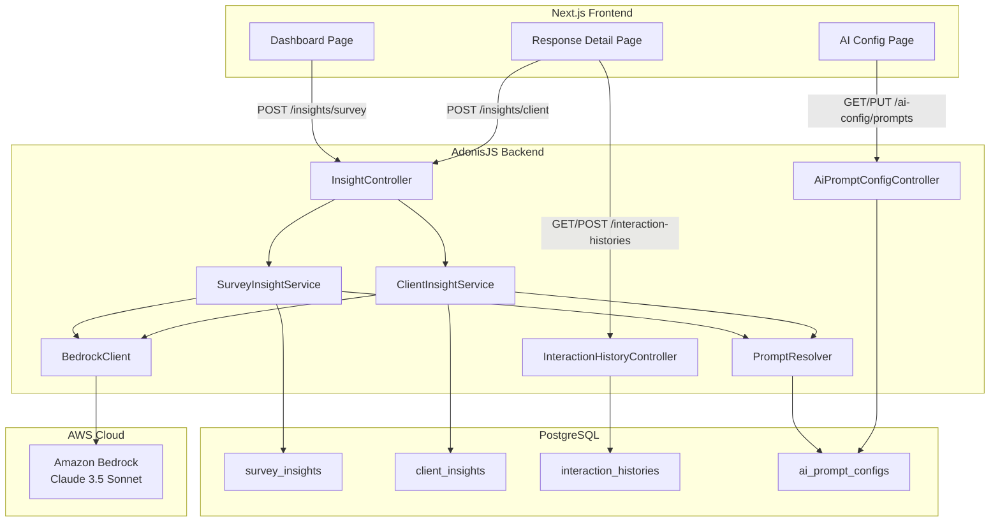
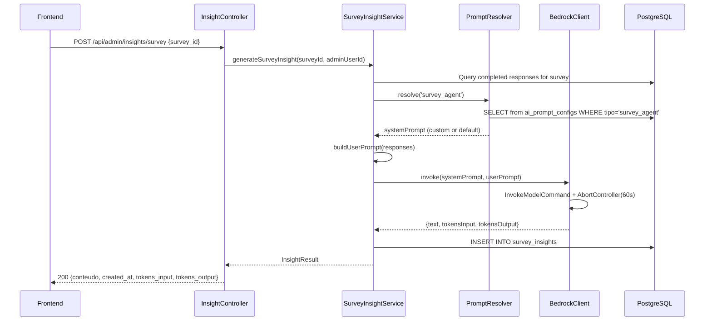
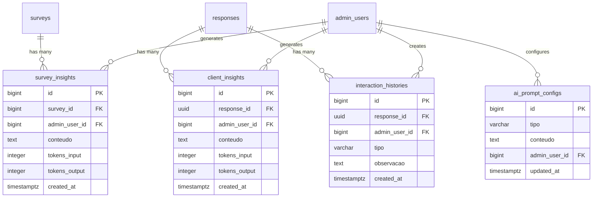

# Design Document: AI Agent Insights

## Overview

Este documento descreve o design técnico da feature **AI Agent Insights** para a plataforma BouCheck. A feature adiciona capacidade de análise inteligente via AWS Bedrock, fornecendo dois tipos de insights (agregado por survey e individual por cliente), histórico de interações comerciais e configuração de prompts dos agentes de IA.

### Decisões Arquiteturais Chave

1. **Append-only para insights**: Insights nunca são deletados ou atualizados; novos registros são inseridos e a consulta retorna sempre o mais recente (`ORDER BY created_at DESC LIMIT 1`).
2. **Reutilização do BedrockClient existente**: O mesmo módulo `app/support/bedrock_client.ts` é reutilizado, mantendo timeout via AbortController e formato Anthropic Messages API.
3. **Prompt resolution com fallback**: Prompts customizados são lidos do banco; se inexistentes, um prompt padrão hardcoded é utilizado.
4. **Histórico imutável**: Registros de interação comercial são somente-leitura após criação (sem endpoints PUT/DELETE).

## Architecture

### High-Level System Diagram



### Request Flow (Survey Insight)



## Components and Interfaces

### Backend Components

#### 1. InsightController (`app/controllers/admin/insight_controller.ts`)

Responsável pelos endpoints de geração e consulta de insights.

```typescript
// POST /api/admin/insights/survey
// GET  /api/admin/insights/survey/:surveyId
// POST /api/admin/insights/client
// GET  /api/admin/insights/client/:responseId
export default class InsightController {
  async generateSurvey({ request, response, auth }: HttpContext): Promise<void>
  async showSurvey({ params, response }: HttpContext): Promise<void>
  async generateClient({ request, response, auth }: HttpContext): Promise<void>
  async showClient({ params, response }: HttpContext): Promise<void>
}
```

#### 2. InteractionHistoryController (`app/controllers/admin/interaction_history_controller.ts`)

Gerencia o CRUD (somente Create + Read) do histórico de interações.

```typescript
// GET  /api/admin/responses/:responseId/interactions
// POST /api/admin/responses/:responseId/interactions
export default class InteractionHistoryController {
  async index({ params, request, response }: HttpContext): Promise<void>
  async store({ params, request, response, auth }: HttpContext): Promise<void>
}
```

#### 3. AiPromptConfigController (`app/controllers/admin/ai_prompt_config_controller.ts`)

Gerencia a configuração dos prompts de IA.

```typescript
// GET /api/admin/ai-config/prompts
// PUT /api/admin/ai-config/prompts
export default class AiPromptConfigController {
  async show({ response }: HttpContext): Promise<void>
  async update({ request, response, auth }: HttpContext): Promise<void>
}
```

#### 4. SurveyInsightService (`app/services/survey_insight_service.ts`)

Orquestra a geração de insights agregados de survey.

```typescript
export class SurveyInsightService {
  constructor(
    private bedrock: BedrockClient,
    private promptResolver: PromptResolver
  ) {}

  /**
   * Gera insight agregado para um survey.
   * 1. Busca todas as respostas completed do survey
   * 2. Resolve o system prompt (custom ou default)
   * 3. Constrói o user prompt com dados agregados
   * 4. Invoca Bedrock
   * 5. Persiste o insight
   */
  async generate(surveyId: number, adminUserId: number): Promise<SurveyInsightResult>

  /**
   * Retorna o insight mais recente para um survey, ou null.
   */
  async getLatest(surveyId: number): Promise<SurveyInsight | null>

  /**
   * Verifica se um survey é elegível para gerar insight
   * (tem ao menos 1 resposta completed).
   */
  async isEligible(surveyId: number): Promise<boolean>

  /**
   * Constrói o user prompt com dados agregados de todas as respostas.
   * Inclui: respostas quantitativas (opção + pontuação) e qualitativas (texto livre).
   */
  buildUserPrompt(responses: CompletedResponseData[]): string
}
```

#### 5. ClientInsightService (`app/services/client_insight_service.ts`)

Orquestra a geração de insights individuais por cliente.

```typescript
export class ClientInsightService {
  constructor(
    private bedrock: BedrockClient,
    private promptResolver: PromptResolver
  ) {}

  /**
   * Gera insight individual para uma resposta de cliente.
   * 1. Busca respostas do cliente (perguntas + opções + texto livre)
   * 2. Busca dados de identificação (nome, empresa, cargo, cidade)
   * 3. Busca histórico de interações
   * 4. Resolve o system prompt (custom ou default)
   * 5. Constrói user prompt com todos os dados
   * 6. Invoca Bedrock
   * 7. Persiste o insight
   */
  async generate(responseId: string, adminUserId: number): Promise<ClientInsightResult>

  /**
   * Retorna o insight mais recente para uma resposta, ou null.
   */
  async getLatest(responseId: string): Promise<ClientInsight | null>

  /**
   * Constrói o user prompt incluindo respostas, identificação e histórico.
   */
  buildUserPrompt(data: ClientPromptData): string
}
```

#### 6. PromptResolver (`app/services/prompt_resolver.ts`)

Resolve qual system prompt utilizar (customizado ou padrão).

```typescript
export type AgentType = 'survey_agent' | 'client_agent'

export class PromptResolver {
  /** Prompts padrão hardcoded para cada tipo de agente */
  static readonly DEFAULTS: Record<AgentType, string>

  /**
   * Retorna o prompt customizado se existir no banco,
   * senão retorna o prompt padrão para o tipo de agente.
   */
  async resolve(tipo: AgentType): Promise<string>
}
```

#### 7. InteractionHistoryService (`app/services/interaction_history_service.ts`)

Gerencia operações sobre o histórico de interações.

```typescript
export const INTERACTION_TYPES = [
  'enviou_orcamento',
  'fechou_negocio',
  'nao_respondeu_contato',
  'agendou_reuniao',
  'em_negociacao',
  'perdeu_para_concorrente',
  'cliente_nao_qualificado',
  'retornar_futuramente',
] as const

export type InteractionType = typeof INTERACTION_TYPES[number]

export class InteractionHistoryService {
  /**
   * Cria uma nova entrada de histórico (append-only, imutável).
   */
  async create(data: CreateInteractionData): Promise<InteractionHistory>

  /**
   * Lista histórico paginado por response_id, ordenado por created_at DESC.
   */
  async list(responseId: string, page: number, perPage?: number): Promise<PaginatedResult>

  /**
   * Retorna todos os registros de histórico para inclusão no prompt.
   */
  async getAllForPrompt(responseId: string): Promise<InteractionHistory[]>
}
```

### API Routes

Todos os endpoints ficam sob `/api/admin` com middleware `auth + ensureAdminActive`:

| Method | Path | Controller | Description |
|--------|------|------------|-------------|
| POST | `/api/admin/insights/survey` | InsightController.generateSurvey | Gera insight agregado |
| GET | `/api/admin/insights/survey/:surveyId` | InsightController.showSurvey | Retorna último insight do survey |
| POST | `/api/admin/insights/client` | InsightController.generateClient | Gera insight individual |
| GET | `/api/admin/insights/client/:responseId` | InsightController.showClient | Retorna último insight do cliente |
| GET | `/api/admin/responses/:responseId/interactions` | InteractionHistoryController.index | Lista histórico paginado |
| POST | `/api/admin/responses/:responseId/interactions` | InteractionHistoryController.store | Cria entrada de histórico |
| GET | `/api/admin/ai-config/prompts` | AiPromptConfigController.show | Retorna prompts configurados |
| PUT | `/api/admin/ai-config/prompts` | AiPromptConfigController.update | Atualiza prompts |

### Request/Response Shapes

```typescript
// POST /api/admin/insights/survey
interface GenerateSurveyInsightRequest {
  survey_id: number
}

interface InsightResponse {
  id: number
  conteudo: string
  tokens_input: number | null
  tokens_output: number | null
  created_at: string // ISO 8601
}

// POST /api/admin/insights/client
interface GenerateClientInsightRequest {
  response_id: string // UUID
}

// POST /api/admin/responses/:responseId/interactions
interface CreateInteractionRequest {
  tipo: InteractionType
  observacao?: string // max 500 chars
}

interface InteractionResponse {
  id: number
  tipo: string
  observacao: string | null
  admin_user_id: number
  created_at: string
}

// PUT /api/admin/ai-config/prompts
interface UpdatePromptsRequest {
  survey_agent_prompt?: string  // max 10000 chars
  client_agent_prompt?: string  // max 10000 chars
}

interface PromptsResponse {
  survey_agent: { conteudo: string | null; is_default: boolean }
  client_agent: { conteudo: string | null; is_default: boolean }
}
```

## Data Models

### Entity Relationship Diagram



### Model: SurveyInsight (`app/models/survey_insight.ts`)

```typescript
export default class SurveyInsight extends BaseModel {
  static table = 'survey_insights'

  @column({ isPrimary: true })
  declare id: number

  @column({ columnName: 'survey_id' })
  declare surveyId: number

  @column({ columnName: 'admin_user_id' })
  declare adminUserId: number

  @column()
  declare conteudo: string

  @column({ columnName: 'tokens_input' })
  declare tokensInput: number | null

  @column({ columnName: 'tokens_output' })
  declare tokensOutput: number | null

  @column.dateTime({ autoCreate: true, columnName: 'created_at' })
  declare createdAt: DateTime

  @belongsTo(() => Survey, { foreignKey: 'surveyId' })
  declare survey: BelongsTo<typeof Survey>

  @belongsTo(() => AdminUser, { foreignKey: 'adminUserId' })
  declare adminUser: BelongsTo<typeof AdminUser>
}
```

### Model: ClientInsight (`app/models/client_insight.ts`)

```typescript
export default class ClientInsight extends BaseModel {
  static table = 'client_insights'

  @column({ isPrimary: true })
  declare id: number

  @column({ columnName: 'response_id' })
  declare responseId: string

  @column({ columnName: 'admin_user_id' })
  declare adminUserId: number

  @column()
  declare conteudo: string

  @column({ columnName: 'tokens_input' })
  declare tokensInput: number | null

  @column({ columnName: 'tokens_output' })
  declare tokensOutput: number | null

  @column.dateTime({ autoCreate: true, columnName: 'created_at' })
  declare createdAt: DateTime

  @belongsTo(() => Response, { foreignKey: 'responseId' })
  declare response: BelongsTo<typeof Response>

  @belongsTo(() => AdminUser, { foreignKey: 'adminUserId' })
  declare adminUser: BelongsTo<typeof AdminUser>
}
```

### Model: InteractionHistory (`app/models/interaction_history.ts`)

```typescript
export default class InteractionHistory extends BaseModel {
  static table = 'interaction_histories'

  @column({ isPrimary: true })
  declare id: number

  @column({ columnName: 'response_id' })
  declare responseId: string

  @column({ columnName: 'admin_user_id' })
  declare adminUserId: number

  @column()
  declare tipo: InteractionType

  @column()
  declare observacao: string | null

  @column.dateTime({ autoCreate: true, columnName: 'created_at' })
  declare createdAt: DateTime

  @belongsTo(() => Response, { foreignKey: 'responseId' })
  declare response: BelongsTo<typeof Response>

  @belongsTo(() => AdminUser, { foreignKey: 'adminUserId' })
  declare adminUser: BelongsTo<typeof AdminUser>
}
```

### Model: AiPromptConfig (`app/models/ai_prompt_config.ts`)

```typescript
export default class AiPromptConfig extends BaseModel {
  static table = 'ai_prompt_configs'

  @column({ isPrimary: true })
  declare id: number

  @column()
  declare tipo: 'survey_agent' | 'client_agent'

  @column()
  declare conteudo: string

  @column({ columnName: 'admin_user_id' })
  declare adminUserId: number

  @column.dateTime({ autoUpdate: true, columnName: 'updated_at' })
  declare updatedAt: DateTime

  @belongsTo(() => AdminUser, { foreignKey: 'adminUserId' })
  declare adminUser: BelongsTo<typeof AdminUser>
}
```

### Database Migrations

#### Migration: `create_survey_insights`

```typescript
export default class extends BaseSchema {
  protected tableName = 'survey_insights'

  async up() {
    this.schema.createTable(this.tableName, (table) => {
      table.bigIncrements('id').primary()
      table.bigInteger('survey_id').notNullable()
        .references('id').inTable('surveys').onDelete('CASCADE')
      table.bigInteger('admin_user_id').notNullable()
        .references('id').inTable('admin_users').onDelete('CASCADE')
      table.text('conteudo').notNullable()
      table.integer('tokens_input').nullable()
      table.integer('tokens_output').nullable()
      table.timestamp('created_at', { useTz: true }).notNullable().defaultTo(this.now())

      table.index(['survey_id', 'created_at'], 'idx_survey_insights_survey_latest')
    })
  }

  async down() {
    this.schema.dropTable(this.tableName)
  }
}
```

#### Migration: `create_client_insights`

```typescript
export default class extends BaseSchema {
  protected tableName = 'client_insights'

  async up() {
    this.schema.createTable(this.tableName, (table) => {
      table.bigIncrements('id').primary()
      table.uuid('response_id').notNullable()
        .references('id').inTable('responses').onDelete('CASCADE')
      table.bigInteger('admin_user_id').notNullable()
        .references('id').inTable('admin_users').onDelete('CASCADE')
      table.text('conteudo').notNullable()
      table.integer('tokens_input').nullable()
      table.integer('tokens_output').nullable()
      table.timestamp('created_at', { useTz: true }).notNullable().defaultTo(this.now())

      table.index(['response_id', 'created_at'], 'idx_client_insights_response_latest')
    })
  }

  async down() {
    this.schema.dropTable(this.tableName)
  }
}
```

#### Migration: `create_interaction_histories`

```typescript
export default class extends BaseSchema {
  protected tableName = 'interaction_histories'

  async up() {
    this.schema.createTable(this.tableName, (table) => {
      table.bigIncrements('id').primary()
      table.uuid('response_id').notNullable()
        .references('id').inTable('responses').onDelete('CASCADE')
      table.bigInteger('admin_user_id').notNullable()
        .references('id').inTable('admin_users').onDelete('CASCADE')
      table.string('tipo', 50).notNullable()
      table.text('observacao').nullable()
      table.timestamp('created_at', { useTz: true }).notNullable().defaultTo(this.now())

      table.index(['response_id', 'created_at'], 'idx_interaction_histories_response_date')
    })
  }

  async down() {
    this.schema.dropTable(this.tableName)
  }
}
```

#### Migration: `create_ai_prompt_configs`

```typescript
export default class extends BaseSchema {
  protected tableName = 'ai_prompt_configs'

  async up() {
    this.schema.createTable(this.tableName, (table) => {
      table.bigIncrements('id').primary()
      table.string('tipo', 30).notNullable().unique()
      table.text('conteudo').notNullable()
      table.bigInteger('admin_user_id').notNullable()
        .references('id').inTable('admin_users').onDelete('CASCADE')
      table.timestamp('updated_at', { useTz: true }).notNullable().defaultTo(this.now())
    })
  }

  async down() {
    this.schema.dropTable(this.tableName)
  }
}
```

### Low-Level Design: Key Algorithms

#### Survey Prompt Builder Algorithm

```typescript
/**
 * Builds the user prompt for survey aggregate insight.
 * Includes only completed responses.
 *
 * Format:
 * ---
 * SURVEY: {nome} (Tipo: {categoria})
 * TOTAL RESPOSTAS COMPLETADAS: {count}
 *
 * === RESPOSTAS AGREGADAS ===
 *
 * PERGUNTA {n}: {texto}
 * - {opção_texto}: {count} respondentes ({pontuação} pts)
 * - Textos livres: "{texto1}", "{texto2}", ...
 *
 * === CHECKLIST MAIS SELECIONADOS ===
 * - {item}: {count}
 * ---
 */
function buildSurveyUserPrompt(
  survey: Survey,
  responses: CompletedResponseData[]
): string
```

#### Client Prompt Builder Algorithm

```typescript
/**
 * Builds the user prompt for individual client insight.
 * Includes: answers, identification, interaction history.
 *
 * Format:
 * ---
 * CLIENTE: {nome}
 * EMPRESA: {empresa}
 * CARGO: {cargo}
 * CIDADE: {cidade}
 *
 * === RESPOSTAS DO CLIENTE ===
 *
 * PERGUNTA: {texto}
 * RESPOSTA: {opção_texto} | Texto livre: "{texto_livre}"
 *
 * === HISTÓRICO DE INTERAÇÕES COMERCIAIS ===
 *
 * [{data}] {tipo}: {observacao}
 * ---
 */
function buildClientUserPrompt(data: ClientPromptData): string

interface ClientPromptData {
  response: Response  // com nome, empresa, cargo, cidade
  answers: Array<{ questionText: string; optionText: string | null; textoLivre: string | null }>
  interactions: InteractionHistory[]
}
```

#### Prompt Resolution Algorithm

```typescript
/**
 * Resolves the system prompt for a given agent type.
 * Priority: custom (from ai_prompt_configs) > default (hardcoded).
 *
 * Pseudocode:
 * 1. SELECT conteudo FROM ai_prompt_configs WHERE tipo = agentType
 * 2. IF found → return config.conteudo
 * 3. ELSE → return DEFAULTS[agentType]
 */
async function resolvePrompt(tipo: AgentType): Promise<string>
```

#### Latest Insight Retrieval

```typescript
/**
 * Gets the most recent insight for a given entity.
 * Uses ORDER BY created_at DESC LIMIT 1 pattern.
 *
 * This ensures the append-only strategy works:
 * - New insights are always INSERT (never UPDATE/DELETE)
 * - Query always returns the latest one
 * - Historical insights remain for auditing
 */
async function getLatestSurveyInsight(surveyId: number): Promise<SurveyInsight | null> {
  return SurveyInsight.query()
    .where('survey_id', surveyId)
    .orderBy('created_at', 'desc')
    .first()
}
```

### Validators

```typescript
// app/validators/insight_validators.ts
import vine from '@vinejs/vine'
import { INTERACTION_TYPES } from '#services/interaction_history_service'

export const generateSurveyInsightValidator = vine.compile(
  vine.object({
    survey_id: vine.number().positive(),
  })
)

export const generateClientInsightValidator = vine.compile(
  vine.object({
    response_id: vine.string().uuid(),
  })
)

export const createInteractionValidator = vine.compile(
  vine.object({
    tipo: vine.enum(INTERACTION_TYPES),
    observacao: vine.string().maxLength(500).optional(),
  })
)

export const updatePromptsValidator = vine.compile(
  vine.object({
    survey_agent_prompt: vine.string().maxLength(10000).optional(),
    client_agent_prompt: vine.string().maxLength(10000).optional(),
  })
)
```

## Correctness Properties

*A property is a characteristic or behavior that should hold true across all valid executions of a system—essentially, a formal statement about what the system should do. Properties serve as the bridge between human-readable specifications and machine-verifiable correctness guarantees.*

### Property 1: Survey prompt includes only completed responses

*For any* survey with a mix of responses in various statuses (started, completed, abandoned), the user prompt built by `buildSurveyUserPrompt` SHALL include data exclusively from responses with status "completed" and SHALL NOT contain any data from responses with other statuses.

**Validates: Requirements 1.2**

### Property 2: Client prompt includes all required data sections

*For any* response with associated answers, identification data (nome, empresa, cargo, cidade), and interaction history entries, the user prompt built by `buildClientUserPrompt` SHALL contain all answer texts, all non-null identification fields, and all interaction history records.

**Validates: Requirements 2.2, 3.5**

### Property 3: Latest survey insight retrieval

*For any* survey with N > 0 insight records (each with distinct `created_at` timestamps), calling `getLatest(surveyId)` SHALL always return the insight with the most recent `created_at`, and all N records SHALL remain in the database unchanged.

**Validates: Requirements 1.5, 1.6, 7.5**

### Property 4: Latest client insight retrieval

*For any* response with N > 0 client insight records (each with distinct `created_at` timestamps), calling `getLatest(responseId)` SHALL always return the insight with the most recent `created_at`, and all N records SHALL remain in the database unchanged.

**Validates: Requirements 2.5, 2.6, 7.6**

### Property 5: Survey eligibility requires completed responses

*For any* survey, `isEligible(surveyId)` SHALL return true if and only if the survey has at least one response with status "completed". A survey with zero completed responses SHALL return false regardless of how many responses exist in other statuses.

**Validates: Requirements 1.7**

### Property 6: Interaction entry validation

*For any* string value for `tipo`, the interaction creation SHALL succeed if and only if `tipo` is one of the 8 predefined interaction types. Additionally, *for any* `observacao` string, creation SHALL succeed if its length is ≤ 500 characters and SHALL be rejected if its length exceeds 500 characters.

**Validates: Requirements 3.2, 3.3**

### Property 7: Interaction history ordering and pagination

*For any* set of interaction history entries associated with a response_id, the list endpoint SHALL return entries ordered by `created_at` descending, and each page SHALL contain at most 20 entries.

**Validates: Requirements 3.4**

### Property 8: Prompt resolution uses custom when available, default otherwise

*For any* agent type ('survey_agent' or 'client_agent'), if a custom prompt config record exists for that type, `resolve(tipo)` SHALL return the custom `conteudo`. If no custom record exists, `resolve(tipo)` SHALL return the hardcoded default prompt for that agent type.

**Validates: Requirements 4.6, 4.7**

### Property 9: Prompt length validation

*For any* string with length ≤ 10,000 characters, saving as a prompt config SHALL succeed. *For any* string with length > 10,000 characters, the save operation SHALL be rejected with a validation error.

**Validates: Requirements 4.1, 4.4**

### Property 10: Interaction history immutability

*For any* existing interaction history record, the system SHALL NOT expose any mechanism to modify or delete it. The only mutation allowed on the `interaction_histories` table is INSERT.

**Validates: Requirements 3.7**

### Property 11: Foreign key violation graceful handling

*For any* non-existent `survey_id`, `response_id`, or `admin_user_id` value, attempting to create an insight or interaction history record SHALL fail with an appropriate error message indicating the referenced resource was not found, and no partial record SHALL be persisted.

**Validates: Requirements 7.7**

## Error Handling

### Error Classification and HTTP Responses

| Error Type | HTTP Status | Scenario |
|-----------|------------|----------|
| `BedrockTimeoutError` | 504 | Bedrock não responde em 60s |
| `BedrockInvocationError` | 502 | Erro de SDK/rede com Bedrock |
| Validation Error (VineJS) | 422 | Payload inválido (tipo fora do enum, observação >500 chars, prompt >10000 chars) |
| Not Found | 404 | Survey/Response/Resource não encontrado |
| Auth Error | 401 | Token JWT ausente, inválido, expirado ou admin inativo |
| Foreign Key Violation | 422 | Referência a recurso inexistente |
| Internal Server Error | 500 | Erros inesperados |

### Error Response Format

```typescript
// Formato padrão de erro (consistente com o restante da API)
interface ErrorResponse {
  error: string        // Mensagem amigável ao usuário
  details?: string     // Detalhes técnicos (apenas em dev/staging)
}
```

### Error Handling Strategy

1. **Bedrock errors**: Capturados no controller, logados via `logger.error`, retornados com mensagem amigável. Insight anterior preservado.
2. **Validation errors**: VineJS lança automaticamente 422 com detalhes dos campos.
3. **FK violations**: Capturadas no service layer via try/catch em DB operations, traduzidas para 422/404.
4. **Timeout client-side**: Frontend implementa timeout de 60s no fetch com `AbortController` e exibe mensagem específica.

## Testing Strategy

### Dual Testing Approach

Esta feature combina:
- **Property-based tests** (PBT): Para validar propriedades universais dos componentes puros (prompt builders, resolvers, validators, retrieval logic)
- **Unit tests (example-based)**: Para cenários específicos de integração, error handling e edge cases
- **Integration tests**: Para validar fluxo end-to-end com banco de dados

### Property-Based Testing

**Library**: `fast-check` (já disponível ou a ser adicionada ao projeto)

**Configuração**: Mínimo 100 iterações por propriedade.

**Tag format**: `Feature: ai-agent-insights, Property {N}: {description}`

Cada propriedade do design document será implementada como um único property-based test:

| Property | Componente Testado | Estratégia de Geração |
|----------|-------------------|----------------------|
| 1 | SurveyInsightService.buildUserPrompt | Gerar arrays de responses com status aleatórios |
| 2 | ClientInsightService.buildUserPrompt | Gerar dados de cliente com respostas e histórico aleatórios |
| 3 | SurveyInsightService.getLatest | Inserir N insights com timestamps crescentes |
| 4 | ClientInsightService.getLatest | Inserir N insights com timestamps crescentes |
| 5 | SurveyInsightService.isEligible | Gerar surveys com mix de response statuses |
| 6 | InteractionHistoryService (validator) | Gerar strings aleatórias para tipo e observação |
| 7 | InteractionHistoryService.list | Gerar entries com timestamps aleatórios |
| 8 | PromptResolver.resolve | Gerar configurações aleatórias (presentes ou ausentes) |
| 9 | Validator (updatePromptsValidator) | Gerar strings com comprimentos variados |
| 10 | API surface (no PUT/DELETE routes) | Verificar que endpoints de mutação não existem |
| 11 | Service layer FK handling | Gerar IDs inexistentes aleatórios |

### Unit Tests (Example-Based)

- Error handling: Bedrock timeout → 504, Bedrock invocation error → 502
- Anonymized response → insight generation blocked
- Empty survey (no completed responses) → 400/422
- Successful generation flow with mocked Bedrock
- Prompt config CRUD operations
- Frontend components: loading states, error displays, button visibility

### Integration Tests

- Full flow: generate survey insight → persist → retrieve latest
- Full flow: generate client insight with history → persist → retrieve
- Auth middleware: unauthenticated → 401, inactive admin → 401
- Route registration: verify middleware chain includes auth + ensureAdminActive
