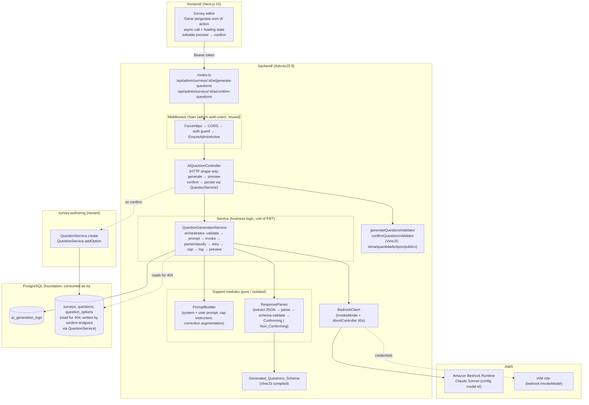
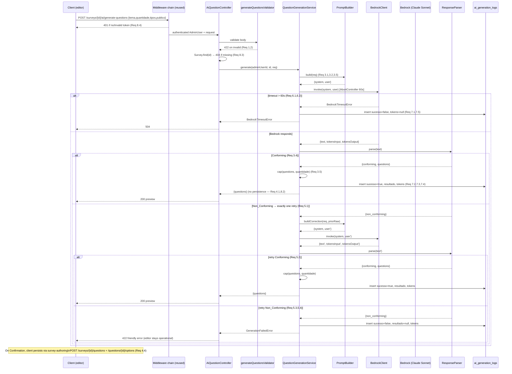

# Design Document

## Overview

This design specifies **ai-question-generation** (spec 4 of 7 for BouCheck): the administrative capability to generate an initial set of survey questions with a generative AI model (Amazon Bedrock, Claude Sonnet) from a theme supplied by the administrator, presented for editable review and never persisted by this feature. It realizes master requirement **REQ-ADM-004** (AI-assisted question generation), the section 9 admin API contract `POST /api/admin/surveys/{id}/ai/generate-questions` (preview, does not persist), and the section 11 risk #2 cost-mitigation controls that apply to generation (the 20-question cap and token logging that feeds cost auditing).

The whole surface of this spec is one endpoint. What makes it non-trivial — and worth a careful design — is everything behind that endpoint: bounding and validating the request, assembling a prompt that forces machine-parseable output, defensively parsing a large-language-model response that is *untrusted text*, classifying it against a strict schema, correcting it exactly once when it is malformed, capping the result, auditing every attempt for cost, and doing all of that without ever writing a row of survey structure.

### Consumed specs (reused as-is, not redefined here)

- **foundation-data-model** (spec 1 of 7): the `ai_generation_logs` table and its `AiGenerationLog` Lucid model already exist (columns `admin_user_id`, `survey_id`, `prompt`, `resultado` JSONB, `tokens_input` nullable, `tokens_output` nullable, `sucesso`, `created_at`). The `questions` and `question_options` tables/models and the `QuestionTipo` union (`escolha_unica | multipla_escolha | aberta`) also exist. This design **queries only through the ORM_Model_Layer** and adds **no migration and no schema change**.
- **admin-auth-users** (spec 2 of 7): the endpoint is an authenticated admin route under `/api/admin`. The middleware chain (`ForceHttps → CORS → auth guard → EnsureAdminActive`), the **controller → service → validator** layering, the VineJS-per-endpoint convention, and the typed-domain-error → HTTP-status exception handler are **reused as-is and not redefined here**. The authenticated `AdminUser` (for `admin_user_id`) is resolved by the reused auth guard.
- **survey-authoring** (spec 3 of 7): persistence of confirmed questions and answer options. Once an administrator edits and explicitly confirms the previewed questions, they are saved through survey-authoring's existing endpoints (`POST /api/admin/surveys/{id}/questions` and `POST /api/admin/questions/{id}/options`) and their `QuestionService` rules/validators. Those paths are **referenced, not reimplemented**; this spec's endpoint is strictly preview-only.

### Scope boundaries

In scope: the preview generation pipeline — request validation, Bedrock invocation with timeout, prompt construction, response parsing and schema classification, one correction retry, quantity cap, audit logging, and the preview payload.

Out of scope: persistence of confirmed questions/options (survey-authoring owns it — this design only references those endpoints); the report-generation AI (`usar_ia_no_relatorio`, a reporting-spec concern); the authentication mechanism itself (admin-auth-users); the public respondent flow, response management, and dashboards.

### Key design decisions

| Decision | Choice | Rationale |
|---|---|---|
| Layering | Reuse the admin-auth-users / survey-authoring **controller → service → validator** split verbatim | `AiQuestionController` shapes HTTP only; `QuestionGenerationService` owns all rules and is the unit of property testing; the VineJS request validator owns input shape. Consistency across specs. |
| Preview-only endpoint | The generate endpoint **never persists**; confirmation reuses survey-authoring's create endpoints | REQ-ADM-004.3 mandates explicit review before save. Keeping generation side-effect-free (except the audit log) makes the no-persistence invariant structural, not incidental. |
| Bedrock SDK | AWS SDK v3 `@aws-sdk/client-bedrock-runtime` `InvokeModel`, wrapped in a thin injectable `BedrockClient` | The wrapper isolates the one impure collaborator so the service is fully mockable for property testing; the account credential comes from the task IAM role, never static keys. |
| Model id | **Config-driven** (`BEDROCK_MODEL_ID`), defaulting to the latest Claude Sonnet available in the account | REQ-ADM-004.2 says "latest Sonnet available"; a config value lets ops point at a new Sonnet (or a cross-region inference profile) without a code change. |
| Region | Prefer `sa-east-1` for data residency; fall back to `us-east-1` where Sonnet is not yet offered in São Paulo | Foundation runs in `sa-east-1`, but Bedrock Claude model availability there is partial. `BEDROCK_REGION` is config so we can route Bedrock traffic to `us-east-1` while the rest of the stack stays in `sa-east-1`. Documented as a deployment concern. |
| Timeout | 60 s via `AbortController`; expiry → **504** | REQ-ADM-004.5. An abort signal cancels the in-flight `InvokeModel` so the request path is bounded regardless of Bedrock latency. |
| Untrusted response | Treat the model's text as untrusted: extract-then-parse-then-schema-validate before use | LLM output is not guaranteed JSON. A dedicated parse+`Generated_Questions_Schema` validation stage classifies Conforming vs Non_Conforming and drives the retry. |
| Correction retry | **Exactly one** augmented retry on non-conforming; second failure → **422** friendly error | REQ-ADM-004.4. A single retry balances resilience against cost (risk #2); the editor is never left broken. |
| Quantity cap | `quantidade ≤ 20` at validation **and** the parsed result is truncated to `quantidade` | REQ-ADM-004.1 / risk #2. Defense in depth: even a well-behaved model that over-produces cannot exceed the requested count in the preview. |
| Schema validation | A compiled **VineJS** schema (`Generated_Questions_Schema`), the same library the other specs use | One validator, reused for both the first response and the retry; conformance is a single, testable predicate. |
| Audit | One `ai_generation_logs` row per attempt, on **both** success and failure | REQ-ADM-004.6 / risk #2 cost auditing. `sucesso`, `prompt`, `admin_user_id`, `survey_id` always; tokens when reported, else null. |

## Architecture



### Layering (reused from admin-auth-users / survey-authoring)

- **Controller** (`AiQuestionController`) validates input via the VineJS request validator, resolves the authenticated `AdminUser` and the `{id}` survey, invokes exactly one service method, and shapes the HTTP response. No business rules.
- **Service** (`QuestionGenerationService`) owns the whole generation pipeline and is the unit of property testing. Its only side-effecting collaborators are injected/mockable: the `BedrockClient`, the `AiGenerationLog` model (repository), and the `Survey`/`Question` models (read-only, for existence).
- **Support modules** (`PromptBuilder`, `ResponseParser`) are pure functions — no I/O — property-tested in isolation.
- **Validators** are VineJS compiled schemas: `generateQuestionsValidator` for the request, `Generated_Questions_Schema` for the model output. Request failures surface as HTTP 422 with offending fields via the reused exception handler.

### Directory additions (within `backend/`)

```
backend/app/
├── controllers/
│   └── ai_question_controller.ts        # POST .../ai/generate-questions + POST .../ai/confirm-questions
├── services/
│   └── question_generation_service.ts   # orchestration + audit (unit of PBT)
├── support/
│   ├── bedrock_client.ts                # AWS SDK InvokeModel + 60s AbortController
│   ├── prompt_builder.ts                # structured prompt + correction augmentation (pure)
│   └── response_parser.ts              # extract/parse/classify against schema (pure)
└── validators/
    └── ai_question_validators.ts        # generateQuestionsValidator + confirmQuestionsValidator + Generated_Questions_Schema
```

```
backend/config/
└── bedrock.ts                           # model id, region, timeout (from SSM/Secrets/env)
```

## Components and Interfaces

### Request validator (VineJS)

```ts
// validators/ai_question_validators.ts
import vine from '@vinejs/vine'

const ALLOWED_TYPES = ['escolha_unica', 'multipla_escolha', 'aberta'] as const

// Req 1.2–1.5, 2.1–2.3
export const generateQuestionsValidator = vine.compile(
  vine.object({
    tema: vine.string().trim().minLength(1),                 // Req 1.2, 1.5 (non-empty free text)
    quantidade: vine.number().withoutDecimals().min(1).max(20), // Req 2.1–2.3 (integer 1..20)
    tipos_permitidos: vine.array(vine.enum(ALLOWED_TYPES))   // Req 1.3, 1.4 (set of Allowed_Type)
      .minLength(1).distinct(),
    publico_alvo: vine.string().trim().minLength(1),          // Req 1.2 (free text)
  })
)

export type GenerationRequest = {
  tema: string
  quantidade: number
  tipos_permitidos: Array<(typeof ALLOWED_TYPES)[number]>
  publico_alvo: string
}
```

Notes:
- `withoutDecimals()` rejects non-integer `quantidade` with 422 (Req 2.3); `min(1).max(20)` enforces the bounded range with a message that states "between 1 and 20 questions may be generated per request" (Req 2.2).
- `tema` and `publico_alvo` are accepted as arbitrary free text; only emptiness/whitespace is rejected (Req 1.2, 1.5). `.trim()` makes an all-whitespace `tema` collapse to length 0 and fail `minLength(1)`.
- `tipos_permitidos` is a set of enum members; any member outside the three Allowed_Types fails the `vine.enum` rule with 422 (Req 1.4). `.distinct()` normalizes it to a true set.

### Generated_Questions_Schema (VineJS, model-output validation)

```ts
// validators/ai_question_validators.ts (continued) — Req 3.3
export const Generated_Questions_Schema = vine.compile(
  vine.array(
    vine.object({
      texto: vine.string().minLength(1),
      tipo: vine.enum(ALLOWED_TYPES),
      obrigatoria: vine.boolean(),
      opcoes: vine.array(
        vine.object({
          texto: vine.string().minLength(1),
          pontuacao: vine.number(),
        })
      ),
    })
  )
)

export type GeneratedQuestion = {
  texto: string
  tipo: (typeof ALLOWED_TYPES)[number]
  obrigatoria: boolean
  opcoes: Array<{ texto: string; pontuacao: number }>
}
```

This is the exact `Generated_Questions_Schema` from the requirements glossary: an array of `{ texto, tipo, obrigatoria, opcoes:[{ texto, pontuacao }] }`. A response is **Conforming** iff `ResponseParser` can extract a JSON value from it and that value passes this schema; otherwise **Non_Conforming** (Req 3.3, 3.4).

### BedrockClient (support/bedrock_client.ts)

```ts
import { BedrockRuntimeClient, InvokeModelCommand } from '@aws-sdk/client-bedrock-runtime'

export interface BedrockInvokeResult {
  text: string                       // the model's raw completion text (untrusted)
  tokensInput: number | null         // usage.input_tokens when reported (Req 7.2/7.3)
  tokensOutput: number | null        // usage.output_tokens when reported
}

export class BedrockTimeoutError extends Error {}   // → 504 (Req 6.2)
export class BedrockInvocationError extends Error {} // → surfaced by service, logged sucesso=false

export class BedrockClient {
  constructor(
    private cfg: { modelId: string; region: string; timeoutMs: number },
    private client = new BedrockRuntimeClient({ region: cfg.region }) // creds via IAM role
  ) {}

  // Applies a 60s AbortController; aborts the in-flight request on expiry (Req 6.1, 6.2)
  async invoke(system: string, user: string): Promise<BedrockInvokeResult>
}
```

- **Credentials (REQ-NFR / IAM):** the SDK default credential provider resolves the task/instance **IAM role**; no static keys are read or logged. The role is granted `bedrock:InvokeModel` on the configured model ARN only.
- **Model id / region (config-driven):** `cfg.modelId` (`BEDROCK_MODEL_ID`) and `cfg.region` (`BEDROCK_REGION`) come from `config/bedrock.ts`, sourced from SSM/Secrets/env at boot (consistent with the foundation's private-by-default posture). Default region `sa-east-1`; where the target Sonnet is not offered in São Paulo, ops sets `us-east-1` (see Bedrock availability note below).
- **Request body** targets the Anthropic Messages API on Bedrock (`anthropic_version`, `max_tokens`, `system`, `messages`), and the response body is decoded to `{ text, usage }`. `usage.input_tokens` / `usage.output_tokens` map to `tokensInput` / `tokensOutput`, left `null` when the payload omits usage (Req 7.2, 7.3).
- **Timeout (Req 6.1, 6.2):** `invoke` starts an `AbortController` with `setTimeout(timeoutMs = 60000)`; the abort signal is passed to `InvokeModelCommand`. On abort it throws `BedrockTimeoutError`, which the service surfaces as 504.

#### Bedrock availability note (documented deployment concern)

Amazon Bedrock does not offer every Claude model in every region. The BouCheck foundation is provisioned in **`sa-east-1` (São Paulo)** for data residency, but Claude Sonnet availability in `sa-east-1` is partial and lags `us-east-1`. Two supported deployment postures, selected by config, with no code change:

1. **`sa-east-1` direct** — when the desired Sonnet model id is listed as available in São Paulo. Preferred for data residency; the generation prompt carries only the admin-supplied `tema`/`publico_alvo` (no respondent PII).
2. **`us-east-1` (or a cross-region inference profile)** — set `BEDROCK_REGION=us-east-1` and `BEDROCK_MODEL_ID` to the Sonnet model/inference-profile id available there, while RDS, S3, and SQS remain in `sa-east-1`. This is acceptable because the prompt contains no personal data of respondents (only the administrator's theme and target-audience text). Operators must confirm the model id/region pairing in the account before deploy.

### PromptBuilder (support/prompt_builder.ts)

```ts
export interface PromptPair { system: string; user: string }

export class PromptBuilder {
  // First attempt (Req 3.1, 3.2, 3.5)
  static build(req: GenerationRequest): PromptPair
  // Correction retry: same inputs, augmented with a correction instruction (Req 5.1)
  static buildCorrection(req: GenerationRequest, priorRaw: string): PromptPair
}
```

#### Exact Structured Prompt Template

The prompt is deterministic given the request (a pure function of `GenerationRequest`). Below is the exact template used by `PromptBuilder.build`:

**System prompt:**

```text
Você é um gerador especializado de perguntas para questionários de diagnóstico em pt-BR.

REGRAS OBRIGATÓRIAS DE FORMATO:
1. Responda EXCLUSIVAMENTE com um array JSON válido. Nenhum texto, explicação, saudação, markdown ou commentary fora do JSON é permitido.
2. O array JSON deve seguir EXATAMENTE este schema:
[
  {
    "texto": "string (não vazio, texto da pergunta)",
    "tipo": "escolha_unica" | "multipla_escolha" | "aberta",
    "obrigatoria": true | false,
    "opcoes": [
      { "texto": "string (não vazio, texto da opção)", "pontuacao": number }
    ]
  }
]
3. Para perguntas de tipo "aberta", o campo "opcoes" DEVE ser um array vazio [].
4. Para perguntas de tipo "escolha_unica" ou "multipla_escolha", o campo "opcoes" DEVE conter entre 2 e 10 objetos, cada um com "texto" (string não vazia) e "pontuacao" (número).
5. Use SOMENTE os tipos de pergunta listados em "tipos_permitidos" abaixo.
6. Gere EXATAMENTE a quantidade de perguntas indicada em "quantidade" abaixo.
7. NÃO inclua blocos de código (```), comentários, ou qualquer caractere fora do array JSON.
```

**User prompt:**

```text
Gere perguntas de diagnóstico com base nas seguintes especificações:

Tema/Contexto: ${req.tema}
Público-alvo: ${req.publico_alvo}
Quantidade de perguntas: ${req.quantidade}
Tipos permitidos: ${req.tipos_permitidos.join(', ')}

Responda APENAS com o array JSON. Nenhuma outra saída.
```

#### Correction Retry Prompt Template

`buildCorrection` reuses the same system and user prompts, and **prepends** an additional correction instruction to the user message:

```text
ATENÇÃO: Sua resposta anterior NÃO era um JSON válido ou não seguiu o schema exigido.
Corrija sua resposta e retorne APENAS o array JSON no formato especificado.
Sua resposta anterior (inválida):
---
${priorRaw.slice(0, 500)}
---

${originalUserPrompt}
```

The correction prompt retains the full original Generation_Request inputs and the schema definition so the model can produce a correct response (Req 6.2). `priorRaw` is truncated to 500 characters to stay within token budgets.

The prompt is *deterministic given the request* (a pure function of `GenerationRequest`), which lets us property-test that it always carries the four inputs and both constraints (schema + cap).

### ResponseParser (support/response_parser.ts)

```ts
export type ParseOutcome =
  | { kind: 'conforming'; questions: GeneratedQuestion[] }   // Req 3.4
  | { kind: 'non_conforming'; reason: string }               // Req 5

export class ResponseParser {
  // Extract a JSON value from raw model text (strip fences/prose), parse, then
  // validate against Generated_Questions_Schema. Classify accordingly.
  static parse(raw: string): ParseOutcome
}
```

`parse` is pure and defensive:
1. **Extract** — trim, strip any ```` ```json ```` / ```` ``` ```` fences, and if surrounding prose exists, slice from the first `[` to its matching last `]`. This tolerates a model that wraps JSON in commentary despite the instruction.
2. **Parse** — `JSON.parse` the extracted substring; a throw → `non_conforming`.
3. **Schema-validate** — run `Generated_Questions_Schema`; failure → `non_conforming`; success → `conforming` with the typed `questions`.

Classification is a single predicate reused for the first response and the retry, so "Conforming iff parses-and-matches" is one property.

### QuestionGenerationService (services/question_generation_service.ts)

```ts
export interface GenerationPreview {
  questions: GeneratedQuestion[]   // capped to quantidade (Req 3.5)
}

export class QuestionGenerationService {
  constructor(
    private bedrock: BedrockClient,
    private prompts = PromptBuilder,
    private parser = ResponseParser
    // AiGenerationLog + Survey models used via the ORM layer
  ) {}

  // Orchestrates the full pipeline. Never persists a question/option.
  // surveyId is assumed to exist (controller does the 404 check first).
  async generate(
    adminUserId: number,
    surveyId: number,
    req: GenerationRequest
  ): Promise<GenerationPreview>
}
```

**`generate` algorithm:**

1. `prompt = PromptBuilder.build(req)`; keep `promptText` (the serialized system+user) for the audit `prompt` column (Req 7.1).
2. `first = await bedrock.invoke(prompt.system, prompt.user)` (Req 3.1). A `BedrockTimeoutError` propagates (controller → 504, Req 6.2); before rethrowing, the service writes a failure log (`sucesso=false`, tokens from the aborted call are null).
3. `outcome = parser.parse(first.text)`.
   - **Conforming** → `questions = cap(outcome.questions, req.quantidade)`; write success log (`sucesso=true`, `resultado=questions`, tokens from `first`); return `{ questions }` (Req 3.4, 4.1, 7.4).
   - **Non_Conforming** → issue **exactly one** correction retry (Req 5.1):
     - `correction = PromptBuilder.buildCorrection(req, first.text)`.
     - `second = await bedrock.invoke(correction.system, correction.user)`.
     - `retryOutcome = parser.parse(second.text)`.
       - **Conforming** → `cap(...)`; success log (tokens from `second`); return preview (Req 5.2).
       - **Non_Conforming** → write failure log (`sucesso=false`, `resultado` = null/diagnostic, tokens from `second`); throw `GenerationFailedError` (controller → 422 friendly message, Req 5.3, 5.4).
4. `cap(qs, n)` returns `qs.slice(0, n)` — the parsed result is truncated to `quantidade` so the preview can never exceed the requested count even if the model over-produces (Req 3.5, risk #2).

**No persistence:** `generate` touches only `ai_generation_logs`. It never inserts into `questions` or `question_options`. Persisting confirmed questions is the frontend's job on Confirmation, via survey-authoring's create endpoints (Req 4.1, 4.3, 4.4, 8.2).

**Token capture (Req 7.2, 7.3):** the log's `tokens_input`/`tokens_output` are taken from whichever invocation produced the logged outcome; when the Bedrock payload omits usage, both are recorded as `null`.

**Audit on every path (Req 7.1, 7.4, 7.5):** success, second-retry failure, and timeout all write exactly one `ai_generation_logs` row with `admin_user_id`, `survey_id`, `prompt`, `sucesso`, and (nullable) tokens; `resultado` holds the generated questions only on success.

### Confirmation path (Persist_Endpoint — POST /api/admin/surveys/{id}/ai/confirm-questions)

This spec **implements the confirm endpoint** as a thin orchestrator that delegates persistence to survey-authoring's `QuestionService`. When the administrator finishes editing the preview and confirms:

1. The **frontend** calls `POST /api/admin/surveys/{id}/ai/confirm-questions` with the final edited array of questions.
2. The controller validates the body, checks survey existence (404 if missing), and iterates the confirmed questions.
3. For each question, it calls `QuestionService.create` (survey-authoring) with the question fields and then `QuestionService.addOption` for each option — delegating all business rules (option count 2–10, versionamento gate, deduplication) to that spec.
4. Returns 201 with the count of created questions. An empty array confirmation returns 201 with `created_count: 0`.

The generate endpoint returns a preview payload shaped so the client can populate the confirm call directly. No manual API chaining to `POST /surveys/{id}/questions` is required — the confirm endpoint encapsulates that delegation.

## Data Models

This spec **adds no tables and no columns**. It writes to the foundation `ai_generation_logs` table and reads `surveys` (for the 404 existence check). `questions`/`question_options` are read-only here and written only through survey-authoring on Confirmation.

### ai_generation_logs (foundation, consumed as-is)

| Column | Type | Written by this spec | Notes |
|---|---|---|---|
| `admin_user_id` | bigint FK → admin_users | yes | the requesting Authenticated_Admin (Req 7.1) |
| `survey_id` | bigint FK → surveys (nullable) | yes | the `{id}` path survey (Req 7.1) |
| `prompt` | text | yes | the serialized Structured_Prompt sent (Req 7.1) |
| `resultado` | jsonb (nullable) | yes | the Generated_Questions on success; null on failure (Req 7.4) |
| `tokens_input` | integer (nullable) | yes | from `usage.input_tokens`, else null (Req 7.2, 7.3) |
| `tokens_output` | integer (nullable) | yes | from `usage.output_tokens`, else null (Req 7.2, 7.3) |
| `sucesso` | boolean | yes | true iff a Conforming_Response was obtained (Req 7.4, 7.5) |
| `created_at` | timestamptz | (default now) | attempt time |

`AiGenerationLog` uses the same `prepare`/`consume` JSONB pattern as the other foundation models for `resultado`.

### In-memory types (this spec)

```ts
// GenerationRequest — validated request (see validator)
// GeneratedQuestion — a single previewed question (see schema)
// GenerationPreview  — { questions: GeneratedQuestion[] } capped to quantidade
// BedrockInvokeResult — { text, tokensInput, tokensOutput }
```

These are transient shapes for the request/response pipeline; none is persisted by this spec.

## API Endpoints

Both endpoints sit under `/api/admin`, behind the reused middleware chain (`ForceHttps → CORS → auth guard → EnsureAdminActive`). Any request without a valid access token is rejected by the auth guard from admin-auth-users (Req 8.4). Request-validation failures return 422 with offending fields via the reused exception handler.

| Method | Path | Purpose | Success | Failure |
|---|---|---|---|---|
| POST | `/api/admin/surveys/{id}/ai/generate-questions` | Generate questions for **preview only** (no persistence) | 200 | 401 (no/invalid token), 404 (survey missing), 422 (invalid request or unrecoverable AI output), 504 (Bedrock timeout) |
| POST | `/api/admin/surveys/{id}/ai/confirm-questions` | Persist confirmed questions through survey-authoring | 201 | 401 (no/invalid token), 404 (survey missing), 422 (invalid body) |

### Request / response shapes

**POST `/api/admin/surveys/{id}/ai/generate-questions`**

```jsonc
// request
{
  "tema": "Maturidade em segurança de nuvem",
  "quantidade": 5,
  "tipos_permitidos": ["escolha_unica", "multipla_escolha"],
  "publico_alvo": "Gestores de TI de médias empresas"
}

// 200 — preview payload; nothing persisted (Req 4.1, 8.2)
{
  "questions": [
    {
      "texto": "Sua organização possui uma política formal de segurança em nuvem?",
      "tipo": "escolha_unica",
      "obrigatoria": true,
      "opcoes": [
        { "texto": "Sim, documentada e revisada", "pontuacao": 10 },
        { "texto": "Sim, mas informal", "pontuacao": 5 },
        { "texto": "Não", "pontuacao": 0 }
      ]
    }
    // ... up to `quantidade` questions
  ]
}

// 422 — invalid request (Req 1.4, 1.5, 2.2, 2.3)
{ "errors": [{ "field": "quantidade", "rule": "max", "message": "between 1 and 20 questions may be generated per request" }] }

// 422 — AI output could not be generated after one correction retry (Req 5.3)
{ "error": "Não foi possível gerar as perguntas. Tente novamente ou ajuste o tema." }

// 404 — survey {id} does not exist (Req 8.3)
{ "error": "Survey not found" }

// 504 — Bedrock did not respond within 60s (Req 6.2)
{ "error": "A geração excedeu o tempo limite. Tente novamente." }

// 401 — handled by the reused auth guard (Req 8.4)
```

### POST `/api/admin/surveys/{id}/ai/confirm-questions`

```jsonc
// request — the administrator-confirmed questions after preview/edit (Req 5.5, 9.3, 9.4)
{
  "questions": [
    {
      "texto": "Sua organização possui uma política formal de segurança em nuvem?",
      "tipo": "escolha_unica",
      "obrigatoria": true,
      "opcoes": [
        { "texto": "Sim, documentada e revisada", "pontuacao": 10 },
        { "texto": "Sim, mas informal", "pontuacao": 5 },
        { "texto": "Não", "pontuacao": 0 }
      ]
    }
  ]
}

// 201 — questions persisted through survey-authoring QuestionService (Req 5.5)
{
  "message": "Perguntas confirmadas e salvas com sucesso.",
  "created_count": 1
}

// 201 — empty list confirmation, no-op (Req 5.6)
{
  "message": "Nenhuma pergunta para salvar.",
  "created_count": 0
}

// 422 — invalid body (question fails survey-authoring validation rules)
{ "errors": [{ "field": "questions[0].opcoes", "rule": "minLength", "message": "Perguntas de escolha devem ter entre 2 e 10 opções" }] }

// 404 — survey {id} does not exist (Req 9.5)
{ "error": "Survey not found" }

// 401 — handled by the reused auth guard (Req 9.6)
```

### Confirm endpoint responsibilities (`AiQuestionController.confirm`)

1. Validate the body (array of `GeneratedQuestion`, may be empty).
2. Load `Survey.find(id)`; if absent → 404 (Req 9.5).
3. Resolve `adminUserId` from the authenticated `auth.user`.
4. If `questions` is empty → return 201 with `created_count: 0` (Req 5.6).
5. For each confirmed question, call `QuestionService.create` (survey-authoring) with the survey id, passing `texto`, `tipo`, `obrigatoria`, `ordem` (sequential from current max), and `peso` (default 1). For each option in `opcoes`, call `QuestionService.addOption` with `texto` and `pontuacao`. This delegates all validation (option count, versionamento gate) to the survey-authoring spec.
6. Return 201 with the count of created questions.

### Controller responsibilities (`AiQuestionController`)

1. Validate the body with `generateQuestionsValidator` → 422 on failure (Req 1, 2).
2. Load `Survey.find(id)`; if absent → 404 (Req 8.3). (Existence is checked before invoking Bedrock so a bad id never spends a model call.)
3. Resolve `adminUserId` from the authenticated `auth.user` (guaranteed by the reused guard).
4. Call `QuestionGenerationService.generate(adminUserId, id, req)`.
5. Map results: preview → 200; `GenerationFailedError` → 422 (friendly); `BedrockTimeoutError` → 504. All via the reused typed-error → HTTP mapping.

### Frontend note (Req 6.3)

The "Gerar perguntas com IA" action calls the endpoint **asynchronously** and shows a loading state while the (synchronous, ≤60 s) backend request is in flight; the rest of the survey editor stays usable for other editing actions. The backend request itself is synchronous with the 60 s timeout — there is no server-side job/polling. On 200 the client renders the editable preview; edit/delete/accept happen entirely client-side until the administrator confirms, at which point the client persists via survey-authoring's create endpoints.

## Sequence Diagram



## Correctness Properties

*A property is a characteristic or behavior that should hold true across all valid executions of a system — essentially, a formal statement about what the system should do. Properties serve as the bridge between human-readable specifications and machine-verifiable correctness guarantees.*

This spec is a strong fit for property-based testing: its core is input-varying pure logic (request validation over arbitrary field combinations, prompt construction as a pure function of the request, defensive parsing/classification of arbitrary text against a strict schema) plus a small orchestration whose collaborators (`BedrockClient`, the log repository) are injected and mockable. Transport/config/routing criteria (the endpoint's existence, the 60 s timeout wiring, the 404 for a missing survey, the auth-guard rejection, and the client-side loading/edit UI) do not vary meaningfully with input and are covered by example and integration tests in the Testing Strategy. The prework consolidated the testable criteria into the nine non-redundant properties below.

### Property 1: Request validation correctness

*For any* candidate request, `generateQuestionsValidator` accepts it **if and only if** `tema` is a non-empty (non-whitespace) string **and** `publico_alvo` is a non-empty string **and** `quantidade` is an integer in the inclusive range [1, 20] **and** `tipos_permitidos` is a non-empty set whose every member is one of `escolha_unica`, `multipla_escolha`, `aberta`; and whenever it rejects, it produces an HTTP 422 whose offending fields are exactly those that failed.

**Validates: Requirements 1.2, 1.3, 1.4, 1.5, 2.1, 2.2, 2.3**

### Property 2: Structured prompt carries all inputs and constraints

*For any* valid `GenerationRequest`, the prompt produced by `PromptBuilder.build` contains the `tema`, the `publico_alvo`, the requested `quantidade`, and every member of `tipos_permitidos`, and also contains both the instruction to respond exclusively with JSON matching the Generated_Questions_Schema and the instruction to produce no more than `quantidade` questions.

**Validates: Requirements 3.1, 3.2, 3.5**

### Property 3: Schema-conformance classification is exact (parse round-trip)

*For any* value `x`, `ResponseParser.parse(serialize(x))` — where `serialize(x)` renders `x` as JSON, optionally wrapped in prose or code fences — returns a Conforming outcome whose `questions` are structurally equal to `x` **if and only if** `x` matches the Generated_Questions_Schema; any input that is not valid JSON or does not match the schema yields a Non_Conforming outcome.

**Validates: Requirements 3.3, 3.4**

### Property 4: Preview count never exceeds the requested quantity

*For any* valid `GenerationRequest` and *any* Conforming response of arbitrary question count, the preview returned by `QuestionGenerationService.generate` contains at most `quantidade` questions, preserving their original order.

**Validates: Requirements 3.5**

### Property 5: Exactly one correction retry, with correct outcome

*For any* pair of AI responses (first, second): if the first response is Conforming, the service invokes the AI Model exactly once and returns its questions; if the first response is Non_Conforming, the service invokes the AI Model exactly twice (the second call carrying a correction instruction), and then returns a preview when the second response is Conforming or raises the unrecoverable-generation error (HTTP 422) when the second response is also Non_Conforming — never issuing more than one retry.

**Validates: Requirements 5.1, 5.2, 5.3**

### Property 6: The generation endpoint never persists questions or options

*For any* request and *any* outcome (Conforming first response, Conforming-on-retry, both-non-conforming failure, or timeout), `QuestionGenerationService.generate` performs zero inserts or updates against the `questions` and `question_options` tables; the only row it may write is a single `ai_generation_logs` entry.

**Validates: Requirements 4.1, 4.3, 5.4, 8.2**

### Property 7: Every attempt writes exactly one audit log with a correct outcome flag

*For any* generation attempt, exactly one `ai_generation_logs` row is written recording the requesting `admin_user_id`, the `survey_id`, and the sent `prompt`; the row has `sucesso = true` with `resultado` equal to the previewed questions when a Conforming response was obtained (on the first call or the retry), and `sucesso = false` with `resultado` null when the attempt fails after the retry or times out.

**Validates: Requirements 7.1, 7.4, 7.5**

### Property 8: Token counts are logged when reported and null otherwise

*For any* generation attempt, the `tokens_input` and `tokens_output` of the written `ai_generation_logs` row equal the input/output token counts reported by the AI Model response that produced the logged outcome when those counts are present, and are both null when the response reports no token usage.

**Validates: Requirements 7.2, 7.3**

### Property 9: Confirm endpoint persists confirmed questions through survey-authoring

*For any* valid array of confirmed questions submitted to the Persist_Endpoint, the endpoint SHALL call the survey-authoring `QuestionService.create` exactly once per question (with matching `texto`, `tipo`, `obrigatoria`) and `QuestionService.addOption` once per option (with matching `texto`, `pontuacao`), and when the array is empty, zero persistence calls are made.

**Validates: Requirements 5.5, 5.6, 9.3, 9.4**

## Error Handling

Errors are modeled as typed domain errors thrown by `QuestionGenerationService` / `BedrockClient` and mapped to HTTP status by the **reused** typed-error → HTTP exception handler (admin-auth-users). No error path persists survey structure, and every terminal error still writes its audit log.

| Condition | Origin | Domain error | HTTP | Client message | Audit log |
|---|---|---|---|---|---|
| Invalid request body | `generateQuestionsValidator` | VineJS validation error | 422 | offending fields (Req 1, 2) | none (rejected before invocation) |
| Survey `{id}` not found | controller | `SurveyNotFoundError` | 404 | "Survey not found" (Req 8.3) | none (checked before invocation) |
| Missing/invalid token | reused auth guard | (admin-auth-users) | 401 | reused (Req 8.4) | none |
| Bedrock exceeds 60 s | `BedrockClient` | `BedrockTimeoutError` | 504 | friendly timeout message (Req 6.2) | `sucesso=false`, tokens null |
| Bedrock invocation error (5xx/network) | `BedrockClient` | `BedrockInvocationError` | 502 | "Falha ao contatar o serviço de IA." | `sucesso=false`, tokens null |
| Non-conforming after one retry | `QuestionGenerationService` | `GenerationFailedError` | 422 | "Não foi possível gerar as perguntas…" (Req 5.3) | `sucesso=false`, `resultado=null` |

Design guarantees:
- **Editor never breaks (Req 5.4, 6.3):** all failures are clean HTTP responses; nothing is half-persisted, so the survey editor remains fully operational and the administrator can retry or fall back to manual authoring.
- **Untrusted-input containment:** the model's completion is only ever consumed through `ResponseParser` (extract → parse → schema-validate). It is never `eval`-ed, never used to build queries, and never persisted except as the audited `resultado` JSONB on success.
- **Cost containment (risk #2):** at most two Bedrock invocations per request (one retry cap); `quantidade ≤ 20` bounds output size; a bad `{id}` and an invalid body are both rejected before any invocation.
- **No secret/PII leakage:** the prompt carries only administrator-supplied theme/audience text (no respondent PII); IAM-role credentials and the raw model text are never written to application logs (only the structured `prompt`/`resultado` go to `ai_generation_logs`).

## Testing Strategy

### Dual approach

- **Property-based tests** verify the nine universal properties above across generated inputs. `BedrockClient` and the `AiGenerationLog`/`Survey` repositories are **mocked** so the service logic is tested in isolation, deterministically, and at zero Bedrock cost.
- **Unit / example tests** cover specific behaviors, edge cases, and error conditions that do not vary with input.
- **Integration / smoke tests** cover wiring to external and reused components.

### Property-based testing

- Library: **fast-check** (the repository is TypeScript/Node 22), driving Japa/Vitest test cases. PBT is **not** implemented from scratch.
- Each property test runs a **minimum of 100 iterations**.
- Each test is tagged with a comment referencing its design property, in the format:
  `// Feature: ai-question-generation, Property {number}: {property_text}`
- Properties covered: P1 (request validation), P2 (prompt inputs), P3 (schema classification round-trip), P4 (preview count cap), P5 (retry logic), P6 (no-persistence invariant), P7 (audit log), P8 (token logging), P9 (confirm persistence).
- Generators:
  - **Requests:** arbitraries for valid and invalid `tema`/`publico_alvo` (including all-whitespace), `quantidade` (integers in/out of range, and non-integers), and `tipos_permitidos` (valid subsets and sets salted with invalid members) — drives P1, P2, P4.
  - **Model responses:** an arbitrary for schema-matching `GeneratedQuestion[]` (varying counts, `tipo` values, option counts, unicode `texto`, negative/zero/large `pontuacao`), serialized bare / fenced / prose-wrapped; plus an arbitrary for malformed text (truncated JSON, wrong types, missing fields, non-JSON) — drives P3, and, via a mock `BedrockClient` returning first/second responses, drives P4–P8.
  - **Token usage:** arbitrary present/absent usage payloads — drives P8.
  - **Confirmed questions:** arbitrary valid arrays of `GeneratedQuestion[]` (including empty) for the confirm endpoint — drives P9.
- Edge cases folded into generators (per prework): all-whitespace `tema`; boundary `quantidade` 0/1/20/21 and decimals; empty and oversized `tipos_permitidos`; empty model output; non-HTML/non-JSON model output; unicode and special characters in `texto`/`opcoes`; a model returning more than `quantidade` questions.

### Unit / example tests

- **Routing (Req 8.1):** the endpoint is registered at `POST /api/admin/surveys/:id/ai/generate-questions` under the admin prefix.
- **404 (Req 8.3):** unknown `{id}` ⇒ 404 and **no** Bedrock invocation and **no** audit log.
- **Timeout (Req 6.1, 6.2):** a `BedrockClient` whose invoke never resolves (fake timer) ⇒ `BedrockTimeoutError` ⇒ 504 and a `sucesso=false` audit row.
- **200 payload shape (Req 8.2):** a conforming mock ⇒ 200 with the documented `{ questions: [...] }` preview shape.
- **Friendly 422 (Req 5.3):** both-non-conforming ⇒ the administrator-facing error body.
- **PromptBuilder.buildCorrection (Req 5.1):** the correction prompt retains the four inputs and adds the correction instruction.

### Integration / smoke tests

- **Auth guard (Req 8.4, 9.6):** a request without a valid token is rejected with 401 before reaching the controller (behavior owned by admin-auth-users; here we assert both routes sit behind the reused chain).
- **Confirmation persistence (Req 5.5, 9.4):** an integration test that a confirmed preview is persisted through survey-authoring's `QuestionService` — the endpoint calls `create` for each question and `addOption` for each option, delegating validation to survey-authoring. This is property-tested (P9) with mocks and also smoke-tested end-to-end.
- **Empty confirmation (Req 5.6):** calling `POST .../ai/confirm-questions` with `{ "questions": [] }` returns 201 and creates zero questions.
- **Bedrock smoke (manual/CI-gated):** a single, opt-in live `InvokeModel` against the configured model id/region to confirm credentials (IAM role) and the model/region pairing are valid in the target account (see Bedrock availability note). Not part of the default suite; not property-tested (external, non-input-varying, and costly).

### Frontend tests (Req 4.2, 6.3)

- Interaction tests that the "Gerar perguntas com IA" action calls the endpoint asynchronously, shows a loading state while in flight, keeps the rest of the editor usable, and lets the administrator edit/delete/accept each previewed question before confirming.
