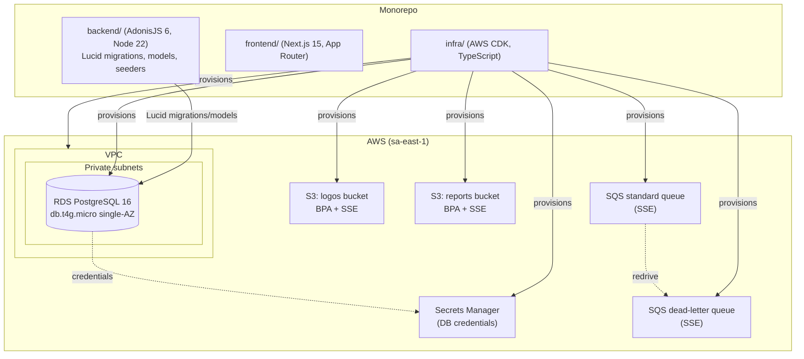
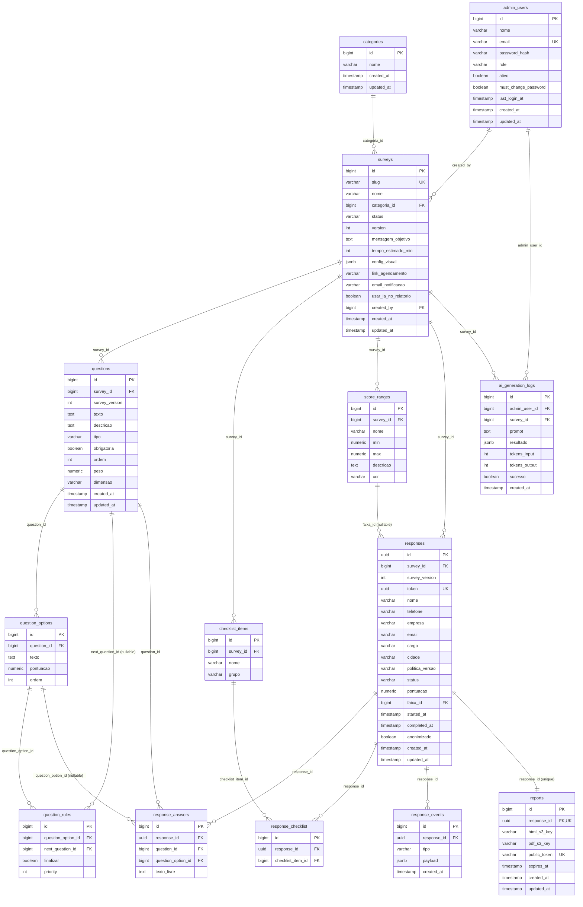
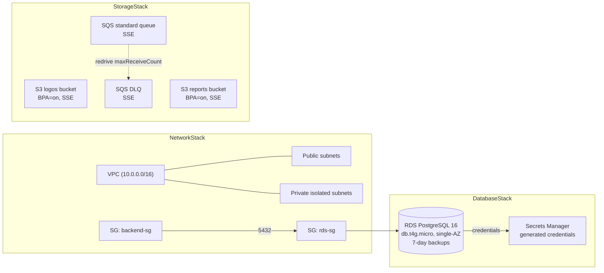

# Design Document

## Overview

This design specifies the shared technical foundation for the BouCheck platform (spec 1 of 7). It delivers the complete PostgreSQL 16 data model (master requirements section 8), the Lucid ORM migrations and models, development seeds, the base AWS CDK infrastructure, and the baseline code-quality configuration.

Scope is strictly the persistence and infrastructure foundation layer. This design defines *structures* (tables, constraints, ORM models, seeds, cloud resources) — it does not implement application behavior (auth flows, public response flow, conditional-navigation engine, scoring, reporting, dashboards, AI generation). Those behaviors live in later specs and consume the ORM_Model_Layer defined here.

Traceability: this design realizes requirements 1–15 of `requirements.md`, which in turn trace to the master data model in section 8 and to non-functional requirements REQ-NFR-001 (architecture/infrastructure) and REQ-NFR-004 (code quality). Where master behavioral codes (REQ-PUB, REQ-ADM, REQ-REP) imply data shapes, only the persistence structures are covered here.

### Design goals

- A single, deterministic, referentially-consistent schema that every downstream spec can rely on.
- Survey versioning encoded at the data layer so historical responses stay interpretable when a survey's structure changes.
- Infrastructure that is private-by-default (no public database, buckets with Block Public Access, encrypted queues) per REQ-NFR-001/002.
- Reproducible schema evolution via timestamp-ordered Lucid migrations with working `down` methods.
- Idempotent seeds so local environments converge to a known demonstration survey.

### Key design decisions

| Decision | Choice | Rationale |
|---|---|---|
| ENUM representation | PostgreSQL `CHECK` constraints backed by `varchar` columns (not native `CREATE TYPE` enums) | Lucid migrations manage `CHECK` cleanly; adding a value later is an `ALTER` of the check rather than a native-enum migration, which is easier to reverse in `down`. TypeScript union types enforce the same domain at the ORM layer. |
| `responses.id` type | UUID | Master section 8 specifies UUID; response tokens are non-sequential and externally referenced. |
| Other PKs | auto-increment `bigint` identity | Internal surrogate keys; smaller indexes and simpler FKs for high-churn child tables. |
| Survey versioning | `version` on `surveys`; `survey_version` copied onto `questions` and `responses` | A response records the structure version it answered so later structure edits don't corrupt historical interpretation (Req 7.4). |
| Monetary/score fields | `numeric` | Exact arithmetic for scoring; avoids float drift. |
| JSONB fields | `config_visual`, `response_events.payload`, `ai_generation_logs.resultado` | Flexible, queryable semi-structured data (Req 7). |
| Region | `sa-east-1` (São Paulo) | Domain and audience are Brazil (pt-BR); latency and data residency. |

## Architecture

The foundation spans three top-level projects in a single repository, plus a managed PostgreSQL database and supporting AWS resources.



### Layering

- **Migration_System** (Lucid migrations) owns schema DDL. It is the single source of truth for tables, constraints, and indexes.
- **ORM_Model_Layer** (Lucid models) maps rows to typed objects and declares relationships. Downstream specs query only through this layer.
- **Seed_System** (Lucid seeders) populates deterministic development data (Demonstration_Survey + starter admin).
- **Infrastructure_Stack** (CDK) provisions the runtime substrate. It does not run migrations; migrations run from the backend via `node ace migration:run` against the RDS endpoint.
- **Build_Configuration** applies TypeScript strict mode, ESLint, and Prettier uniformly.

## Components and Interfaces

### Repository / monorepo structure

```
boucheck/
├── backend/                      # AdonisJS 6 (Node.js 22, TypeScript)
│   ├── ace.js
│   ├── package.json
│   ├── tsconfig.json             # strict: true
│   ├── .eslintrc(.json|.js)
│   ├── .prettierrc
│   ├── config/
│   │   └── database.ts           # Lucid → PostgreSQL, reads Secrets Manager / env
│   ├── database/
│   │   ├── migrations/           # timestamp-prefixed migration files
│   │   └── seeders/
│   │       └── main_seeder.ts    # orchestrates idempotent seeding
│   └── app/
│       └── models/               # one Lucid model per table
├── frontend/                     # Next.js 15 (App Router, TypeScript)
│   ├── package.json
│   ├── tsconfig.json             # strict: true
│   ├── next.config.ts
│   ├── .eslintrc(.json)          # next/core-web-vitals
│   ├── .prettierrc
│   └── app/                      # App Router root
├── infra/                        # AWS CDK (TypeScript)
│   ├── package.json
│   ├── tsconfig.json             # strict: true
│   ├── cdk.json
│   ├── bin/boucheck.ts           # CDK app entry
│   └── lib/
│       ├── network-stack.ts      # VPC + subnets + security groups
│       ├── database-stack.ts     # RDS + Secrets Manager
│       └── storage-stack.ts      # S3 buckets + SQS + DLQ
└── README.md                     # deploy steps, env vars, migration convention
```

Each project (`backend`, `frontend`, `infra`) is a clearly named top-level directory (Req 13.3). The README documents deploy steps, required environment variables, and the migration naming/ordering convention (Req 13.4, 15.4). No secrets are committed; `.env` files are git-ignored and credentials are resolved from Secrets Manager / SSM at runtime (Req 13.5).

### Build configuration interface

| Project | Type check | Lint | Format check |
|---|---|---|---|
| backend | `npm run typecheck` → `tsc --noEmit` | `npm run lint` → `eslint .` | `npm run format:check` → `prettier --check .` |
| frontend | `npm run typecheck` → `tsc --noEmit` | `npm run lint` → `next lint` | `npm run format:check` → `prettier --check .` |
| infra | `npm run typecheck` → `tsc --noEmit` | `npm run lint` → `eslint .` | `npm run format:check` → `prettier --check .` |

All three `tsconfig.json` files set `"strict": true` (Req 14.1). The `typecheck` command exits non-zero on any strict violation (Req 14.4). These commands are runnable in CI (Req 14.3).

### Migration ordering interface

Lucid generates files named `{timestamp}_{name}.ts` (e.g. `1704067200000_create_categories_table.ts`). Lexicographic sort of the timestamp prefix yields execution order (Req 15.1). Migrations are authored in referential-dependency order so that a foreign key never references a not-yet-created table.

## Data Models

### Entity-relationship diagram



### PostgreSQL 16 schema (DDL-level)

The following is the target schema the migrations produce. It is expressed as reference DDL; the actual creation is via Lucid schema builders (see Migration strategy). Enumerated domains are enforced with `CHECK` constraints.

#### categories (Req 1.1)

```sql
CREATE TABLE categories (
  id          bigint GENERATED ALWAYS AS IDENTITY PRIMARY KEY,
  nome        varchar(255) NOT NULL,
  created_at  timestamptz NOT NULL DEFAULT now(),
  updated_at  timestamptz NOT NULL DEFAULT now()
);
```

#### admin_users (Req 1.2, 1.3, 1.4)

```sql
CREATE TABLE admin_users (
  id                    bigint GENERATED ALWAYS AS IDENTITY PRIMARY KEY,
  nome                  varchar(255) NOT NULL,
  email                 varchar(255) NOT NULL,
  password_hash         varchar(255) NOT NULL,
  role                  varchar(20)  NOT NULL DEFAULT 'admin',
  ativo                 boolean      NOT NULL DEFAULT true,
  must_change_password  boolean      NOT NULL DEFAULT false,
  last_login_at         timestamptz  NULL,
  created_at            timestamptz  NOT NULL DEFAULT now(),
  updated_at            timestamptz  NOT NULL DEFAULT now(),
  CONSTRAINT admin_users_email_unique UNIQUE (email)
);
```

#### surveys (Req 2.1–2.4, 6.1, 7.1)

```sql
CREATE TABLE surveys (
  id                    bigint GENERATED ALWAYS AS IDENTITY PRIMARY KEY,
  slug                  varchar(255) NOT NULL,
  nome                  varchar(255) NOT NULL,
  categoria_id          bigint       NULL REFERENCES categories(id),
  status                varchar(20)  NOT NULL DEFAULT 'rascunho',
  version               integer      NOT NULL DEFAULT 1,
  mensagem_objetivo     text         NULL,
  tempo_estimado_min    integer      NULL,
  config_visual         jsonb        NULL,
  link_agendamento      varchar(1024) NULL,
  email_notificacao     varchar(255) NULL,
  usar_ia_no_relatorio  boolean      NOT NULL DEFAULT false,
  created_by            bigint       NULL REFERENCES admin_users(id),
  created_at            timestamptz  NOT NULL DEFAULT now(),
  updated_at            timestamptz  NOT NULL DEFAULT now(),
  CONSTRAINT surveys_slug_unique UNIQUE (slug),
  CONSTRAINT surveys_status_check CHECK (status IN ('rascunho','ativo','inativo','arquivado'))
);
CREATE INDEX surveys_slug_index         ON surveys (slug);
CREATE INDEX surveys_categoria_id_index ON surveys (categoria_id);
CREATE INDEX surveys_created_by_index   ON surveys (created_by);
```

#### questions (Req 2.5, 6.2, 7.4)

```sql
CREATE TABLE questions (
  id             bigint GENERATED ALWAYS AS IDENTITY PRIMARY KEY,
  survey_id      bigint      NOT NULL REFERENCES surveys(id),
  survey_version integer     NOT NULL DEFAULT 1,
  texto          text        NOT NULL,
  descricao      text        NULL,
  tipo           varchar(20) NOT NULL,
  obrigatoria    boolean     NOT NULL DEFAULT true,
  ordem          integer     NOT NULL DEFAULT 0,
  peso           numeric(10,2) NOT NULL DEFAULT 1,
  dimensao       varchar(255) NULL,
  created_at     timestamptz NOT NULL DEFAULT now(),
  updated_at     timestamptz NOT NULL DEFAULT now(),
  CONSTRAINT questions_tipo_check CHECK (tipo IN ('escolha_unica','multipla_escolha','aberta'))
);
CREATE INDEX questions_survey_id_index ON questions (survey_id);
```

#### question_options (Req 2.6)

```sql
CREATE TABLE question_options (
  id           bigint GENERATED ALWAYS AS IDENTITY PRIMARY KEY,
  question_id  bigint        NOT NULL REFERENCES questions(id),
  texto        text          NOT NULL,
  pontuacao    numeric(10,2) NOT NULL DEFAULT 0,
  ordem        integer       NOT NULL DEFAULT 0
);
CREATE INDEX question_options_question_id_index ON question_options (question_id);
```

#### question_rules (Req 2.7, 2.8, 2.9)

```sql
CREATE TABLE question_rules (
  id                 bigint GENERATED ALWAYS AS IDENTITY PRIMARY KEY,
  question_option_id bigint  NOT NULL REFERENCES question_options(id),
  next_question_id   bigint  NULL REFERENCES questions(id),
  finalizar          boolean NOT NULL DEFAULT false,
  priority           integer NOT NULL DEFAULT 0
);
CREATE INDEX question_rules_question_option_id_index ON question_rules (question_option_id);
CREATE INDEX question_rules_next_question_id_index   ON question_rules (next_question_id);
-- next_question_id NULL + finalizar = true  => early-termination rule (Req 2.9)
```

#### checklist_items (Req 3.1, 6.3)

```sql
CREATE TABLE checklist_items (
  id         bigint GENERATED ALWAYS AS IDENTITY PRIMARY KEY,
  survey_id  bigint      NOT NULL REFERENCES surveys(id),
  nome       varchar(255) NOT NULL,
  grupo      varchar(20) NOT NULL,
  CONSTRAINT checklist_items_grupo_check CHECK (grupo IN ('servico_cloud','fabricante','solucao'))
);
CREATE INDEX checklist_items_survey_id_index ON checklist_items (survey_id);
```

#### score_ranges (Req 3.2)

```sql
CREATE TABLE score_ranges (
  id         bigint GENERATED ALWAYS AS IDENTITY PRIMARY KEY,
  survey_id  bigint        NOT NULL REFERENCES surveys(id),
  nome       varchar(255)  NOT NULL,
  min        numeric(10,2) NOT NULL,
  max        numeric(10,2) NOT NULL,
  descricao  text          NULL,
  cor        varchar(20)   NULL
);
CREATE INDEX score_ranges_survey_id_index ON score_ranges (survey_id);
```

#### responses (Req 4.1–4.4, 6.4, 7.4)

```sql
CREATE TABLE responses (
  id             uuid PRIMARY KEY DEFAULT gen_random_uuid(),
  survey_id      bigint      NOT NULL REFERENCES surveys(id),
  survey_version integer     NOT NULL DEFAULT 1,
  token          uuid        NOT NULL DEFAULT gen_random_uuid(),
  nome           varchar(255) NULL,
  telefone       varchar(50)  NULL,
  empresa        varchar(255) NULL,
  email          varchar(255) NULL,
  cargo          varchar(255) NULL,
  cidade         varchar(255) NULL,
  politica_versao varchar(50) NULL,
  status         varchar(20) NOT NULL DEFAULT 'iniciado',
  pontuacao      numeric(10,2) NULL,
  faixa_id       bigint      NULL REFERENCES score_ranges(id),
  started_at     timestamptz NULL,
  completed_at   timestamptz NULL,
  anonimizado    boolean     NOT NULL DEFAULT false,
  created_at     timestamptz NOT NULL DEFAULT now(),
  updated_at     timestamptz NOT NULL DEFAULT now(),
  CONSTRAINT responses_token_unique UNIQUE (token),
  CONSTRAINT responses_status_check CHECK (status IN ('iniciado','completo'))
);
CREATE INDEX responses_survey_id_index ON responses (survey_id);
CREATE INDEX responses_faixa_id_index  ON responses (faixa_id);
CREATE INDEX responses_token_index     ON responses (token);
```

#### response_answers (Req 4.5, 4.6)

```sql
CREATE TABLE response_answers (
  id                 bigint GENERATED ALWAYS AS IDENTITY PRIMARY KEY,
  response_id        uuid   NOT NULL REFERENCES responses(id),
  question_id        bigint NOT NULL REFERENCES questions(id),
  question_option_id bigint NULL REFERENCES question_options(id),
  texto_livre        text   NULL,
  CONSTRAINT response_answers_unique UNIQUE (response_id, question_id, question_option_id)
);
CREATE INDEX response_answers_response_id_index        ON response_answers (response_id);
CREATE INDEX response_answers_question_id_index        ON response_answers (question_id);
CREATE INDEX response_answers_question_option_id_index ON response_answers (question_option_id);
```

> Note on the UNIQUE constraint (Req 4.6): PostgreSQL treats `NULL` as distinct in unique indexes, so multiple rows with `question_option_id IS NULL` for the same (`response_id`, `question_id`) are permitted by default. This matches open-question (`aberta`) semantics where there is no option. Enforcement of "one open answer per question" is application-layer behavior owned by a later spec, not this foundation.

#### response_checklist (Req 4.7)

```sql
CREATE TABLE response_checklist (
  id                bigint GENERATED ALWAYS AS IDENTITY PRIMARY KEY,
  response_id       uuid   NOT NULL REFERENCES responses(id),
  checklist_item_id bigint NOT NULL REFERENCES checklist_items(id)
);
CREATE INDEX response_checklist_response_id_index       ON response_checklist (response_id);
CREATE INDEX response_checklist_checklist_item_id_index ON response_checklist (checklist_item_id);
```

#### response_events (Req 4.8, 7.2, 8.4)

```sql
CREATE TABLE response_events (
  id          bigint GENERATED ALWAYS AS IDENTITY PRIMARY KEY,
  response_id uuid        NOT NULL REFERENCES responses(id),
  tipo        varchar(50) NOT NULL,
  payload     jsonb       NULL,
  created_at  timestamptz NOT NULL DEFAULT now()
);
CREATE INDEX response_events_response_id_index ON response_events (response_id);
CREATE INDEX response_events_response_created_index ON response_events (response_id, created_at);
```

#### reports (Req 5.1, 5.2)

```sql
CREATE TABLE reports (
  id           bigint GENERATED ALWAYS AS IDENTITY PRIMARY KEY,
  response_id  uuid         NOT NULL REFERENCES responses(id),
  html_s3_key  varchar(1024) NOT NULL,
  pdf_s3_key   varchar(1024) NULL,
  public_token varchar(255) NOT NULL,
  expires_at   timestamptz  NULL,
  created_at   timestamptz  NOT NULL DEFAULT now(),
  updated_at   timestamptz  NOT NULL DEFAULT now(),
  CONSTRAINT reports_response_id_unique  UNIQUE (response_id),
  CONSTRAINT reports_public_token_unique UNIQUE (public_token)
);
CREATE INDEX reports_response_id_index   ON reports (response_id);
CREATE INDEX reports_public_token_index  ON reports (public_token);
```

#### ai_generation_logs (Req 5.3, 7.3)

```sql
CREATE TABLE ai_generation_logs (
  id            bigint GENERATED ALWAYS AS IDENTITY PRIMARY KEY,
  admin_user_id bigint  NOT NULL REFERENCES admin_users(id),
  survey_id     bigint  NULL REFERENCES surveys(id),
  prompt        text    NOT NULL,
  resultado     jsonb   NULL,
  tokens_input  integer NULL,
  tokens_output integer NULL,
  sucesso       boolean NOT NULL DEFAULT false,
  created_at    timestamptz NOT NULL DEFAULT now()
);
CREATE INDEX ai_generation_logs_admin_user_id_index ON ai_generation_logs (admin_user_id);
CREATE INDEX ai_generation_logs_survey_id_index     ON ai_generation_logs (survey_id);
```

### Index summary (Req 8)

| Requirement | Index |
|---|---|
| 8.1 | `surveys.slug` |
| 8.2 | FK indexes on all 19 listed FK columns (see per-table DDL above) |
| 8.3 | `responses.token`, `reports.public_token` |
| 8.4 | composite `(response_events.response_id, response_events.created_at)` |

### ENUM domains (Req 6)

Enforced as `CHECK` constraints and mirrored as TypeScript union types in the ORM layer:

| Column | Allowed values |
|---|---|
| `surveys.status` | `rascunho`, `ativo`, `inativo`, `arquivado` |
| `questions.tipo` | `escolha_unica`, `multipla_escolha`, `aberta` |
| `checklist_items.grupo` | `servico_cloud`, `fabricante`, `solucao` |
| `responses.status` | `iniciado`, `completo` |

### Lucid ORM model design (Req 9)

One model class per table under `backend/app/models/`. ENUM columns are typed as TypeScript union literals (Req 9.6); JSONB columns use `prepare`/`consume` to serialize/deserialize (Req 9.5).

#### Shared TypeScript types

```ts
// app/models/types.ts
export type SurveyStatus = 'rascunho' | 'ativo' | 'inativo' | 'arquivado'
export type QuestionTipo = 'escolha_unica' | 'multipla_escolha' | 'aberta'
export type ChecklistGrupo = 'servico_cloud' | 'fabricante' | 'solucao'
export type ResponseStatus = 'iniciado' | 'completo'

export interface ConfigVisual {
  cor_primaria?: string
  cor_secundaria?: string
  cor_fundo?: string
  logo_s3_key?: string
}
```

#### Column decorators and JSONB serialization

Representative model showing the JSONB attribute pattern and the ENUM union type:

```ts
// app/models/survey.ts
import { DateTime } from 'luxon'
import { BaseModel, column, belongsTo, hasMany } from '@adonisjs/lucid/orm'
import type { BelongsTo, HasMany } from '@adonisjs/lucid/types/relations'
import Category from './category.js'
import AdminUser from './admin_user.js'
import Question from './question.js'
import ChecklistItem from './checklist_item.js'
import ScoreRange from './score_range.js'
import Response from './response.js'
import type { SurveyStatus, ConfigVisual } from './types.js'

export default class Survey extends BaseModel {
  @column({ isPrimary: true })
  declare id: number

  @column()
  declare slug: string

  @column()
  declare nome: string

  @column({ columnName: 'categoria_id' })
  declare categoriaId: number | null

  @column()
  declare status: SurveyStatus // TS union mirrors CHECK constraint (Req 9.6)

  @column()
  declare version: number

  @column({ columnName: 'usar_ia_no_relatorio' })
  declare usarIaNoRelatorio: boolean

  // JSONB serialization (Req 9.5)
  @column({
    columnName: 'config_visual',
    prepare: (value: ConfigVisual | null) => (value ? JSON.stringify(value) : null),
    consume: (value: unknown): ConfigVisual | null =>
      value == null ? null : typeof value === 'string' ? JSON.parse(value) : (value as ConfigVisual),
  })
  declare configVisual: ConfigVisual | null

  @column({ columnName: 'created_by' })
  declare createdBy: number | null

  @column.dateTime({ autoCreate: true })
  declare createdAt: DateTime

  @column.dateTime({ autoCreate: true, autoUpdate: true })
  declare updatedAt: DateTime

  // Relationships (Req 9.2)
  @belongsTo(() => Category, { foreignKey: 'categoriaId' })
  declare categoria: BelongsTo<typeof Category>

  @belongsTo(() => AdminUser, { foreignKey: 'createdBy' })
  declare creator: BelongsTo<typeof AdminUser>

  @hasMany(() => Question, { foreignKey: 'surveyId' })
  declare questions: HasMany<typeof Question>

  @hasMany(() => ChecklistItem, { foreignKey: 'surveyId' })
  declare checklistItems: HasMany<typeof ChecklistItem>

  @hasMany(() => ScoreRange, { foreignKey: 'surveyId' })
  declare scoreRanges: HasMany<typeof ScoreRange>

  @hasMany(() => Response, { foreignKey: 'surveyId' })
  declare responses: HasMany<typeof Response>
}
```

#### Relationship map (Req 9.2, 9.3, 9.4)

| Model | Relationship | Target | Kind |
|---|---|---|---|
| `Survey` | `questions` | `Question` | hasMany |
| `Survey` | `checklistItems` | `ChecklistItem` | hasMany |
| `Survey` | `scoreRanges` | `ScoreRange` | hasMany |
| `Survey` | `responses` | `Response` | hasMany |
| `Survey` | `categoria` | `Category` | belongsTo |
| `Survey` | `creator` | `AdminUser` | belongsTo |
| `Question` | `options` | `QuestionOption` | hasMany |
| `QuestionOption` | `rules` | `QuestionRule` | hasMany |
| `QuestionRule` | `nextQuestion` | `Question` | belongsTo |
| `Response` | `answers` | `ResponseAnswer` | hasMany |
| `Response` | `checklistSelections` | `ResponseChecklist` | hasMany |
| `Response` | `events` | `ResponseEvent` | hasMany |
| `Response` | `report` | `Report` | hasOne |
| `Response` | `survey` | `Survey` | belongsTo |
| `Response` | `faixa` | `ScoreRange` | belongsTo |

The 14 model classes (Req 9.1): `Category`, `Survey`, `Question`, `QuestionOption`, `QuestionRule`, `ChecklistItem`, `ScoreRange`, `Response`, `ResponseAnswer`, `ResponseChecklist`, `ResponseEvent`, `Report`, `AdminUser`, `AiGenerationLog`.

`Response` uses a UUID primary key: `@column({ isPrimary: true }) declare id: string` with no auto-increment; the database default `gen_random_uuid()` supplies the value. JSONB attributes on `ResponseEvent.payload` and `AiGenerationLog.resultado` follow the same `prepare`/`consume` pattern as `Survey.configVisual`.

### Migration strategy and ordering

Migrations are created with `node ace make:migration <name>` and produce timestamp-prefixed files that sort into deterministic execution order (Req 15.1). They are authored in **referential-dependency order** so every FK target exists before the referencing table:

1. `create_categories_table`
2. `create_admin_users_table`
3. `create_surveys_table` (FK → categories, admin_users)
4. `create_questions_table` (FK → surveys)
5. `create_question_options_table` (FK → questions)
6. `create_question_rules_table` (FK → question_options, questions)
7. `create_checklist_items_table` (FK → surveys)
8. `create_score_ranges_table` (FK → surveys)
9. `create_responses_table` (FK → surveys, score_ranges)
10. `create_response_answers_table` (FK → responses, questions, question_options)
11. `create_response_checklist_table` (FK → responses, checklist_items)
12. `create_response_events_table` (FK → responses)
13. `create_reports_table` (FK → responses)
14. `create_ai_generation_logs_table` (FK → admin_users, surveys)

Each migration's `up` creates one table with its columns, defaults, CHECK constraints, UNIQUE constraints, FKs, and indexes. The `down` method drops the same table (Req 15.3). Because tables are dropped in the reverse order Lucid tracks by batch, rolling back a batch removes referencing tables before referenced ones. Representative migration:

```ts
// database/migrations/xxxx_create_surveys_table.ts
import { BaseSchema } from '@adonisjs/lucid/schema'

export default class extends BaseSchema {
  protected tableName = 'surveys'

  async up() {
    this.schema.createTable(this.tableName, (table) => {
      table.bigIncrements('id').primary()
      table.string('slug').notNullable().unique()
      table.string('nome').notNullable()
      table.bigInteger('categoria_id').unsigned().nullable().references('id').inTable('categories')
      table.string('status', 20).notNullable().defaultTo('rascunho')
      table.integer('version').notNullable().defaultTo(1)
      table.text('mensagem_objetivo').nullable()
      table.integer('tempo_estimado_min').nullable()
      table.jsonb('config_visual').nullable()
      table.string('link_agendamento', 1024).nullable()
      table.string('email_notificacao').nullable()
      table.boolean('usar_ia_no_relatorio').notNullable().defaultTo(false)
      table.bigInteger('created_by').unsigned().nullable().references('id').inTable('admin_users')
      table.timestamp('created_at', { useTz: true }).notNullable().defaultTo(this.now())
      table.timestamp('updated_at', { useTz: true }).notNullable().defaultTo(this.now())
      table.index('slug')
      table.index('categoria_id')
      table.index('created_by')
    })
    // CHECK constraint for the status ENUM domain (Req 6.1)
    this.schema.raw(
      "ALTER TABLE surveys ADD CONSTRAINT surveys_status_check CHECK (status IN ('rascunho','ativo','inativo','arquivado'))"
    )
  }

  async down() {
    this.schema.dropTable(this.tableName) // drops table + its constraints (Req 15.3)
  }
}
```

**Rollback approach:** each `down` drops its table; dropping a table also removes its CHECK/UNIQUE constraints and indexes. `node ace migration:rollback` reverts the last batch; `--batch=0` reverts everything, returning the database to empty (validated by the migration reversibility property). Running `node ace migration:run` against an empty database creates the full schema without error (Req 15.2).

### Seed design (Req 10)

Seeders live in `backend/database/seeders/`. A `main_seeder.ts` orchestrates sub-seeders in dependency order. All seeders are **idempotent**: they use `updateOrCreate` keyed on natural unique keys (`admin_users.email`, `surveys.slug`, and deterministic natural keys for children) so a second run converges to the same shape (Req 10.9).

Idempotency strategy for child rows (which lack natural unique keys in the schema): the seeder resolves the parent (e.g. the demonstration survey by slug), then for each logical child uses `updateOrCreate` on a deterministic search key composed of stable fields (e.g. a question's `(survey_id, ordem)`, an option's `(question_id, ordem)`, a checklist item's `(survey_id, nome, grupo)`, a score range's `(survey_id, nome)`). This guarantees the second execution updates rather than duplicates.

#### Demonstration_Survey structure

- **Admin (Req 10.1):** one `admin_users` row, `email = admin@boucheck.local`, `password_hash` = scrypt hash of a dev password, `role = admin`, `ativo = true`, `must_change_password = true`.
- **Category (Req 10.2):** one `categories` row, e.g. `nome = 'Infraestrutura & Cloud'`.
- **Survey (Req 10.3):** slug `maturidade-cloud`, `status = 'ativo'`, `version = 1`, populated `config_visual` (`cor_primaria`, `cor_secundaria`, `cor_fundo`, `logo_s3_key`).
- **Questions (Req 10.4):** at least 8, spanning all three `tipo` values. Example plan (ordem in parentheses):

  | ordem | tipo | dimensao | notes |
  |---|---|---|---|
  | 1 | escolha_unica | Governança | drives a cascade rule |
  | 2 | escolha_unica | Governança | |
  | 3 | multipla_escolha | Operação | |
  | 4 | multipla_escolha | Operação | |
  | 5 | escolha_unica | Segurança | early-termination branch |
  | 6 | escolha_unica | Segurança | |
  | 7 | aberta | — | free text, no scoring |
  | 8 | aberta | — | free text, no scoring |

- **Options (Req 10.5):** every choice-type question (ordens 1–6) gets 3–4 `question_options` with `pontuacao` values.
- **Rules (Req 10.6):** at least 2 `question_rules`:
  - Rule A: on a specific option of question 1, `next_question_id` = question 3 (skip-ahead cascade).
  - Rule B: on a specific option of question 5, `next_question_id = NULL` and `finalizar = true` (early termination, Req 2.9).
- **Checklist (Req 10.7):** `checklist_items` covering all three `grupo` values (`servico_cloud`, `fabricante`, `solucao`), e.g. AWS/Azure/GCP; Fortinet/Cisco; backup/observability solutions.
- **Score ranges (Req 10.8):** at least 2 non-overlapping bands, e.g. `0–50 'Inicial'` and `51–100 'Avançado'` (max of one < min of the next).

```ts
// database/seeders/main_seeder.ts (orchestration sketch)
import { BaseSeeder } from '@adonisjs/lucid/seeders'
export default class extends BaseSeeder {
  async run() {
    const admin = await this.seedAdmin()       // updateOrCreate by email
    const category = await this.seedCategory()  // updateOrCreate by nome
    const survey = await this.seedSurvey(category, admin) // updateOrCreate by slug
    await this.seedQuestionsAndOptions(survey)  // updateOrCreate by (survey_id, ordem)/(question_id, ordem)
    await this.seedRules(survey)                // updateOrCreate by deterministic key
    await this.seedChecklist(survey)            // updateOrCreate by (survey_id, nome, grupo)
    await this.seedScoreRanges(survey)          // updateOrCreate by (survey_id, nome)
  }
}
```

### AWS CDK stack design (Req 11, 12)

The Infrastructure_Stack is an AWS CDK app in TypeScript (Req 11.1), region `sa-east-1`. It is decomposed into three stacks by concern; `bin/boucheck.ts` wires them with cross-stack references.



#### NetworkStack (Req 11.2, 11.6)

- `ec2.Vpc` with `maxAzs: 2` and subnet configuration including at least one **private isolated** subnet group (`PRIVATE_ISOLATED`) for RDS, plus public subnets for future NAT/egress.
- `rdsSecurityGroup` (`rds-sg`): no ingress by default.
- `backendSecurityGroup` (`backend-sg`): represents the compute tier; `rds-sg` allows ingress on 5432 **only** from `backend-sg` (Req 11.6). The RDS instance is placed in a private isolated subnet with no public accessibility, so it is not exposed to the internet.

#### DatabaseStack (Req 11.3–11.6)

- `rds.DatabaseInstance` with `engine: PostgreSQL version VER_16`, `instanceType: t4g.micro`, `multiAz: false` (single-AZ), `vpcSubnets: { subnetType: PRIVATE_ISOLATED }`, `publiclyAccessible: false`, `securityGroups: [rdsSecurityGroup]`.
- `backupRetention: Duration.days(7)` (Req 11.4).
- `credentials: rds.Credentials.fromGeneratedSecret('boucheck_admin')` — CDK generates the password and stores the full credential set in **Secrets Manager** (Req 11.5); no plaintext password in code or config.

#### StorageStack (Req 12.1–12.4)

- Two `s3.Bucket`s (logos, reports) with `blockPublicAccess: BlockPublicAccess.BLOCK_ALL` (Req 12.1) and `encryption: S3_MANAGED` (SSE, Req 12.4). `enforceSSL: true` for in-transit protection.
- `sqs.Queue` **deadLetterQueue** first, with `encryption: SQS_MANAGED` (Req 12.4).
- `sqs.Queue` standard main queue with `encryption: SQS_MANAGED` and `deadLetterQueue: { queue: dlq, maxReceiveCount: 3 }` (redrive policy, Req 12.3).

#### CI / deploy interface (Req 13.4)

README documents: `npm ci` per project, `cdk deploy` order (Network → Database → Storage), how migrations are run against the RDS endpoint (`node ace migration:run` using the Secrets Manager credential), and the required environment variables (DB host/secret ARN, S3 bucket names, SQS queue URL). No secret values are committed (Req 13.5).

## Correctness Properties

*A property is a characteristic or behavior that should hold true across all valid executions of a system — essentially, a formal statement about what the system should do. Properties serve as the bridge between human-readable specifications and machine-verifiable correctness guarantees.*

This foundation applies property-based testing to a focused subset: the parts that embody logic which varies with input — schema-enforced invariants (UNIQUE, foreign keys, CHECK domains, defaults), ORM JSONB round-tripping, seed idempotency, and migration up/down reversibility. The remainder of the spec (table/index existence, project scaffolding, and CDK template configuration) does not vary with input and is verified with smoke tests, example tests, and CDK template-assertion (snapshot) tests as described in the Testing Strategy. The prework consolidated the testable criteria into the eight non-redundant properties below.

### Property 1: JSONB attribute round-trip

*For any* valid value of a JSONB-mapped model attribute (`Survey.configVisual` as a `ConfigVisual` object with any subset of the keys `cor_primaria`, `cor_secundaria`, `cor_fundo`, `logo_s3_key`; `ResponseEvent.payload` as any JSON value or null; `AiGenerationLog.resultado` as any JSON value), persisting the model and then reloading it from the database yields an attribute value deeply equal to the original.

**Validates: Requirements 7.1, 7.2, 7.3, 9.5**

### Property 2: ENUM domain enforcement

*For any* string value, inserting a row whose enumerated column is set to that value succeeds if and only if the value is a member of the column's allowed set — `surveys.status` ∈ {`rascunho`,`ativo`,`inativo`,`arquivado`}, `questions.tipo` ∈ {`escolha_unica`,`multipla_escolha`,`aberta`}, `checklist_items.grupo` ∈ {`servico_cloud`,`fabricante`,`solucao`}, `responses.status` ∈ {`iniciado`,`completo`} — and is rejected by the CHECK constraint otherwise.

**Validates: Requirements 6.1, 6.2, 6.3, 6.4**

### Property 3: UNIQUE constraint enforcement

*For any* value of a UNIQUE-constrained key, once one row holding that key exists, a second insert attempting to persist the same key is rejected. This holds for `admin_users.email`, `surveys.slug`, `responses.token`, `reports.response_id`, `reports.public_token`, and the composite `(response_answers.response_id, question_id, question_option_id)` when the option is non-null.

**Validates: Requirements 1.3, 2.2, 4.2, 4.6, 5.2**

### Property 4: Referential integrity enforcement

*For any* foreign-key column, inserting a child row whose FK value does not correspond to an existing parent row is rejected, and inserting a child row whose FK references an existing parent (or, where the column is nullable, is NULL) is accepted. This holds for every FK in the schema, including `surveys.categoria_id`, `surveys.created_by`, `responses.survey_id`, and `responses.faixa_id`.

**Validates: Requirements 2.3, 4.3**

### Property 5: Column defaults on omission

*For any* insert that omits a defaulted column while supplying all required columns with arbitrary valid values, reading the row back returns the documented default: `admin_users.role`=`admin`, `admin_users.ativo`=`true`, `admin_users.must_change_password`=`false`, `surveys.version`=`1`, `surveys.usar_ia_no_relatorio`=`false`, `question_rules.finalizar`=`false`, and `responses.anonimizado`=`false`.

**Validates: Requirements 1.4, 2.4, 2.8, 4.4**

### Property 6: Survey version retention

*For any* integer survey version value written when creating a response and its associated questions, reading those rows back returns the same `survey_version` unchanged on both the `responses` row and the `questions` rows, so the response remains interpretable against the structure version it answered.

**Validates: Requirements 7.4**

### Property 7: Seed idempotency

*For any* database state produced by running the Seed_System once, running the Seed_System a second time leaves the demonstration data in the same shape — identical row counts per seeded table and identical key data (same demonstration survey, same questions/options/rules/checklist/score-ranges) — with no duplicated rows.

**Validates: Requirements 10.9**

### Property 8: Migration up/down reversibility

*For any* full run of the migration set against an empty PostgreSQL 16 database, migrating fully up and then rolling fully back returns the schema to its pre-migration baseline (the set of application tables is empty again); equivalently, `up` followed by `down` is the identity on the schema.

**Validates: Requirements 15.2, 15.3**

## Error Handling

### Schema-level (database)

- **Constraint violations** (UNIQUE, FK, CHECK, NOT NULL) surface as PostgreSQL errors that Lucid raises as exceptions. This foundation deliberately relies on the database to reject invalid writes rather than duplicating validation; downstream specs translate these into user-facing validation messages and HTTP status codes.
- **`gen_random_uuid()`** requires the `pgcrypto` functions available by default in PostgreSQL 16; the first migration verifies availability (a no-op `SELECT gen_random_uuid()` guard) and fails fast with a clear message if unavailable.

### Migration execution

- Each migration runs in a transaction where the DDL is transactional; a failure in `up` rolls back that migration's partial changes, leaving the batch consistent.
- If `migration:run` fails midway, `migration:status` reports which migrations applied; the operator fixes the offending migration and re-runs. `down` methods are authored so a partially applied batch can be rolled back cleanly.
- Referential-order authoring guarantees a `create` migration never fails due to a missing FK target.

### Seeding

- Seeders use `updateOrCreate` so a partial or repeated run does not throw on pre-existing rows; it converges instead. A failure mid-seed can be re-run safely (idempotent, Property 7).

### Infrastructure (CDK)

- `cdk deploy` is transactional per stack via CloudFormation rollback; a failed stack rolls back to its last good state.
- Secrets are never emitted to CDK output or logs; the DB password is a generated Secrets Manager secret referenced by ARN.
- Cross-stack references (VPC, security groups) are passed as typed props; missing dependencies fail at synth time, not deploy time.

### ORM (JSONB deserialization)

- `consume` handles the case where the driver returns already-parsed objects vs. raw strings, and tolerates `null`. Malformed JSON at rest (not producible through the ORM's own `prepare`) would throw on parse; this is acceptable because all writes go through `prepare`.

## Testing Strategy

A dual approach: property-based tests for the input-varying invariants above, and example / smoke / template-assertion tests for the structural and configuration criteria.

### Property-based tests

- **Library:** `fast-check` integrated with the backend test runner (Japa). Do not hand-roll generators frameworks — use `fast-check` arbitraries.
- **Iterations:** each property test runs a minimum of 100 iterations (`fc.assert(..., { numRuns: 100 })`).
- **Database:** property tests that touch constraints run against a real PostgreSQL 16 instance (a disposable test database / container), because they validate database-enforced behavior (CHECK, UNIQUE, FK). Each iteration runs in a rolled-back transaction or truncates between runs to stay isolated and fast.
- **Tagging:** each property test is tagged with a comment referencing its design property, format:
  `// Feature: foundation-data-model, Property {number}: {property_text}`
- **Coverage mapping:** Property 1 → JSONB round-trip test; Property 2 → parameterized ENUM-domain test; Property 3 → parameterized UNIQUE test; Property 4 → parameterized FK test; Property 5 → defaults test; Property 6 → version-retention test; Property 7 → seed-idempotency test (run seed twice, compare snapshots of row counts + key data); Property 8 → migration up/down reversibility test (`migration:run` then `migration:rollback --batch=0`, assert baseline).

### Example and edge-case tests

- Early-termination rule row persists (Req 2.9): insert a `question_rules` row with `next_question_id = NULL`, `finalizar = true`.
- Relationship wiring (Req 9.2–9.4): seed a small survey graph; assert `preload` of each declared relation returns the expected related rows.
- Seed content assertions (Req 10.1–10.8): after seeding, assert the admin has a non-plaintext hash, a category exists, the demo survey is `ativo` with populated `config_visual`, ≥8 questions covering all three tipos, options on every choice question, ≥2 cascade rules, checklist items covering all three grupos, and ≥2 non-overlapping score ranges.
- Strict typecheck failure (Req 14.4): a fixture containing a deliberate type error causes `tsc --noEmit` to exit non-zero (run in isolation, excluded from the main build).

### Smoke tests

- Schema existence (Req 1.1, 1.2, 2.x, 3.x, 4.x, 5.x): after `migration:run`, assert each of the 14 tables and its columns exist (via `information_schema`).
- Index existence (Req 8.1–8.4): assert each named index (and the composite) exists in `pg_indexes`.
- Migration naming/order (Req 15.1): assert migration filenames are timestamp-prefixed and sort into the intended dependency order.
- End-to-end migrate (Req 15.2): `migration:run` on a fresh DB succeeds and all 14 tables are present.
- Project structure and config (Req 13.1–13.5, 14.1–14.3, 15.4): assert `backend/`, `frontend/`, `infra/` exist; `strict: true` in both app tsconfigs; ESLint/Prettier configs present; lint/format-check scripts exist; README documents deploy, env vars, and the migration convention; secret scan passes and `.env` is gitignored.

### CDK template-assertion (snapshot) tests

PBT is not appropriate for IaC. Infrastructure criteria are verified with the CDK `assertions` module against the synthesized CloudFormation template (Req 11.2–11.6, 12.1–12.4):

- VPC has ≥1 private subnet (11.2).
- `AWS::RDS::DBInstance` with `Engine: postgres`, `EngineVersion` 16.x, `DBInstanceClass: db.t4g.micro`, `MultiAZ: false`, `PubliclyAccessible: false`, placed in private subnets (11.3), `BackupRetentionPeriod: 7` (11.4).
- A Secrets Manager secret is created and referenced by the DB instance; no plaintext password literal in the template (11.5).
- RDS security group ingress on 5432 only from the backend security group (11.6).
- Two S3 buckets with `PublicAccessBlockConfiguration` all-true (12.1) and SSE enabled (12.4).
- A standard SQS queue (12.2) with a DLQ and `RedrivePolicy.maxReceiveCount` (12.3), both with SSE enabled (12.4).
- CDK app compiles and `cdk synth` succeeds (11.1).

### CI integration

CI runs, per project: `typecheck`, `lint`, `format:check`, and the test suites (backend property + example + smoke against a PostgreSQL 16 service container; infra template-assertion tests). Any strict-type violation, lint error, format drift, or failing test fails the pipeline (Req 14.3, 14.4).
