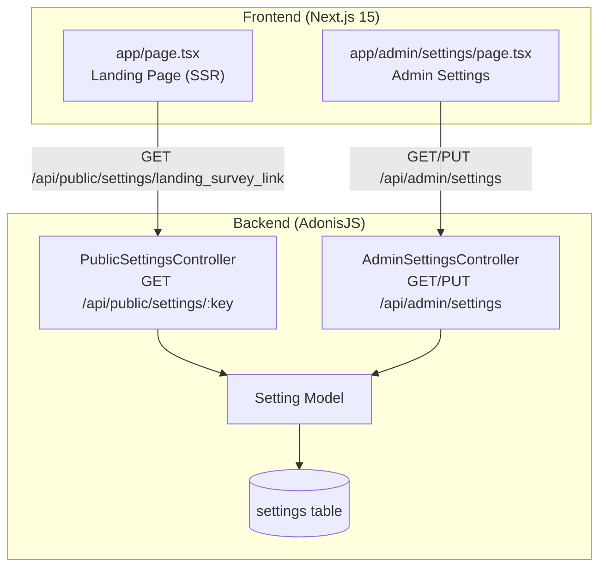

# Design Document

## Overview

This design covers the landing page at the root route (`/`) of the Next.js frontend and the supporting admin settings infrastructure. The landing page promotes the "Raio-X de Maturidade de TI" diagnostic, with the CTA link dynamically configured via a new admin Settings module backed by a key-value settings table.

The architecture follows a clean separation: a generic settings API on the backend (key-value store), a server-rendered landing page that reads the configured survey link, and an admin settings page that writes it.

## Architecture



### Data Flow

1. **Landing page load (SSR)**:
   - Next.js server component fetches `GET /api/public/settings/landing_survey_link`
   - Response contains `{ key, value }` where value is the survey slug (or null)
   - If value exists, CTA renders as link to `/{slug}`. If null, CTA is hidden.

2. **Admin configuration**:
   - Admin navigates to `/admin/settings`
   - Page fetches all settings via `GET /api/admin/settings` + published surveys via `GET /api/admin/surveys`
   - Admin selects a survey from dropdown
   - On save, `PUT /api/admin/settings` with body `{ landing_survey_link: "<survey-slug>" }`
   - Backend upserts the `settings` row for key `landing_survey_link`

## Components and Interfaces

### Backend Components

#### Setting Model (`app/models/setting.ts`)

```typescript
interface ISetting {
  id: number
  key: string
  value: string | null
  updatedAt: DateTime
}
```

#### PublicSettingsController (`app/controllers/public/settings_controller.ts`)

```typescript
interface PublicSettingsController {
  // GET /api/public/settings/:key
  show(ctx: HttpContext): Promise<{ key: string; value: string | null }>
}
```

#### AdminSettingsController (`app/controllers/admin/settings_controller.ts`)

```typescript
interface AdminSettingsController {
  // GET /api/admin/settings - returns all settings
  index(ctx: HttpContext): Promise<ISetting[]>
  // PUT /api/admin/settings - upserts key-value pairs
  update(ctx: HttpContext): Promise<{ message: string }>
}
```

### Frontend Components

#### Landing Page Components

| Component | Path | Props |
|-----------|------|-------|
| `HeroSection` | `components/landing/hero-section.tsx` | `surveySlug: string \| null` |
| `BenefitsSection` | `components/landing/benefits-section.tsx` | — |
| `HowItWorksSection` | `components/landing/how-it-works-section.tsx` | — |
| `LandingHeader` | `components/landing/landing-header.tsx` | — |
| `LandingFooter` | `components/landing/landing-footer.tsx` | — |

#### Admin Settings Page

| Component | Path | Description |
|-----------|------|-------------|
| `AdminSettingsPage` | `app/admin/settings/page.tsx` | Client component with survey dropdown and save button |

### API Interfaces

#### Public Endpoint

```
GET /api/public/settings/:key
Response: 200 { "key": string, "value": string | null }
```

#### Admin Endpoints

```
GET /api/admin/settings
Response: 200 [{ "key": string, "value": string | null, "updatedAt": string }]

PUT /api/admin/settings
Body: { [key: string]: string }
Response: 200 { "message": "ok" }
```

## Data Models

### Settings Table

| Column     | Type         | Constraints          | Description                              |
|------------|--------------|----------------------|------------------------------------------|
| id         | integer      | PK, auto-increment   | Row identifier                           |
| key        | varchar(100) | UNIQUE, NOT NULL     | Setting key name                         |
| value      | text         | NULLABLE             | Setting value (JSON or plain string)     |
| updated_at | timestamp    | auto-update          | Last modification timestamp              |

### Seed Data

For this feature, one key is seeded:

| key                  | value | description                                      |
|----------------------|-------|--------------------------------------------------|
| landing_survey_link  | null  | Slug of the survey linked from the landing CTA   |

### Setting Model (Lucid ORM)

```typescript
class Setting extends BaseModel {
  @column({ isPrimary: true })
  declare id: number

  @column()
  declare key: string

  @column()
  declare value: string | null

  @column.dateTime({ autoUpdate: true })
  declare updatedAt: DateTime
}
```

## Correctness Properties

*A property is a characteristic or behavior that should hold true across all valid executions of a system — essentially, a formal statement about what the system should do. Properties serve as the bridge between human-readable specifications and machine-verifiable correctness guarantees.*

### Property 1: Settings Round-Trip

*For any* valid survey slug, storing it via the admin PUT endpoint and subsequently reading it via the public GET endpoint for key `landing_survey_link` SHALL return the same slug value.

```
∀ slug ∈ ValidSlugs:
  PUT /api/admin/settings { landing_survey_link: slug } → 200
  GET /api/public/settings/landing_survey_link → { value: slug }
```

**Validates: Requirements 4.3, 5.1, 5.2**

### Property 2: CTA Visibility Invariant

*For any* setting value of `landing_survey_link`, the CTA button SHALL be rendered if and only if the value is non-null and non-empty, and when rendered, its href SHALL equal `"/" + value`.

```
∀ settingValue:
  settingValue ≠ null ∧ settingValue ≠ "" ⟹ CTA.visible = true ∧ CTA.href = "/" + settingValue
  settingValue = null ∨ settingValue = "" ⟹ CTA.visible = false
```

**Validates: Requirements 2.1, 2.2**

### Property 3: Authentication Guard on Write

*For any* request body, a PUT request to the admin settings endpoint without a valid authentication token SHALL be rejected with HTTP 401 status.

```
∀ body ∈ ValidBodies:
  PUT /api/admin/settings (no auth, body) → 401
```

**Validates: Requirements 5.4**

## Error Handling

### Backend Error Handling

| Scenario | HTTP Status | Response Body | Notes |
|----------|-------------|---------------|-------|
| Setting key not found (public GET) | 200 | `{ "key": "...", "value": null }` | Returns null rather than 404 for simplicity |
| Unauthenticated admin request | 401 | `{ "message": "Unauthorized" }` | Existing auth middleware handles this |
| Invalid key format | 422 | `{ "errors": [...] }` | Key must match `^[a-z_]+$` pattern |
| Invalid body on PUT | 422 | `{ "errors": [...] }` | VineJS validation on request body |
| Database connection failure | 500 | `{ "message": "Internal Server Error" }` | Generic error, logged server-side |

### Frontend Error Handling

| Scenario | Behavior |
|----------|----------|
| Settings API unreachable during SSR | Landing page renders without CTA (graceful degradation) |
| Settings API returns null | CTA is hidden, rest of page renders normally |
| Admin save fails | Toast notification with error message, form remains editable |
| Admin surveys fetch fails | Empty dropdown with error message, retry button |

### Resilience Strategy

- The landing page uses a `try/catch` around the settings fetch. On failure, `surveySlug` defaults to `null`, hiding the CTA but keeping the rest of the page functional.
- Admin settings page shows loading skeletons and retries on transient failures.
- Rate limiting on public settings endpoint prevents abuse (existing middleware).

## Testing Strategy

### Unit Tests (Example-Based)

| Test | Validates |
|------|-----------|
| Landing page renders hero section with headline and CTA | Req 1.1 |
| Landing page renders benefits section with 4+ items | Req 1.2, 3.2 |
| CTA shows correct text "Quero meu diagnóstico agora" | Req 2.3 |
| CTA hidden when setting is null | Req 2.2 |
| Admin settings form renders dropdown of published surveys | Req 4.1, 4.2 |
| Admin save without selection shows validation error | Req 4.4 |
| Sidebar contains "Configurações" nav item | Req 4.5 |
| Public GET for nonexistent key returns 200 with null | Req 5.3 |
| Public endpoint accessible without auth | Req 5.5 |
| Meta tags are present (title, description, OG) | Req 6.2 |
| Semantic HTML elements used (header, main, section, footer) | Req 6.4 |

### Property-Based Tests

Property-based tests use [fast-check](https://github.com/dubzzz/fast-check) with minimum 100 iterations per property.

| Property | Generator Strategy | Validates |
|----------|-------------------|-----------|
| Settings Round-Trip | Generate random alphanumeric slugs (1-50 chars, lowercase + hyphens) | Req 4.3, 5.1, 5.2 |
| CTA Visibility Invariant | Generate arbitrary strings including null, empty, and valid slugs | Req 2.1, 2.2 |
| Authentication Guard on Write | Generate random JSON bodies with valid key-value pairs | Req 5.4 |

**Test Configuration:**
- Library: `fast-check` (already in ecosystem for TypeScript/Node)
- Iterations: minimum 100 per property
- Tag format: `Feature: landpage-boucheck, Property {N}: {description}`

### Integration Tests

| Test | Validates |
|------|-----------|
| Full SSR page load fetches setting and renders correctly | Req 2.4, 6.1 |
| Admin save → public GET returns updated value (E2E) | Req 4.3, 5.1 |
| Page achieves LCP < 2.5s | Req 6.3 |

### Test Tools

- **Unit/Property tests**: Vitest + fast-check + Testing Library (React)
- **Integration/E2E**: Playwright or Cypress (existing project setup)
- **Performance**: Lighthouse CI for LCP measurement

## File Structure

```
backend/
  app/models/setting.ts                           # Setting model
  app/controllers/admin/settings_controller.ts    # Admin CRUD
  app/controllers/public/settings_controller.ts   # Public read
  database/migrations/..._create_settings_table.ts

frontend/
  app/page.tsx                                    # Landing page (rewrite)
  app/admin/settings/page.tsx                     # Admin settings page
  components/landing/hero-section.tsx             # Hero component
  components/landing/benefits-section.tsx         # Benefits component
  components/landing/how-it-works-section.tsx     # Process steps
  components/landing/landing-header.tsx           # Nav/header
  components/landing/landing-footer.tsx           # Footer
```
