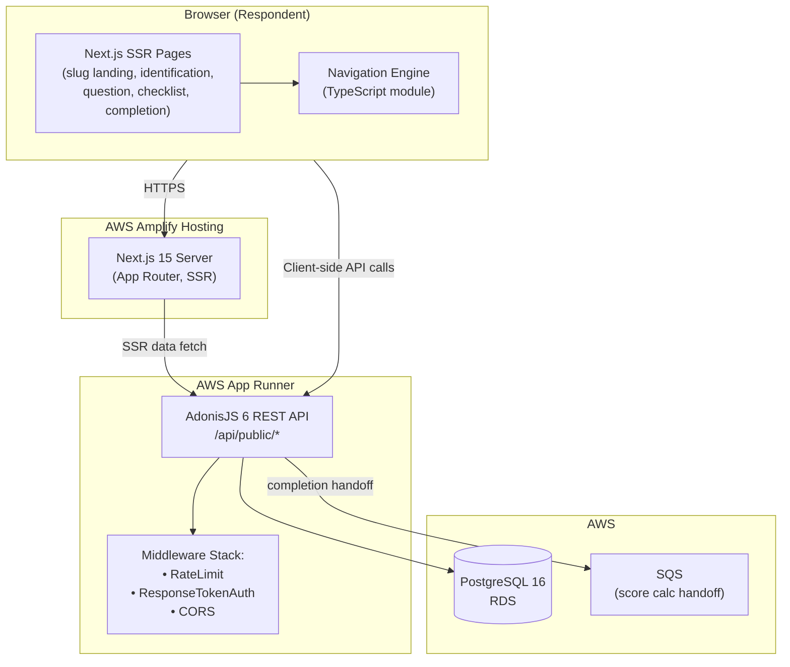
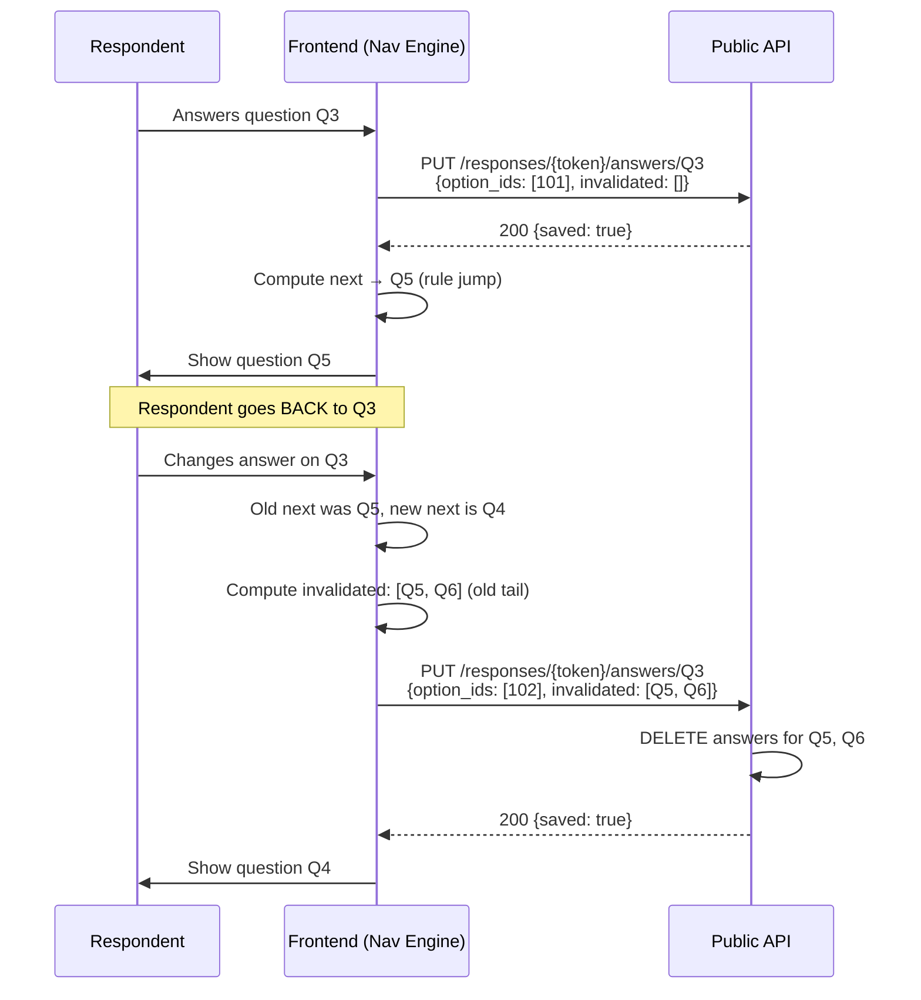
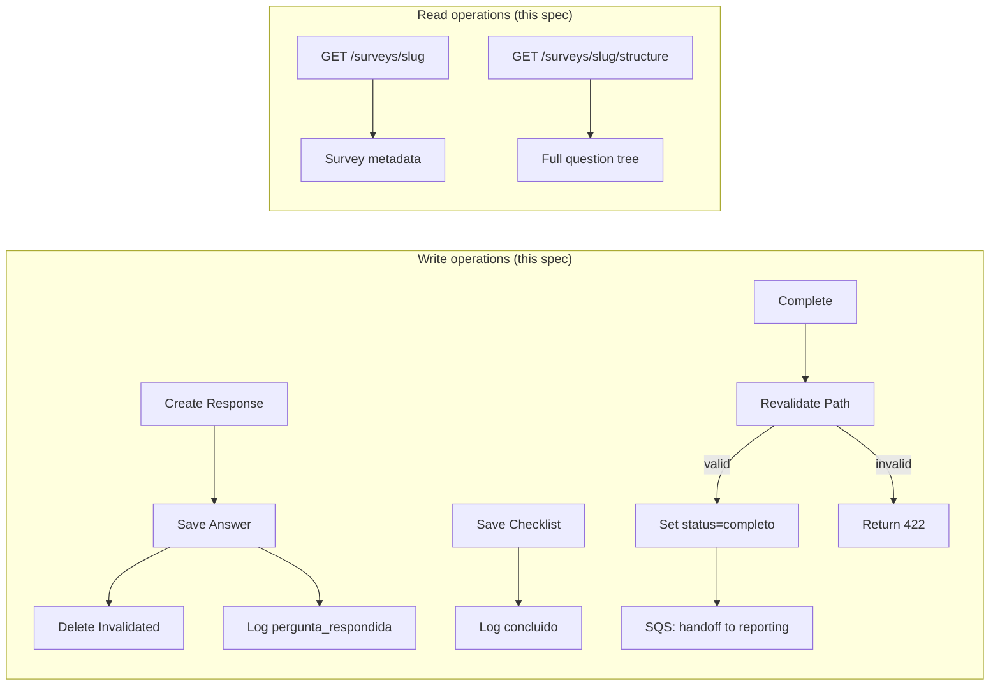

# Design Document

## Overview

This design specifies the runtime public respondent experience and the underlying API for the BouCheck platform (spec 5 of 7). It delivers:

1. **Next.js SSR pages** that render the survey slug landing, identification form, one-question-at-a-time flow, optional checklist, and completion boundary.
2. **AdonisJS REST API endpoints** (`/api/public/*`) that create and manage Response_Sessions, persist answers, log events, and validate completion.
3. **A frontend Navigation_Engine** that determines the next question purely from the Survey_Structure (questions + options + rules) without per-question server round-trips.
4. **Auto-save per question** with answer invalidation on back-navigation when conditional branching changes.
5. **Backend completion revalidation** that deterministically replays the answered path before marking a session `completo`.

### Traceability

| Requirements spec | Traces to |
|---|---|
| Requirement 1 (slug access) | REQ-PUB-001 |
| Requirement 2 (initial screen) | REQ-PUB-002 |
| Requirement 3 (LGPD identification) | REQ-PUB-003 |
| Requirement 4 (question navigation) | REQ-PUB-004 |
| Requirement 5 (conditional navigation engine) | REQ-PUB-005 |
| Requirement 6 (checklist step) | REQ-PUB-006 |
| Requirement 7 (completion transition) | REQ-PUB-005/007 boundary |
| Requirement 8 (event logging) | Section 9 |
| Requirement 9 (authorization & rate limiting) | REQ-NFR-002 |
| Requirement 10 (performance) | REQ-NFR-003 |

### Key design decisions

| Decision | Choice | Rationale |
|---|---|---|
| Navigation engine location | Frontend (TypeScript module) | The entire survey structure is static for a given version; client-side computation eliminates N round-trips and allows instant transitions. Backend revalidates only on completion. |
| Auto-save granularity | Per-question `PUT` immediately on answer | Prevents data loss on mobile (where connections drop); keeps backend authoritative. |
| Answer invalidation strategy | Frontend detects path divergence; sends deletion list on branching answer change | Ensures stale answers never pollute the final result. Backend revalidates at completion to guarantee consistency. |
| Session resume | 7-day window by e-mail + survey pair | Matches REQ-PUB-003.5; prevents accidental re-identification while allowing resume after interruption. |
| Rate limiting | AdonisJS middleware using sliding-window 30 req/min per IP (backed by in-memory store, upgradeable to Redis) | Satisfies REQ-NFR-002.2; in-memory is acceptable for single-instance v1. |
| Response_Token authorization | Custom middleware checking `token` URL param against `responses.token` | Simple, stateless per-request auth for unauthenticated respondents. |
| Progress bar calculation | `(answered questions on current path) / (estimated total questions on current path)` computed by Navigation_Engine | Provides accurate progress even when branching shortens or lengthens the path. |

### Dependencies (consumed, not redefined)

- **foundation-data-model** — all ORM models, migrations, and database schema.
- **survey-authoring** — rule-graph acyclicity guarantee; visual identity configuration; checklist item catalogs.
- **reporting** (downstream consumer) — this spec hands off at the `completo` transition; score calculation & report delivery are out of scope.

---

## Architecture



### Request flow

1. **Initial page load** — The respondent navigates to `boucheck.beonup.com.br/{slug}`. Next.js App Router fetches `GET /api/public/surveys/{slug}` at SSR time, renders the landing page with Open Graph meta.
2. **Identification** — Client submits `POST /api/public/surveys/{slug}/responses` → creates a session, returns `token`.
3. **Structure fetch** — Client fetches `GET /api/public/surveys/{slug}/structure` → receives all questions, options, rules. The Navigation_Engine initializes.
4. **Question loop** — Navigation_Engine determines next question locally. On answer, client fires `PUT /api/public/responses/{token}/answers/{questionId}`. On back + branch change, client sends deletion of invalidated answers.
5. **Checklist** (optional) — `POST /api/public/responses/{token}/checklist`.
6. **Completion** — `POST /api/public/responses/{token}/complete` → backend revalidates path, transitions status, triggers reporting handoff via SQS message.
7. **Events** — `POST /api/public/responses/{token}/events` for traceability records at each step.

### Next.js page structure

```
frontend/app/
├── [slug]/
│   ├── page.tsx              # SSR landing page (Req 1, 2)
│   ├── identificacao/
│   │   └── page.tsx          # Identification form (Req 3) — client component
│   ├── perguntas/
│   │   └── page.tsx          # Question flow (Req 4, 5) — client component
│   ├── checklist/
│   │   └── page.tsx          # Checklist step (Req 6) — client component
│   └── concluido/
│       └── page.tsx          # Completion boundary (Req 7) — client component
└── not-found.tsx             # Branded 404
```

The `[slug]/page.tsx` is the only SSR page. Subsequent pages (`identificacao`, `perguntas`, `checklist`, `concluido`) are client components that rely on the Response_Token stored in browser state (React context or `sessionStorage`). Navigation between them is client-side (Next.js `router.push`) — no full page reloads.

---

## Components and Interfaces

### Backend: AdonisJS Controller & Services

```
backend/app/
├── controllers/public/
│   ├── survey_controller.ts        # GET /surveys/{slug}, GET /surveys/{slug}/structure
│   ├── response_controller.ts      # POST /surveys/{slug}/responses
│   ├── answer_controller.ts        # PUT /responses/{token}/answers/{questionId}
│   ├── checklist_controller.ts     # POST /responses/{token}/checklist
│   ├── completion_controller.ts    # POST /responses/{token}/complete
│   └── event_controller.ts        # POST /responses/{token}/events
├── services/
│   ├── navigation_validator.ts     # Backend path revalidation algorithm
│   └── session_resume_service.ts   # Resume logic (7-day lookup)
├── middleware/
│   ├── rate_limit.ts               # 30 req/min per IP sliding window
│   └── response_token_auth.ts      # Validates {token} param against DB
└── validators/
    ├── identification_validator.ts # VineJS schema for identification form
    ├── answer_validator.ts         # VineJS schema for answer submission
    ├── checklist_validator.ts      # VineJS schema for checklist
    └── event_validator.ts          # VineJS schema for event logging
```

### Frontend: Navigation Engine Module

```
frontend/lib/navigation/
├── engine.ts                  # Core NavigationEngine class
├── types.ts                   # SurveyStructure, Question, Option, Rule types
├── path_calculator.ts         # Computes answered_path and invalidated questions
└── progress.ts                # Progress percentage calculation
```

### API Endpoint Contracts

#### `GET /api/public/surveys/{slug}`

Returns survey metadata for the landing page (SSR).

**Response 200:**
```json
{
  "id": 1,
  "slug": "maturidadeti",
  "nome": "Maturidade de TI",
  "mensagem_objetivo": "<p>Avalie o nível de maturidade...</p>",
  "tempo_estimado_min": 15,
  "config_visual": {
    "cor_primaria": "#1E40AF",
    "cor_secundaria": "#3B82F6",
    "cor_fundo": "#F8FAFC",
    "logo_s3_key": "logos/survey-1/logo.png"
  },
  "logo_url": "https://cdn.boucheck.beonup.com.br/logos/survey-1/logo.png"
}
```

**Response 404:** `{ "error": "survey_not_found" }`

---

#### `GET /api/public/surveys/{slug}/structure`

Returns the complete survey structure for the Navigation_Engine.

**Response 200:**
```json
{
  "survey_id": 1,
  "survey_version": 3,
  "questions": [
    {
      "id": 10,
      "texto": "Qual o nível de adoção de cloud?",
      "descricao": "Considere IaaS, PaaS e SaaS",
      "tipo": "escolha_unica",
      "obrigatoria": true,
      "ordem": 1,
      "options": [
        {
          "id": 100,
          "texto": "Nenhum — totalmente on-premises",
          "ordem": 1,
          "rules": []
        },
        {
          "id": 101,
          "texto": "Parcial — workloads híbridos",
          "ordem": 2,
          "rules": [
            { "next_question_id": 12, "finalizar": false, "priority": 0 }
          ]
        }
      ]
    }
  ],
  "has_checklist": true
}
```

**Response 404:** `{ "error": "survey_not_found" }`

---

#### `POST /api/public/surveys/{slug}/responses`

Creates a Response_Session (identification + LGPD acceptance).

**Request body:**
```json
{
  "nome": "João Silva",
  "telefone": "+55 (11) 99999-0000",
  "empresa": "Empresa X",
  "email": "joao@empresa.com",
  "cargo": "CTO",
  "cidade": "São Paulo",
  "politica_versao": "2025-01-v1"
}
```

**Response 201 (new session):**
```json
{
  "token": "a7b3c4d5-e6f7-8901-abcd-ef0123456789",
  "resumed": false
}
```

**Response 200 (resumable session found):**
```json
{
  "resumable": true,
  "existing_token": "previous-token-uuid",
  "started_at": "2025-07-01T10:00:00Z",
  "answered_count": 5
}
```

When `resumable: true` is returned, the frontend presents the choice. If the user chooses "resume", the frontend uses `existing_token`. If "start new", the frontend re-submits with header `X-Force-New-Session: true`.

**Response 422:** `{ "errors": [{ "field": "email", "message": "..." }] }`

---

#### `PUT /api/public/responses/{token}/answers/{questionId}`

Persists or updates a single answer. Auto-save endpoint.

**Request body (single choice):**
```json
{
  "question_option_ids": [101],
  "invalidated_question_ids": [15, 16]
}
```

**Request body (multiple choice):**
```json
{
  "question_option_ids": [200, 203],
  "invalidated_question_ids": []
}
```

**Request body (open text):**
```json
{
  "texto_livre": "Nossa infra é 100% on-prem, com plano de migração em 2026.",
  "invalidated_question_ids": []
}
```

The `invalidated_question_ids` array, when non-empty, instructs the backend to delete all persisted answers for those questions from this Response_Session. This handles path invalidation on back-navigation with branch change.

**Response 200:** `{ "saved": true }`
**Response 401:** token invalid
**Response 422:** questionId doesn't belong to survey, or validation failure

---

#### `POST /api/public/responses/{token}/checklist`

Persists checklist selections.

**Request body:**
```json
{
  "checklist_item_ids": [1, 5, 12, 20]
}
```

**Response 200:** `{ "saved": true }`
**Response 401:** token invalid
**Response 422:** item doesn't belong to survey

---

#### `POST /api/public/responses/{token}/complete`

Triggers completion revalidation and transition.

**Request body:** (empty or `{}`)

**Response 200:** `{ "completed": true, "completed_at": "2025-07-08T14:30:00Z" }`
**Response 401:** token invalid
**Response 422:** `{ "error": "invalid_answered_path", "details": "..." }`

---

#### `POST /api/public/responses/{token}/events`

Logs a traceability event.

**Request body:**
```json
{
  "tipo": "pagina_acessada",
  "payload": { "slug": "maturidadeti" }
}
```

**Recognized public event types:** `pagina_acessada`, `privacidade_aceita`, `pergunta_respondida`, `concluido`, `relatorio_visualizado`, `relatorio_email_solicitado`, `relatorio_whatsapp_solicitado`, `consultor_solicitado`.

**Response 201:** `{ "event_id": 42 }`
**Response 401:** token invalid
**Response 422:** unrecognized event type

---

### Navigation Engine Design (Frontend)

The Navigation_Engine is a pure, deterministic TypeScript module that operates on the Survey_Structure (fetched once) and the in-memory answer state.

#### Core algorithm: `getNextQuestion(currentQuestionId, answers)`

```typescript
interface NavigationEngine {
  /** Initialize with the full survey structure */
  init(structure: SurveyStructure): void

  /** Given current question and all answers so far, determine the next question.
   *  Returns null when the path ends (go to checklist/completion). */
  getNextQuestion(currentQuestionId: number, answers: Map<number, Answer>): number | null

  /** Get the previous question on the answered path */
  getPreviousQuestion(currentQuestionId: number, answeredPath: number[]): number | null

  /** Compute the full forward path from current state (for progress bar) */
  computeEstimatedPath(answers: Map<number, Answer>): number[]

  /** Determine which question IDs become invalid when an answer changes at a given point */
  getInvalidatedQuestions(
    changedQuestionId: number,
    oldAnswer: Answer,
    newAnswer: Answer,
    answeredPath: number[]
  ): number[]
}
```

#### Priority resolution for `multipla_escolha`

When multiple selected options each have a rule:

```typescript
function resolveMultipleRules(selectedOptionIds: number[], options: Option[]): Rule | null {
  const applicableRules = selectedOptionIds
    .flatMap(optId => {
      const opt = options.find(o => o.id === optId)
      return opt?.rules ?? []
    })
    .sort((a, b) => a.priority - b.priority) // lowest number = highest priority

  return applicableRules.length > 0 ? applicableRules[0] : null
}
```

#### Next-question determination

```typescript
function determineNext(
  currentQuestion: Question,
  answer: Answer,
  allQuestions: Question[] // sorted by ordem
): number | null {
  // 1. Find applicable rule
  const rule = currentQuestion.tipo === 'multipla_escolha'
    ? resolveMultipleRules(answer.selectedOptionIds, currentQuestion.options)
    : findSingleRule(answer.selectedOptionIds[0], currentQuestion.options)

  // 2. If rule says "finalizar" → return null (go to checklist/completion)
  if (rule?.finalizar) return null

  // 3. If rule has next_question_id → jump to that question
  if (rule?.next_question_id) return rule.next_question_id

  // 4. No rule → next sequential question by ordem
  const currentIdx = allQuestions.findIndex(q => q.id === currentQuestion.id)
  const next = allQuestions[currentIdx + 1]
  return next?.id ?? null
}
```

#### Path invalidation on back-navigation

When the respondent goes back to question Q and changes their answer:

1. The Navigation_Engine computes the **new next question** from Q given the new answer.
2. It compares against the **old next question** (the one that was originally followed).
3. If they differ, all questions in the answered path *after Q* that are **not reachable** from the new next question are marked invalidated.
4. The `PUT /answers/{questionId}` call includes `invalidated_question_ids` so the backend deletes those answers.

```typescript
function getInvalidatedQuestions(
  changedQuestionId: number,
  newAnswer: Answer,
  answeredPath: number[],  // ordered list of answered question IDs
  structure: SurveyStructure
): number[] {
  const changeIdx = answeredPath.indexOf(changedQuestionId)
  if (changeIdx === -1) return []

  // Questions after the changed one on the old path
  const tailQuestions = answeredPath.slice(changeIdx + 1)

  // Compute new forward path from changedQuestion with newAnswer
  const newForwardPath = computeForwardPath(changedQuestionId, newAnswer, structure)

  // Invalidated = old tail minus anything still on the new forward path
  return tailQuestions.filter(qId => !newForwardPath.includes(qId))
}
```

#### Progress bar calculation

```typescript
function calculateProgress(
  answeredPath: number[],
  currentQuestionId: number,
  structure: SurveyStructure,
  answers: Map<number, Answer>
): number {
  const answeredCount = answeredPath.indexOf(currentQuestionId)
  const estimatedTotal = computeEstimatedPath(answers).length
  return Math.round((answeredCount / estimatedTotal) * 100)
}
```

The estimated total is dynamic: it walks the current answers forward, assuming "no rule" for unanswered future questions (sequential path). This gives a reasonable approximation that updates as the respondent progresses.

---

### Session Creation and Resume Logic

#### Create flow

1. Validate all fields with VineJS (email regex, BR phone regex, non-empty strings).
2. Check for resumable session: `SELECT * FROM responses WHERE email = ? AND survey_id = ? AND status = 'iniciado' AND started_at > NOW() - INTERVAL '7 days' ORDER BY started_at DESC LIMIT 1`.
3. If found → return `{ resumable: true, existing_token, started_at, answered_count }`.
4. If not found OR `X-Force-New-Session: true` header → insert new `responses` row, log `privacidade_aceita` event, return `{ token, resumed: false }`.

#### Resume flow

When the frontend sends the existing token for subsequent calls, the backend finds the existing answers and the client restores the Navigation_Engine state. The structure endpoint returns the same structure regardless — the answered questions are replayed client-side.

---

### Backend Completion Revalidation Algorithm

When `POST /complete` is received, before marking the session complete:

```typescript
async function revalidateAnsweredPath(responseId: string, surveyId: number, surveyVersion: number): Promise<boolean> {
  // 1. Fetch structure for the survey version
  const questions = await Question.query()
    .where('survey_id', surveyId)
    .where('survey_version', surveyVersion)
    .preload('options', (q) => q.preload('rules'))
    .orderBy('ordem', 'asc')

  // 2. Fetch all persisted answers for this response
  const answers = await ResponseAnswer.query()
    .where('response_id', responseId)

  // Build answer map: questionId → selectedOptionIds
  const answerMap = buildAnswerMap(answers)

  // 3. Walk the path deterministically from the first question
  let currentQuestion = questions[0]
  const expectedPath: number[] = []

  while (currentQuestion) {
    expectedPath.push(currentQuestion.id)

    const answer = answerMap.get(currentQuestion.id)
    if (!answer && currentQuestion.obrigatoria) {
      // Mandatory question without answer → invalid
      return false
    }

    if (!answer) {
      // Optional skipped question — advance sequentially
      currentQuestion = getNextSequential(currentQuestion, questions)
      continue
    }

    // Determine next question using same logic as frontend engine
    const nextId = determineNext(currentQuestion, answer, questions)
    if (nextId === null) break // end of path (finalizar or last question)
    
    currentQuestion = questions.find(q => q.id === nextId) ?? null
  }

  // 4. Verify: every answered question must be on the expected path
  const answeredQuestionIds = new Set(answerMap.keys())
  const expectedPathSet = new Set(expectedPath)

  for (const qId of answeredQuestionIds) {
    if (!expectedPathSet.has(qId)) {
      // Answer exists for a question NOT on the valid path → invalid
      return false
    }
  }

  // 5. Verify: every mandatory question on the path has an answer
  for (const qId of expectedPath) {
    const q = questions.find(qu => qu.id === qId)
    if (q?.obrigatoria && !answerMap.has(qId)) {
      return false
    }
  }

  return true
}
```

This algorithm is **deterministic** and mirrors the frontend Navigation_Engine logic. It ensures:
- No stale/orphan answers from old branches exist.
- All mandatory questions on the valid path are answered.
- The path follows the same rule resolution (priority-based for multi-choice).

---

### Rate Limiting (Requirement 9.2)

**Implementation:** Custom AdonisJS middleware using a sliding-window counter per IP.

```typescript
// middleware/rate_limit.ts
class RateLimitMiddleware {
  private store: Map<string, { count: number; windowStart: number }> = new Map()
  private readonly maxRequests = 30
  private readonly windowMs = 60_000

  async handle(ctx: HttpContext, next: NextFn) {
    const ip = ctx.request.ip()
    const now = Date.now()
    const entry = this.store.get(ip)

    if (!entry || now - entry.windowStart > this.windowMs) {
      this.store.set(ip, { count: 1, windowStart: now })
    } else if (entry.count >= this.maxRequests) {
      ctx.response.status(429).json({ error: 'rate_limit_exceeded', retry_after_seconds: Math.ceil((entry.windowStart + this.windowMs - now) / 1000) })
      return
    } else {
      entry.count++
    }

    await next()
  }
}
```

For v1 single-instance this in-memory approach is sufficient. The design allows swapping to Redis (via `@adonisjs/limiter`) if horizontal scaling is needed later.

---

### Response Token Authorization for Writes

All write endpoints use `:token` as a URL parameter. The `ResponseTokenAuth` middleware:

1. Extracts `token` from `ctx.params.token`.
2. Queries `responses` table: `SELECT id, survey_id, status FROM responses WHERE token = ?`.
3. If not found → 401.
4. Attaches the found `response` to `ctx.response_session` for downstream controller use.
5. For `/complete`, also checks `status !== 'completo'` (idempotent 200 if already complete).

---

### Event Logging Strategy

Events are lightweight append-only records in `response_events`. The recognized public event types are whitelisted:

```typescript
const PUBLIC_EVENT_TYPES = [
  'pagina_acessada',
  'privacidade_aceita',
  'pergunta_respondida',
  'concluido',
  'relatorio_visualizado',
  'relatorio_email_solicitado',
  'relatorio_whatsapp_solicitado',
  'consultor_solicitado',
] as const
```

Events that are **system-generated** (logged automatically by the API during other operations):
- `privacidade_aceita` — logged during session creation
- `pergunta_respondida` — logged during answer save
- `concluido` — logged during completion

Events **explicitly logged by the frontend** via the events endpoint:
- `pagina_acessada` — when the slug page loads
- `relatorio_visualizado`, `relatorio_email_solicitado`, `relatorio_whatsapp_solicitado`, `consultor_solicitado` — user actions on the completion screen (these belong to the reporting spec's UI but the event endpoint is provided by this spec)

The `pagina_acessada` event is special: it may be logged **before** a Response_Session exists. For this case, the endpoint also accepts `POST /api/public/surveys/{slug}/events` with no token (rate-limited by IP only). This creates an event with `response_id = NULL` or a lightweight tracking record. Alternatively, this event can be deferred until the session is created and back-filled. **Design choice:** We defer — the `pagina_acessada` event is logged by the frontend as the first event after session creation, with the original page-load timestamp in the payload.

---

### Auto-Save and Answer Invalidation Sequence



---


## Data Models

This spec does not introduce new tables — it **consumes** the models defined by `foundation-data-model`. The key models and their relationships relevant to this spec are:

### Models consumed

| Model | Role in this spec |
|---|---|
| `Survey` | Lookup by slug, status check, visual identity |
| `Question` | Structure delivery, navigation, validation |
| `QuestionOption` | Structure delivery, answer recording |
| `QuestionRule` | Conditional navigation logic |
| `Response` | Session creation, status management, identification data |
| `ResponseAnswer` | Answer persistence, invalidation (delete), completion validation |
| `ResponseChecklist` | Checklist persistence |
| `ResponseEvent` | Event logging |
| `ChecklistItem` | Checklist structure delivery |

### Query patterns introduced

| Operation | Query |
|---|---|
| Fetch survey by slug (active only) | `Survey.query().where('slug', slug).where('status', 'ativo').first()` |
| Fetch full structure | `Question.query().where('survey_id', id).where('survey_version', v).preload('options', q => q.preload('rules')).orderBy('ordem')` |
| Check resumable session | `Response.query().where('email', email).where('survey_id', id).where('status', 'iniciado').where('started_at', '>', sevenDaysAgo).orderBy('started_at', 'desc').first()` |
| Persist answer (upsert) | Delete existing answers for `(response_id, question_id)` then insert new rows |
| Delete invalidated answers | `ResponseAnswer.query().where('response_id', id).whereIn('question_id', invalidatedIds).delete()` |
| Persist checklist | Bulk insert `ResponseChecklist` rows |
| Log event | `ResponseEvent.create({ response_id, tipo, payload, created_at: DateTime.now() })` |
| Count answered questions (for resume info) | `ResponseAnswer.query().where('response_id', id).countDistinct('question_id')` |

### Data flow diagram



### TypeScript interfaces (frontend)

```typescript
// frontend/lib/navigation/types.ts

export interface SurveyStructure {
  survey_id: number
  survey_version: number
  questions: Question[]
  has_checklist: boolean
}

export interface Question {
  id: number
  texto: string
  descricao: string | null
  tipo: 'escolha_unica' | 'multipla_escolha' | 'aberta'
  obrigatoria: boolean
  ordem: number
  options: Option[]
}

export interface Option {
  id: number
  texto: string
  ordem: number
  rules: Rule[]
}

export interface Rule {
  next_question_id: number | null
  finalizar: boolean
  priority: number
}

export interface Answer {
  questionId: number
  selectedOptionIds: number[]  // empty for aberta
  textoLivre: string | null    // null for choice types
}

export interface NavigationState {
  currentQuestionId: number
  answeredPath: number[]       // ordered list of visited question IDs
  answers: Map<number, Answer>
  progress: number             // 0-100
}
```

---

