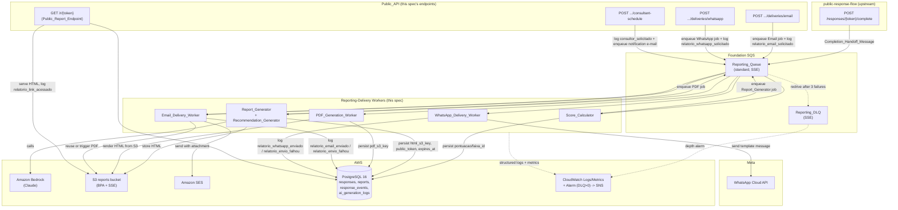
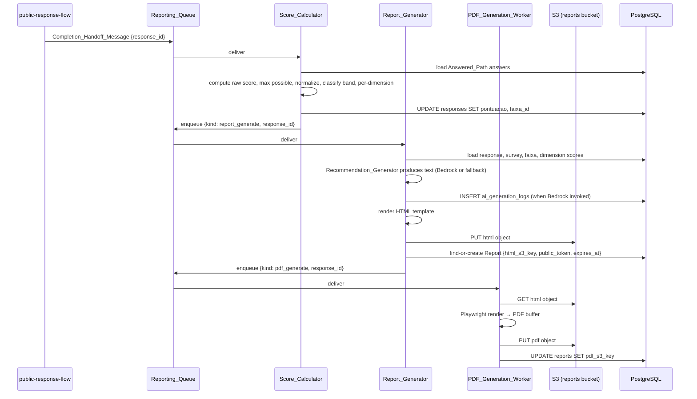

# Design Document

## Overview

This design specifies **reporting-delivery** (spec 6 of 7 for BouCheck): the asynchronous pipeline that turns a completed `Response_Session` into a scored, rendered, and delivered diagnostic report. It covers score calculation, Maturity_Band classification, per-dimension scoring, HTML/PDF report generation (with AI-assisted recommendations and a mandatory non-AI fallback), the public unauthenticated report endpoint, e-mail and WhatsApp delivery with retry-then-fail semantics, and the consultant-scheduling notification.

Everything in this spec is triggered by one event: `public-response-flow` publishes a `Completion_Handoff_Message` to the foundation `Reporting_Queue` when a `Response_Session` reaches `completo`. From there, a chain of `Reporting_Queue` consumers — `Score_Calculator` → `Report_Generator`/`Recommendation_Generator` → `PDF_Generation_Worker`, `Email_Delivery_Worker`, `WhatsApp_Delivery_Worker` — does the rest without blocking any respondent-facing HTTP request.

### Traceability

| Requirements spec section | Traces to master requirement |
|---|---|
| Requirement 1 (handoff consumption) | REQ-PUB-007.1 boundary |
| Requirement 2 (raw score) | REQ-REP-001.1 |
| Requirement 3 (maturity band) | REQ-REP-001.2 |
| Requirement 4 (per-dimension scoring) | REQ-REP-001.3 |
| Requirement 5 (normalization) | REQ-REP-001.4 |
| Requirement 6 (report content assembly) | REQ-REP-002.1 |
| Requirement 7 (AI recommendations + fallback) | REQ-REP-002.2 |
| Requirement 8 (HTML availability + public token) | REQ-REP-002.3 |
| Requirement 9 (PDF generation) | REQ-REP-002.3 |
| Requirement 10 (footer/CTA) | REQ-REP-002.4 |
| Requirement 11 (four actions) | REQ-PUB-007.2 |
| Requirement 12 (view report) | REQ-PUB-007.3 |
| Requirement 13 (e-mail delivery) | REQ-PUB-007.4 |
| Requirement 14 (WhatsApp delivery) | REQ-PUB-007.5 |
| Requirement 15 (consultant scheduling) | REQ-PUB-007.6 |
| Requirement 16 (retry-then-fail) | REQ-PUB-007.7 |
| Requirement 17 (public link security) | REQ-PUB-007.8 |
| Requirement 18 (async worker architecture) | REQ-NFR-001.4, REQ-NFR-001.5 |
| Requirement 19 (observability) | REQ-NFR-005 |

### Dependencies (consumed, not redefined)

- **foundation-data-model** — `responses`, `response_answers`, `response_events`, `questions` (incl. `dimensao`), `question_options`, `score_ranges`, `reports`, `ai_generation_logs` ORM models; the `Reporting_Queue` / `Reporting_DLQ` SQS resources (standard queue, SSE, redrive policy `maxReceiveCount: 3`); the reports S3 bucket (Block Public Access + SSE).
- **survey-authoring** — validated, non-overlapping `score_ranges`; validated `questions.dimensao` labels; `surveys.config_visual`, `link_agendamento`, `email_notificacao`, `usar_ia_no_relatorio`. Consumed as-is; not re-validated.
- **public-response-flow** — publishes the `Completion_Handoff_Message` to `Reporting_Queue` on `completo` transition; owns the completion-screen UI that invokes this spec's action endpoints and the `GET .../events` endpoint used to log `relatorio_visualizado`, `relatorio_email_solicitado`, `relatorio_whatsapp_solicitado`, `consultor_solicitado` (already whitelisted there). This spec adds the enqueue side effects and worker-side confirmation events behind those actions.

### Key design decisions

| Decision | Choice | Rationale |
|---|---|---|
| Job chaining | One SQS message kind per pipeline stage, all on `Reporting_Queue`, each carrying `response_id` (+ stage-specific fields); consumer for stage N enqueues stage N+1 on success | Matches Req 1.3 and Req 18.1 (async, decoupled). Keeps every stage independently retryable via the same queue/DLQ redrive policy already provisioned by foundation. |
| Score persistence idempotency | Recompute-and-overwrite on redelivery; `Report` row creation keyed by `response_id` unique constraint (`reports.response_id_unique`) prevents duplicates | Req 1.4 requires overwrite without duplicate `Report` rows; the DB constraint makes duplicate-row creation structurally impossible, and the service uses "find-or-create" against it. |
| Recommendation generation ownership | `Recommendation_Generator` runs **inside** the `Report_Generator` job (same consumer invocation), not a separate queue message | Req 7.6 requires the Report_Generator to proceed to render/persist HTML *after* recommendation text is produced, regardless of source. Splitting into two queue hops would add redelivery/ordering complexity with no benefit — Bedrock's own timeout already bounds latency, and the mandatory fallback removes any need for a separate retry lane. |
| PDF rendering trigger | `Report_Generator` enqueues the PDF_Generation_Worker job (not the Score_Calculator) | The worker needs `html_s3_key`, which only exists after `Report_Generator` completes. |
| Email/WhatsApp enqueue trigger | Enqueued directly by the Public_API action endpoints (`Requirement 13/14`), not chained from PDF generation | The respondent chooses delivery channel explicitly; report HTML/PDF may already exist from a prior view. The Email_Delivery_Worker enqueues its own PDF-generation job only if `pdf_s3_key` is still null (Req 9.4). |
| Idempotent redelivery detection | Each worker checks a durable "already done" signal specific to its side effect *before* performing it: `reports.pdf_s3_key` set (PDF), a `response_events` row of the worker's success type already existing for the `response_id` (email/WhatsApp send confirmation) | Req 18.2 forbids duplicate Reports/deliveries/events on redelivery. Checking existing state (not a separate dedupe table) reuses columns/rows the spec already writes, keeping the mechanism auditable from the same tables an operator inspects. |
| Retry counting | Rely on the SQS **ApproximateReceiveCount** message attribute (native to the already-provisioned `maxReceiveCount: 3` redrive policy) rather than an application-level counter column | Req 16 defines Retry_Count as "the number of times Reporting_Queue has redelivered" — this is exactly what SQS tracks natively. No new schema needed; foundation's queue is already configured with `maxReceiveCount: 3`. |
| Failure logging exactly-once | The consumer logs `relatorio_envio_falhou` itself on the **3rd** processing attempt (`ApproximateReceiveCount == 3`) immediately before re-throwing/letting the message move to the DLQ, guarded by a check for an existing `relatorio_envio_falhou` event for that `(response_id, canal)` in the current failure episode | SQS's redrive to DLQ happens automatically after the consumer's Nth failure; logging must happen synchronously in the consumer on that Nth attempt (not in a separate DLQ-drain process) so the failure reason is captured with certainty exactly once (Req 16.2, 16.3). |
| Report_Generator ownership | `Report_Generator` and `Recommendation_Generator` are two collaborating classes invoked by one SQS consumer/handler | Clean separation of "assemble HTML" vs. "produce recommendation text" while satisfying the "no separate queue hop" decision above. |
| PDF rendering engine | Playwright (`playwright-chromium`), headless, invoked in-process by `PDF_Generation_Worker` | Req 9.1 mandates headless Chromium/Playwright; Playwright's Node API renders arbitrary HTML to PDF via `page.setContent()` + `page.pdf()` without a separate service. |
| Public token generation | `crypto.randomBytes(32)` base64url-encoded (256 bits of entropy), never derived from `reports.id` or `responses.id` | Req 17.1 forbids encoding the sequential ID; 256 bits makes brute-force/guessing infeasible. Uniqueness enforced by the existing `reports.public_token_unique` DB constraint with a bounded regenerate-on-collision loop. |
| Consultant notification transport | Enqueue an e-mail job to the foundation SQS queue pattern (reusing the same `MailMessage`-style envelope already established in `admin-auth-users`), rendered and sent via SES by the Email_Delivery_Worker | Consistency with the existing e-mail-via-SQS-then-SES pattern in this codebase; keeps the click-handling endpoint fast. |

---

## Architecture



### Pipeline sequence (happy path)



---

## Components and Interfaces

### Backend module layout

```
backend/app/
├── controllers/public/
│   ├── report_controller.ts            # GET /r/{token}
│   └── report_action_controller.ts     # POST .../deliveries/email|whatsapp, .../consultant-schedule
├── jobs/                                # Reporting_Queue consumers (one handler per message kind)
│   ├── score_calculator_job.ts
│   ├── report_generator_job.ts
│   ├── pdf_generation_job.ts
│   ├── email_delivery_job.ts
│   └── whatsapp_delivery_job.ts
├── services/
│   ├── score_calculator.ts             # pure scoring/normalization/classification logic
│   ├── report_generator.ts             # HTML assembly orchestration
│   ├── recommendation_generator.ts     # Bedrock call + fallback
│   ├── pdf_renderer.ts                 # Playwright wrapper
│   ├── email_delivery_service.ts       # SES send + attachment
│   ├── whatsapp_delivery_service.ts    # WhatsApp Cloud API call
│   ├── public_report_token.ts          # token generation/validation
│   └── reporting_queue_client.ts       # thin SQS send/receive wrapper (shared shape)
├── support/
│   ├── bedrock_client.ts               # reused shape from ai-question-generation (recommendation prompt)
│   └── report_html_template.ts         # HTML templating function(s)
└── models/                              # consumed from foundation-data-model (Response, Report, etc.)
```

### Reporting_Queue message contract

All messages share an envelope so a single worker process can dispatch by `kind`:

```ts
// app/services/reporting_queue_client.ts
export type ReportingQueueMessage =
  | { kind: 'score_calculate'; response_id: string }                     // Completion_Handoff_Message shape (produced upstream)
  | { kind: 'report_generate'; response_id: string }
  | { kind: 'pdf_generate'; response_id: string }
  | { kind: 'email_deliver'; response_id: string; to_email: string }
  | { kind: 'whatsapp_deliver'; response_id: string; to_phone: string }
  | { kind: 'consultant_notify'; response_id: string; to_email: string }

export class ReportingQueueClient {
  constructor(private cfg: { queueUrl: string; region: string }) {}
  async enqueue(message: ReportingQueueMessage): Promise<void>
}
```

Each job handler receives the SQS record, including the native `ApproximateReceiveCount` attribute used for Retry_Count (Requirement 16).

### Score_Calculator (services/score_calculator.ts)

Pure, side-effect-free scoring core, unit of property-based testing:

```ts
export interface AnsweredChoice {
  questionId: number
  peso: number                    // questions.peso
  dimensao: string | null
  selectedPontuacoes: number[]    // one per selected option; multi-select can have >1
  maxOptionPontuacao: number      // highest pontuacao among the question's options
}

export interface MaturityBandDef {
  id: number
  min: number
  max: number
}

export interface ScoreResult {
  rawScore: number
  maxPossibleScore: number
  normalizedScore: number         // 0-100, bounded
  dimensionScores: Map<string, { raw: number; max: number; normalized: number }>
  faixaId: number | null
}

export class ScoreCalculator {
  // Req 2, 3, 4, 5 — pure function, no I/O
  static compute(answers: AnsweredChoice[], bands: MaturityBandDef[]): ScoreResult
}
```

`ScoreCalculatorJob` (the queue consumer) loads `response_answers` joined to `questions`/`question_options` restricted to the Answered_Path, maps them to `AnsweredChoice[]`, calls `ScoreCalculator.compute`, then persists `responses.pontuacao = normalizedScore` and `responses.faixa_id = faixaId`, and enqueues the `report_generate` message.

#### Algorithm

```ts
static compute(answers: AnsweredChoice[], bands: MaturityBandDef[]): ScoreResult {
  let rawScore = 0
  let maxPossibleScore = 0
  const dimensionRaw = new Map<string, number>()
  const dimensionMax = new Map<string, number>()

  for (const a of answers) {
    const contribution = a.selectedPontuacoes.reduce((sum, p) => sum + p * a.peso, 0)
    const maxContribution = a.maxOptionPontuacao * a.peso

    rawScore += contribution
    maxPossibleScore += maxContribution

    if (a.dimensao !== null) {
      dimensionRaw.set(a.dimensao, (dimensionRaw.get(a.dimensao) ?? 0) + contribution)
      dimensionMax.set(a.dimensao, (dimensionMax.get(a.dimensao) ?? 0) + maxContribution)
    }
  }

  const normalizedScore = maxPossibleScore === 0
    ? 0
    : clamp((rawScore / maxPossibleScore) * 100, 0, 100)

  const dimensionScores = new Map<string, { raw: number; max: number; normalized: number }>()
  for (const [dim, raw] of dimensionRaw) {
    const max = dimensionMax.get(dim) ?? 0
    const normalized = max === 0 ? 0 : clamp((raw / max) * 100, 0, 100)
    dimensionScores.set(dim, { raw, max, normalized })
  }

  const band = bands.find(b => normalizedScore >= b.min && normalizedScore <= b.max)

  return { rawScore, maxPossibleScore, normalizedScore, dimensionScores, faixaId: band?.id ?? null }
}

function clamp(x: number, lo: number, hi: number): number {
  return Math.max(lo, Math.min(hi, x))
}
```

- Requirement 2.1–2.4: `rawScore` sums `pontuacao × peso` over every selected option of every Choice_Question in the Answered_Path; `multipla_escolha` contributes once per selected option (the `.reduce` over `selectedPontuacoes`); Open_Questions never appear in `answers` (excluded at the query layer, Req 2.2).
- Requirement 5.1–5.3, 5.5: `maxPossibleScore` sums `peso × maxOptionPontuacao`; division guarded by the `maxPossibleScore === 0` check (Req 5.3); `clamp` bounds to `[0, 100]` (Req 5.5).
- Requirement 3.1, 3.3, 3.4: band lookup is an inclusive `[min, max]` scan; zero bands or no matching band both fall through to `faixaId: undefined ?? null`.
- Requirement 4.1–4.3: dimension maps are populated only for non-null `dimensao`; a survey with none produces empty maps, i.e. zero `Dimension_Score` values.

### Idempotent score persistence (Requirement 1.4, 18.2)

```ts
// jobs/score_calculator_job.ts (sketch)
async function handle(responseId: string) {
  const answers = await loadAnsweredChoiceRows(responseId)     // excludes 'aberta' questions
  const bands = await loadBands(responseId)                    // score_ranges for the response's survey
  const result = ScoreCalculator.compute(answers, bands)

  await Response.query()
    .where('id', responseId)
    .update({ pontuacao: result.normalizedScore, faixa_id: result.faixaId }) // overwrite, not insert (Req 1.4)

  await reportingQueue.enqueue({ kind: 'report_generate', response_id: responseId })
}
```

Recomputation on redelivery always overwrites the same `responses` row (`UPDATE`, never `INSERT`), so no duplicate score record can exist. The subsequent `report_generate` enqueue is safe to duplicate because `Report_Generator`'s persistence step (below) is itself find-or-create keyed by the DB's `reports.response_id_unique` constraint — a second `report_generate` message for the same response updates the same `Report` row instead of creating a second one.

### Report_Generator (services/report_generator.ts)

```ts
export interface ReportContext {
  response: { nome: string | null; empresa: string | null }
  visualIdentity: { corPrimaria?: string; corSecundaria?: string; corFundo?: string; logoS3Key?: string }
  normalizedScore: number
  band: { nome: string; descricao: string } | null   // null when faixaId is null (Req 6.3)
  dimensionScores: Array<{ dimensao: string; normalized: number }>  // empty array omits radar (Req 6.2, 4.5)
  answerSummary: Array<{ questionText: string; answerText: string }>
  recommendationText: string
  footer: { contact: string; linkAgendamento: string }
}

export class ReportGenerator {
  constructor(private recommendationGenerator: RecommendationGenerator) {}

  async assemble(responseId: string): Promise<{ html: string; context: ReportContext }>
}
```

Assembly steps (Requirement 6, 10):
1. Load `Response` (+ `survey`, `faixa`), `response_answers` (+ `question`, `question_option`) for the full Answered_Path (choice **and** open questions — Req 6.4 includes both in the summary, unlike scoring which excludes open questions).
2. Load dimension scores computed by `Score_Calculator` (recomputed here from the same query helper, or read from a transient cache — see note below) to build radar-chart data.
3. Call `RecommendationGenerator.generate(...)` (Requirement 7) to obtain `recommendationText`.
4. Render `report_html_template.ts` with the assembled `ReportContext`, including the footer with BeOnUp contact info and the `link_agendamento` CTA (Requirement 10.1, 10.2) unconditionally.
5. Store the rendered HTML to S3 (`reports/{response_id}/report.html`) and find-or-create the `Report` row.

> **Design note on recomputing dimension scores in Report_Generator:** `Score_Calculator` does not persist per-dimension breakdowns (only the overall `pontuacao`/`faixa_id` land in `responses`). Rather than adding new columns to `foundation-data-model` (out of this spec's scope to alter), `Report_Generator` re-derives `dimensionScores` by calling the same pure `ScoreCalculator.compute` against the same Answered_Path query. This is cheap (in-memory, no external calls) and keeps the two workers consistent by construction since they share one pure function.

#### HTML templating approach

A dependency-free template function (no server-side React/JSX rendering) using tagged template literals with HTML-escaping helpers, avoiding a heavyweight templating engine dependency for a single document type:

```ts
// support/report_html_template.ts
export function renderReportHtml(ctx: ReportContext): string {
  return `<!DOCTYPE html>
<html lang="pt-BR">
<head>
  <meta charset="utf-8" />
  <style>${buildInlineStyles(ctx.visualIdentity)}</style>
</head>
<body>
  ${renderHeader(ctx)}
  ${renderScoreSection(ctx)}
  ${ctx.dimensionScores.length > 0 ? renderRadarChart(ctx.dimensionScores) : ''}
  ${renderRecommendation(ctx.recommendationText)}
  ${renderAnswerSummary(ctx.answerSummary)}
  ${renderFooter(ctx.footer)}
</body>
</html>`
}

function esc(s: string): string {
  return s.replace(/[&<>"']/g, c => ({ '&': '&amp;', '<': '&lt;', '>': '&gt;', '"': '&quot;', "'": '&#39;' }[c]!))
}
```

All respondent- and survey-authored text (`nome`, `empresa`, question/answer text, recommendation text) is passed through `esc()` before interpolation, since this HTML is later served verbatim by the Public_Report_Endpoint. The radar chart is rendered as inline SVG (no client-side JS dependency needed for the PDF renderer to capture it) keyed by `dimensao` (Req 6.2).

#### PDF rendering reuses stored HTML (Requirement 9.1, 9.3)

`PDF_Generation_Worker` never re-assembles or re-templates content — it fetches the exact bytes already stored at `reports.html_s3_key` and renders those:

```ts
// services/pdf_renderer.ts
import { chromium } from 'playwright-chromium'

export class PdfRenderer {
  async renderFromHtml(html: string): Promise<Buffer> {
    const browser = await chromium.launch({ headless: true })
    try {
      const page = await browser.newPage()
      await page.setContent(html, { waitUntil: 'networkidle' })
      return await page.pdf({ format: 'A4', printBackground: true })
    } finally {
      await browser.close()
    }
  }
}
```

```ts
// jobs/pdf_generation_job.ts (sketch)
async function handle(responseId: string) {
  const report = await Report.query().where('response_id', responseId).firstOrFail()
  const html = await s3.getObjectAsString(report.html_s3_key)      // Req 9.3: same bytes, no re-render
  const pdfBuffer = await pdfRenderer.renderFromHtml(html)
  const pdfKey = `reports/${responseId}/report.pdf`
  await s3.putObject(pdfKey, pdfBuffer, { contentType: 'application/pdf' })  // BPA-only bucket (Req 18.3)
  await report.merge({ pdf_s3_key: pdfKey }).save()
}
```

Requirement 18.3/18.4 (bucket must have Block Public Access enabled, else refuse to store): the reports bucket is provisioned by foundation-data-model with `blockPublicAccess: BLOCK_ALL` already; this worker additionally verifies the bucket's `PublicAccessBlockConfiguration` via `s3.getPublicAccessBlock` once at process start (cached for the worker's lifetime) and refuses all `putObject` calls if the check fails or returns anything other than all-true, logging a structured error instead of silently storing to a possibly-public bucket.

### Recommendation_Generator (services/recommendation_generator.ts)

```ts
export interface RecommendationInput {
  surveyId: number
  usarIaNoRelatorio: boolean
  answerSummary: Array<{ questionText: string; answerText: string }>
  bandFallbackText: string        // classified Maturity_Band's `descricao` (or a survey-level default when faixaId is null)
  adminUserIdForLog: number | null // ai_generation_logs.admin_user_id is NOT NULL upstream; see note below
}

export class RecommendationGenerator {
  constructor(private bedrock: BedrockClient, private logs: typeof AiGenerationLog) {}

  // Req 7.1-7.6 — always resolves to non-empty text, never throws
  async generate(input: RecommendationInput): Promise<string>
}
```

```ts
async generate(input: RecommendationInput): Promise<string> {
  if (!input.usarIaNoRelatorio) {
    return input.bandFallbackText                                 // Req 7.2 — no Bedrock call at all
  }

  try {
    const prompt = buildRecommendationPrompt(input.answerSummary)
    const result = await this.bedrock.invoke(RECOMMENDATION_SYSTEM_PROMPT, prompt)
    const text = extractRecommendationText(result.text)            // parse; throws on unparseable content
    await this.logs.create({
      survey_id: input.surveyId, prompt, resultado: { text },
      tokens_input: result.tokensInput, tokens_output: result.tokensOutput, sucesso: true,
    })
    return text || input.bandFallbackText                          // guard against empty-but-parseable text
  } catch (err) {
    await this.logs.create({
      survey_id: input.surveyId, prompt: '(see error)', resultado: { error: String(err) },
      tokens_input: null, tokens_output: null, sucesso: false,
    })
    return input.bandFallbackText                                  // Req 7.3, 7.4 — mandatory fallback
  }
}
```

- Requirement 7.1/7.2: the `usarIaNoRelatorio` flag branches *before* any Bedrock call.
- Requirement 7.3/7.4: every failure path (network error, timeout via `BedrockTimeoutError`, unparseable content via a thrown `ParseError`) is caught and substitutes `bandFallbackText`; the function has no throwing exit — it always returns a string, and `|| input.bandFallbackText` covers the edge case of a technically-parseable-but-empty response.
- Requirement 7.5: every completed Bedrock request (success or failure) writes one `ai_generation_logs` row with `survey_id`, outcome (`sucesso`), and token counts when available. `usar_ia_no_relatorio: false` paths write no log row (no request was made).
- Requirement 7.6: `Report_Generator.assemble` calls `generate()` and always proceeds to render/persist regardless of the returned text's origin — there is no branch in `assemble` that inspects *how* the text was produced.

> **Note on `ai_generation_logs.admin_user_id NOT NULL`:** foundation-data-model's schema defines `ai_generation_logs.admin_user_id` as `NOT NULL REFERENCES admin_users(id)`, sized for the admin-triggered `ai-question-generation` use case. Recommendation generation is respondent-triggered and has no admin actor. This design uses a reserved **system admin user row** (seeded by foundation, e.g. `admin_users` id designated for "system"/service actions) as `admin_user_id` for all Recommendation_Generator log rows, so no foundation schema change is required. This is called out explicitly because it is a cross-spec seam; if no such seeded row exists yet, provisioning it is a one-time migration/seed addition owned by this spec's implementation tasks, not a foundation-data-model redesign.

### PDF/Email/WhatsApp delivery workers

#### Email_Delivery_Worker (services/email_delivery_service.ts, jobs/email_delivery_job.ts)

```ts
export class EmailDeliveryService {
  constructor(private ses: SesClientLike, private s3: S3ClientLike) {}

  // Req 13.2, 13.3 — SES send with PDF attachment; reuses existing PDF (Req 9.4)
  async deliver(report: Report, toEmail: string): Promise<void>
}
```

```ts
// jobs/email_delivery_job.ts (sketch)
async function handle(record: SqsRecord, { responseId, toEmail }: { responseId: string; toEmail: string }) {
  const receiveCount = Number(record.attributes.ApproximateReceiveCount)

  // Idempotent redelivery guard (Req 18.2): skip if already confirmed sent
  const alreadySent = await ResponseEvent.query()
    .where('response_id', responseId).where('tipo', 'relatorio_email_enviado').first()
  if (alreadySent) return

  try {
    let report = await Report.query().where('response_id', responseId).firstOrFail()
    if (!report.pdf_s3_key) {                                     // Req 9.4
      await pdfRenderer.renderAndStore(report)                     // in-process, synchronous — no extra queue hop needed here
      report = await report.refresh()
    }
    await emailDeliveryService.deliver(report, toEmail)
    await ResponseEvent.create({ response_id: responseId, tipo: 'relatorio_email_enviado' })  // Req 13.2
  } catch (err) {
    await handleDeliveryFailure({ responseId, canal: 'email', receiveCount, err })             // Requirement 16
    throw err   // let SQS's own redrive-after-3 mechanics move it to the DLQ on the 3rd failure
  }
}
```

#### WhatsApp_Delivery_Worker (services/whatsapp_delivery_service.ts, jobs/whatsapp_delivery_job.ts)

```ts
export class WhatsAppDeliveryService {
  constructor(private client: WhatsAppCloudApiClient) {}

  // Req 14.2 — approved template call containing the Public_Report_Endpoint link
  async deliver(toPhone: string, reportUrl: string): Promise<void>
}
```

```ts
async function handle(record: SqsRecord, { responseId, toPhone }: { responseId: string; toPhone: string }) {
  const receiveCount = Number(record.attributes.ApproximateReceiveCount)
  const alreadySent = await ResponseEvent.query()
    .where('response_id', responseId).where('tipo', 'relatorio_whatsapp_enviado').first()
  if (alreadySent) return

  try {
    const report = await Report.query().where('response_id', responseId).firstOrFail()
    const reportUrl = `${config.publicReportBaseUrl}/r/${report.public_token}`
    await whatsAppDeliveryService.deliver(toPhone, reportUrl)
    await ResponseEvent.create({ response_id: responseId, tipo: 'relatorio_whatsapp_enviado' })  // Req 14.3
  } catch (err) {
    await handleDeliveryFailure({ responseId, canal: 'whatsapp', receiveCount, err })
    throw err
  }
}
```

#### Shared retry/DLQ failure logging (Requirement 16, 19)

```ts
// services/delivery_failure_handler.ts
export async function handleDeliveryFailure(params: {
  responseId: string; canal: 'email' | 'whatsapp'; receiveCount: number; err: unknown
}): Promise<void> {
  logger.error({ event: 'delivery_attempt_failed', ...params }, 'delivery job failed')  // Req 19.1, every attempt
  metrics.increment(params.canal === 'email' ? 'email_delivery_failures' : 'whatsapp_delivery_failures')  // Req 19.2

  if (params.receiveCount < 3) {
    return  // Req 16.1 — redeliver silently, no failure event yet
  }

  // Req 16.2, 16.3 — exactly one relatorio_envio_falhou per Delivery_Job that reaches 3 failures
  const alreadyLogged = await ResponseEvent.query()
    .where('response_id', params.responseId)
    .where('tipo', 'relatorio_envio_falhou')
    .where('payload->>canal', params.canal)
    .first()
  if (alreadyLogged) return

  await ResponseEvent.create({
    response_id: params.responseId,
    tipo: 'relatorio_envio_falhou',
    payload: { canal: params.canal, motivo: String(params.err) },
  })
}
```

`ApproximateReceiveCount` is the SQS-native counter that increments on every redelivery of the *same* message, giving Retry_Count for free (design decision above). Because this handler runs inside the consumer's own failure path — before the message is `throw`n back to the SQS client library, which lets the queue's own visibility-timeout/redrive mechanics either redeliver (count < `maxReceiveCount`) or move the message to `Reporting_DLQ` (count == `maxReceiveCount` = 3, matching foundation's provisioned redrive policy) — the `relatorio_envio_falhou` log and the DLQ routing are two independent consequences of the same 3rd-failure event, both driven off the same `receiveCount`. The `alreadyLogged` guard makes the log write idempotent against SQS's at-least-once delivery of the visibility-timeout expiry itself (Req 16.3's "exactly one").

### Public_Report_Endpoint (controllers/public/report_controller.ts)

```ts
// GET /r/{token}
async function show({ params, response }: HttpContext) {
  const report = await Report.query().where('public_token', params.token).first()

  if (!report || isExpired(report)) {                    // Req 8.5, 17.3 — same 404 for "not found" and "expired"
    return response.status(404).json({ error: 'report_not_found' })
  }

  const html = await s3.getObjectAsString(report.html_s3_key)
  await ResponseEvent.create({ response_id: report.response_id, tipo: 'relatorio_link_acessado' })  // Req 8.4
  return response.type('html').send(html)
}

function isExpired(report: Report): boolean {
  return report.expires_at !== null && report.expires_at.toMillis() < Date.now()
}
```

No authentication middleware is applied to this route — it is intentionally public, gated only by token unguessability and expiry (Requirement 17). This route is exempt from the `ResponseTokenAuth` middleware used elsewhere in the platform for respondent-write endpoints; it performs no writes to respondent data other than the append-only access-log event.

> **Security note:** `GET /r/{token}` is unauthenticated by design per REQ-PUB-007.8 (the token itself is the credential). Because a matched report's full HTML — including respondent name, company, and answers — is served to anyone possessing the token, the token's entropy (256 bits, Requirement 17.1) and 90-day expiry (Requirement 17.3) are the only controls; both are enforced server-side on every request, not just at generation time.

### Report action endpoints (controllers/public/report_action_controller.ts)

```
POST /api/public/responses/{token}/deliveries/email       (Req 13.1)
POST /api/public/responses/{token}/deliveries/whatsapp     (Req 14.1)
POST /api/public/responses/{token}/consultant-schedule     (Req 15.1, 15.2, 15.4)
```

These reuse the `ResponseTokenAuth` middleware from `public-response-flow` (write endpoints keyed by the respondent's session token, not the public report token).

#### `POST .../deliveries/email`

```ts
async function requestEmail({ params, responseSession, response }: HttpContext) {
  const toEmail = responseSession.email                                    // from identification (Req 13.1)
  await ResponseEvent.create({ response_id: responseSession.id, tipo: 'relatorio_email_solicitado' })
  await reportingQueue.enqueue({ kind: 'email_deliver', response_id: responseSession.id, to_email: toEmail })
  return response.json({ requested: true, masked_email: maskEmail(toEmail) })  // Req 13.4
}

function maskEmail(email: string): string {
  const [local, domain] = email.split('@')
  return `${local[0]}${'*'.repeat(Math.max(local.length - 1, 1))}@${domain}`
}
```

**Response 200:** `{ "requested": true, "masked_email": "j***@empresa.com" }`

#### `POST .../deliveries/whatsapp`

```ts
async function requestWhatsapp({ responseSession, response }: HttpContext) {
  await ResponseEvent.create({ response_id: responseSession.id, tipo: 'relatorio_whatsapp_solicitado' })
  await reportingQueue.enqueue({ kind: 'whatsapp_deliver', response_id: responseSession.id, to_phone: responseSession.telefone })
  return response.json({ requested: true })
}
```

**Response 200:** `{ "requested": true }`

#### `POST .../consultant-schedule`

```ts
async function scheduleConsultant({ responseSession, response }: HttpContext) {
  const survey = await responseSession.related('survey').query().firstOrFail()
  await ResponseEvent.create({ response_id: responseSession.id, tipo: 'consultor_solicitado' })  // Req 15.1
  await reportingQueue.enqueue({                                                                  // Req 15.4
    kind: 'consultant_notify', response_id: responseSession.id, to_email: survey.email_notificacao,
  })
  return response.json({ link_agendamento: survey.link_agendamento })                             // Req 15.2
}
```

**Response 200:** `{ "link_agendamento": "https://calendly.com/..." }`
**Response 500** (link missing/unset — surfaced by the frontend as an error message, Req 15.3): `{ "error": "link_agendamento_unavailable" }`

The `Consultant_Notification` is delivered as an `email_deliver`-shaped variant (`consultant_notify` kind) handled by the same `Email_Delivery_Worker` process using a distinct internal template (survey name, respondent name/empresa, timestamp) addressed to `email_notificacao` rather than the respondent — this is an internal, not a respondent-facing, message and therefore is not gated by the `relatorio_*` idempotency checks (a survey may reasonably receive one notification per distinct scheduling click, which the `consultor_solicitado` event already sequences one-per-click upstream).

### Public_Report_Token generation (services/public_report_token.ts)

```ts
import { randomBytes } from 'node:crypto'

export function generatePublicReportToken(): string {
  return randomBytes(32).toString('base64url')   // 256 bits entropy, URL-safe, no padding (Req 17.1)
}

// jobs/report_generator_job.ts (sketch) — regenerate-on-collision loop
async function findOrCreateReport(responseId: string, htmlS3Key: string, expiresAt: DateTime) {
  const existing = await Report.query().where('response_id', responseId).first()
  if (existing) {
    return existing.merge({ html_s3_key: htmlS3Key }).save()          // Req 1.4 — overwrite, no new token/expiry
  }

  for (let attempt = 0; attempt < 5; attempt++) {
    const token = generatePublicReportToken()
    try {
      return await Report.create({
        response_id: responseId, html_s3_key: htmlS3Key,
        public_token: token, expires_at: expiresAt,                    // Req 8.3, 17
      })
    } catch (err) {
      if (isUniqueViolation(err, 'reports_public_token_unique') && attempt < 4) continue  // Req 17.2
      throw err
    }
  }
}
```

- Requirement 17.1: `randomBytes(32)` never touches `responseId`/sequential IDs — the token carries zero structural information about them.
- Requirement 17.2: uniqueness is enforced by the DB's `reports_public_token_unique` constraint (already defined in foundation-data-model); the bounded retry loop handles the astronomically unlikely collision case (256-bit space) without ever surfacing a 500 to the pipeline.
- Requirement 8.3: `expires_at = response.completed_at + 90 days`, computed by the caller (`report_generator_job.ts`) from `responses.completed_at` and passed in.
- Requirement 1.4 (redelivery): an existing `Report` row is updated in place — the token and expiry are **not** regenerated on redelivery, only `html_s3_key` (and by extension `pdf_s3_key` downstream) refreshes; this preserves any link already delivered to the respondent.

---

## Data Models

This spec introduces no new tables. It reads and writes exclusively through the ORM models defined by `foundation-data-model`.

### Models consumed / written

| Model | Read | Written by this spec |
|---|---|---|
| `Response` | `response_answers`-backed Answered_Path, `nome`, `empresa`, `email`, `telefone`, `completed_at`, `survey`, `faixa` | `pontuacao`, `faixa_id` |
| `Question` | `tipo`, `peso`, `dimensao`, `texto` | — |
| `QuestionOption` | `pontuacao`, `texto` | — |
| `ResponseAnswer` | `question_option_id`, `texto_livre` (Answered_Path) | — |
| `ScoreRange` (`score_ranges`) | `min`, `max`, `nome`, `descricao` | — |
| `Report` | `response_id`, `public_token`, `html_s3_key`, `pdf_s3_key`, `expires_at` | `html_s3_key`, `pdf_s3_key`, `public_token` (create-only), `expires_at` (create-only) |
| `AiGenerationLog` (`ai_generation_logs`) | — | `survey_id`, `prompt`, `resultado`, `tokens_input`, `tokens_output`, `sucesso` |
| `ResponseEvent` | existing rows for idempotency checks (`relatorio_email_enviado`, `relatorio_whatsapp_enviado`, `relatorio_envio_falhou`) | `relatorio_email_solicitado`, `relatorio_email_enviado`, `relatorio_whatsapp_solicitado`, `relatorio_whatsapp_enviado`, `relatorio_envio_falhou`, `relatorio_link_acessado`, `consultor_solicitado` |
| `Survey` | `config_visual`, `usar_ia_no_relatorio`, `link_agendamento`, `email_notificacao` | — |

### Query patterns introduced

| Operation | Query |
|---|---|
| Load Answered_Path choice answers for scoring | `ResponseAnswer.query().where('response_id', id).preload('question', q => q.whereIn('tipo', ['escolha_unica','multipla_escolha'])).preload('questionOption')` then map to `AnsweredChoice[]` (per-question max option pontuacao computed from `QuestionOption.query().where('question_id', qid)`) |
| Load Answered_Path full summary (incl. open) for report | Same query without the `tipo` filter, including `texto_livre` |
| Load survey's maturity bands | `ScoreRange.query().where('survey_id', surveyId)` |
| Find-or-create Report | `Report.query().where('response_id', id).first()` → `Report.create(...)` on miss (unique constraint backstop) |
| Lookup by public token | `Report.query().where('public_token', token).first()` |
| Idempotency check (worker) | `ResponseEvent.query().where('response_id', id).where('tipo', type).first()` |
| Failure-episode idempotency check | `ResponseEvent.query().where('response_id', id).where('tipo', 'relatorio_envio_falhou').where('payload->>canal', canal).first()` |

### Data flow diagram

```mermaid
flowchart LR
  subgraph Score["Score_Calculator"]
    A[Load Answered_Path choice answers] --> B[ScoreCalculator.compute]
    B --> C[UPDATE responses.pontuacao/faixa_id]
    C --> D[Enqueue report_generate]
  end

  subgraph Report["Report_Generator"]
    E[Load full Answered_Path + survey + faixa] --> F[RecommendationGenerator.generate]
    F --> G[renderReportHtml]
    G --> H[PUT html to S3]
    H --> I[find-or-create Report row]
    I --> J[Enqueue pdf_generate]
  end

  subgraph PDF["PDF_Generation_Worker"]
    K[GET html from S3] --> L[Playwright render]
    L --> M[PUT pdf to S3]
    M --> N[UPDATE reports.pdf_s3_key]
  end

  D --> E
  J --> K
```



---

## Correctness Properties

*A property is a characteristic or behavior that should hold true across all valid executions of a system-essentially, a formal statement about what the system should do. Properties serve as the bridge between human-readable specifications and machine-verifiable correctness guarantees.*

The properties below were derived from the acceptance-criteria prework analysis, then deduplicated in a reflection pass (e.g. Requirement 8.2's "non-sequential token" and Requirement 17.1/17.2's "non-encoding, unique token" collapse into one token-generation property; Requirement 8.5's "unmatched token → 404" and Requirement 17.3's "expired → 404" collapse into one access-control property; the footer requirements (10.1/10.2) merge into the general report-content-completeness property since both describe unconditionally-present content).

### Property 1: Raw score correctness

For any list of answered Choice_Questions (each with a `peso`, a `dimensao`, and one or more selected options' `pontuacao` values), the computed raw score SHALL equal the sum, over every answered question and every one of its selected options, of that option's `pontuacao` multiplied by the question's `peso` — with Open_Question answers never contributing regardless of how many are present in the input.

**Validates: Requirements 2.1, 2.2, 2.3, 2.4**

### Property 2: Normalization bounds correctness

For any raw score and any overall max-possible score (including zero), the normalized score SHALL equal `(rawScore / maxPossibleScore) * 100` clamped to the closed interval `[0, 100]`, and SHALL equal exactly `0` whenever the max-possible score is `0`, without ever dividing by zero or producing a value outside `[0, 100]`.

**Validates: Requirements 5.1, 5.2, 5.3, 5.5**

### Property 3: Dimension score correctness

For any list of answered Choice_Questions labeled with zero or more distinct non-null `dimensao` values, the computed set of Dimension_Scores SHALL contain exactly one entry per distinct non-null `dimensao` present in the input, each normalized as `(dimensionRaw / dimensionMax) * 100` (or `0` when that dimension's max is `0`), and the set SHALL be empty when no input question carries a non-null `dimensao`.

**Validates: Requirements 4.1, 4.2, 4.3**

### Property 4: Maturity band classification correctness

For any normalized score and any list of Maturity_Bands (including an empty list and lists whose bounds do not cover the score), classification SHALL return a band whose `[min, max]` interval contains the normalized score whenever such a band exists in the list, and SHALL return `null` whenever the list is empty or no band's interval contains the score.

**Validates: Requirements 3.1, 3.2, 3.3, 3.4**

### Property 5: Idempotent score/report redelivery

For any Response_Session and Answered_Path, running the score-calculate-and-persist step twice in succession (simulating queue redelivery) SHALL leave `responses.pontuacao` and `responses.faixa_id` equal to the values produced by a single run, and SHALL NOT result in more than one `Report` row existing for that Response_Session.

**Validates: Requirements 1.4, 18.2**

### Property 6: Report content completeness

For any `ReportContext` (varying `nome`, `empresa`, `normalizedScore`, `answerSummary`, `recommendationText`, footer contact/CTA fields, and a `band` that is either a populated `{nome, descricao}` or `null`), the rendered report HTML SHALL contain the (HTML-escaped) text of `nome`, `empresa`, the normalized score, every answer summary entry's question and answer text, the recommendation text, the footer contact information, and the `link_agendamento` CTA — and SHALL contain the band's `nome` and `descricao` if and only if `band` is non-null.

**Validates: Requirements 6.1, 6.3, 6.4, 10.1, 10.2**

### Property 7: Radar-chart conditional inclusion

For any list of Dimension_Scores (including the empty list), the rendered report HTML SHALL contain radar-chart data keyed by every `dimensao` in the list when the list is non-empty, and SHALL contain no radar-chart data when the list is empty.

**Validates: Requirements 6.2, 4.4, 4.5**

### Property 8: Recommendation mandatory fallback

For any recommendation input and any simulated Bedrock outcome (success with non-empty text, success with empty text, failure, timeout, or unparseable content), `RecommendationGenerator.generate` SHALL always return non-empty text; that text SHALL equal the supplied fallback text whenever `usarIaNoRelatorio` is `false` or the simulated Bedrock outcome is not a successful non-empty response; and exactly one `ai_generation_logs` row SHALL be written if and only if `usarIaNoRelatorio` is `true`, with `sucesso` matching whether the outcome was a successful, parseable, non-empty response.

**Validates: Requirements 7.1, 7.2, 7.3, 7.4, 7.5**

### Property 9: Public_Report_Token non-sequential and unique

For any set of generated Public_Report_Tokens and any set of probe database identifiers (sequential integers/UUIDs), no generated token SHALL contain the decimal, hexadecimal, or raw string representation of any probe identifier as a substring, and across any number of generations within a single test run all generated tokens SHALL be pairwise distinct.

**Validates: Requirements 8.2, 17.1, 17.2**

### Property 10: Report expiry date-math

For any `completed_at` timestamp, the computed `expires_at` SHALL equal `completed_at` plus exactly 90 days.

**Validates: Requirements 8.3**

### Property 11: Public report endpoint access control

For any Public_Report_Token lookup against any set of stored Reports (each with its own token and `expires_at`) evaluated at any "current time," the Public_Report_Endpoint SHALL return that Report's HTML content when a Report with a matching token exists and its `expires_at` is at or after the current time, and SHALL respond with HTTP 404 in every other case (no matching token, or a matching token whose `expires_at` is before the current time).

**Validates: Requirements 8.4, 8.5, 17.3**

### Property 12: Email masking correctness

For any valid e-mail address, the masked form SHALL retain the local part's first character followed by exactly `(local part length - 1)` mask characters and the unmodified `@domain` suffix, and SHALL never reveal any local-part character beyond the first.

**Validates: Requirements 13.4**

### Property 13: WhatsApp template link construction

For any Report with a given `public_token`, the message payload constructed for the WhatsApp Cloud API template call SHALL contain the exact URL `{publicReportBaseUrl}/r/{public_token}` for that Report's token, and no other Report's token.

**Validates: Requirements 14.2**

### Property 14: Retry-count failure logging exactly-once

For any sequence of failure-handler invocations for a given `(response_id, canal)` pair with varying `ApproximateReceiveCount` values, no `relatorio_envio_falhou` event SHALL be logged while the receive count is below 3; a `relatorio_envio_falhou` event containing the failure reason SHALL be logged once the receive count reaches 3; and regardless of how many additional times the handler is invoked at a receive count of 3 or greater for that same pair, exactly one `relatorio_envio_falhou` event SHALL exist for that pair.

**Validates: Requirements 16.1, 16.2, 16.3, 18.2**

### Property 15: Email worker PDF reuse-vs-render gating

For any Report state where `pdf_s3_key` is either set or `null`, the Email_Delivery_Worker's PDF-acquisition step SHALL invoke the PDF-rendering path if and only if `pdf_s3_key` is `null`, and SHALL reuse the existing key without rendering whenever it is already set.

**Validates: Requirements 9.4, 18.2**

### Property 16: PDF worker BPA-gated storage

For any boolean outcome of the Object_Store bucket's Block Public Access check, the PDF_Generation_Worker's storage step SHALL call `putObject` if and only if the check reports Block Public Access fully enabled, and SHALL refuse to store (no `putObject` call, structured error logged) whenever the check reports otherwise.

**Validates: Requirements 18.3, 18.4**

---

## Error Handling

### Score_Calculator

| Failure | Handling |
|---|---|
| Response_Session has zero Choice_Question answers (all open, or none answered) | `maxPossibleScore = 0` → `normalizedScore = 0` (Property 2); `faixaId` resolves per Property 4 (typically the band containing 0, or `null`). No error thrown — this is a valid, if unusual, completed session. |
| Survey has zero `score_ranges` | `faixaId` left `null` (Req 3.3); persistence and the `report_generate` enqueue proceed unconditionally. |
| Redelivered handoff for an already-scored session | Recompute-and-overwrite (Property 5); no error, no branch on "already scored" — the computation is naturally idempotent given the same Answered_Path. |
| Database write failure on `UPDATE responses` | Exception propagates to the SQS consumer wrapper, which lets the message become visible again after its visibility timeout for a natural SQS-driven retry (bounded by `Reporting_Queue`'s own redrive policy, `maxReceiveCount: 3`, same as any other consumer). |

### Report_Generator / Recommendation_Generator

| Failure | Handling |
|---|---|
| Bedrock request fails, times out, or returns unparseable content | Caught inside `RecommendationGenerator.generate`; substitutes the Maturity_Band's `descricao` (or a survey-level default text when `faixaId` is `null`); logs `ai_generation_logs` with `sucesso: false` (Req 7.3, 7.5); **never propagates** — `assemble()` always proceeds (Property 8). |
| `usar_ia_no_relatorio` is `true` but the survey has no classified band (`faixaId` null) and Bedrock also fails | Falls back to a survey-level default recommendation string (not band-specific) so `recommendationText` is still guaranteed non-empty (Req 7.4). |
| S3 `PutObject` for the HTML fails | Exception propagates; the job is retried (redelivery), which re-renders and re-attempts the `PUT` — rendering is deterministic and side-effect-free until the `PUT`, so retries are safe. |
| `reports_public_token_unique` collision on `Report.create` | Caught by the regenerate-on-collision loop (bounded at 5 attempts); on the (practically unreachable) 5th collision, the error propagates for redelivery/DLQ visibility rather than silently giving up. |

### PDF_Generation_Worker

| Failure | Handling |
|---|---|
| Bucket's Block Public Access check reports disabled/misconfigured | `putObject` is never called (Property 16); a structured error is logged (`event: pdf_storage_refused`) and the job errors out, letting it retry/DLQ through the normal SQS path — this treats a misconfigured bucket as an operational incident requiring attention, not a data-loss risk (no PDF is ever written to a possibly-public location). |
| Playwright launch or render throws (e.g. malformed HTML, browser crash) | Exception propagates for SQS redelivery; `page.setContent` is given the exact HTML already validated/escaped at generation time, so this is expected to be rare and environmental (e.g. resource exhaustion) rather than input-driven. |
| `Report` row missing `html_s3_key` when the job runs | Indicates an out-of-order delivery (PDF job processed before `Report_Generator` completed, which should not happen given the enqueue-after-persist ordering, but SQS does not guarantee strict FIFO on the standard queue) — the job throws and retries; by the time it is redelivered, the row is expected to exist. |

### Email_Delivery_Worker / WhatsApp_Delivery_Worker

| Failure | Handling |
|---|---|
| SES `SendEmail`/`SendRawEmail` throws (throttling, invalid address, service error) | Caught by the job handler; routed through `handleDeliveryFailure` (Property 14) — silently retried below 3 receives, `relatorio_envio_falhou` logged and left to DLQ-route at the 3rd. |
| WhatsApp Cloud API returns a non-2xx response or times out | Same `handleDeliveryFailure` path, `canal: 'whatsapp'`. |
| Redelivery after a successful send already occurred | Short-circuited by the `relatorio_*_enviado` existence check before attempting any send (Property 15 covers the PDF-specific sub-case; the same existence-check pattern covers full-send idempotency). |
| `Report` row or `pdf_s3_key` missing when Email_Delivery_Worker runs | Triggers an in-process PDF render-and-store before continuing (Req 9.4 negative branch), rather than failing the job — this keeps "receive by e-mail" usable even if the respondent requests e-mail delivery before ever viewing the report (no prior PDF job was enqueued). |
| Respondent's `email`/`telefone` is missing (never provided at identification) | The request endpoint (`report_action_controller.ts`) is not reached for a channel whose corresponding identification field is absent — `public-response-flow` is responsible for only surfacing the actions the respondent can use; if a job is nonetheless enqueued with a null destination, the delivery service throws immediately (fails validation before any external call), which is treated as a permanent failure and follows the same 3-strikes path rather than a special case. |

### Public_Report_Endpoint

| Failure | Handling |
|---|---|
| No `Report` matches the token | HTTP 404, generic `report_not_found` body — indistinguishable from the expired case (Property 11), so a token-guessing attacker cannot learn whether a token ever existed. |
| Token matches but `expires_at` has passed | Same HTTP 404 as above. |
| S3 `GetObject` for `html_s3_key` fails (object missing/unreadable) despite a matching, non-expired `Report` row | Treated as a 500 (unexpected — the row should not exist without a successfully stored object); logged with full context for operator investigation, since this indicates a data-integrity issue rather than a normal not-found/expired case. |

### Consultant scheduling endpoint

| Failure | Handling |
|---|---|
| Survey's `link_agendamento` is null/empty | Endpoint still logs `consultor_solicitado` (Req 15.1 is unconditional) but responds with a distinct error body (`link_agendamento_unavailable`) instead of `200`, which the frontend surfaces as the error message required by Req 15.3. |
| Survey's `email_notificacao` is null/empty | The `consultant_notify` enqueue is skipped (nothing to notify) and the condition is logged as a warning; the respondent-facing response is unaffected since Req 15.4 concerns an internal notification, not respondent-visible behavior. |

### Observability posture (Requirement 19)

Every job handler logs one structured JSON entry per processing attempt (`{ event, response_id, canal?, outcome, receive_count }`) regardless of outcome (Req 19.1), and increments a named failure metric (`email_delivery_failures` / `whatsapp_delivery_failures`) only on the failure path (Req 19.2). The DLQ-depth alarm and its SNS notification (Req 19.3) are infrastructure configuration owned by `foundation-data-model`'s CDK stack and are not re-provisioned here; this spec relies on that alarm firing against the same `Reporting_DLQ` its workers route into.

---

## Testing Strategy

### Dual testing approach

Unit tests cover specific examples, integration points, and error conditions; property-based tests cover the universal, input-varying logic identified above. Both are necessary: unit tests catch concrete wiring bugs (did the job call the right method with the right argument), property tests catch logic bugs across the input space (does the formula hold for every combination of weights, scores, and paths).

### Property-based tests

**Library:** `fast-check` (TypeScript/Node property-based testing library), run under the project's existing Japa test runner via `fast-check`'s `fc.assert(fc.property(...))` integration. Each property test runs a minimum of 100 iterations and is tagged with a comment referencing its design property.

| # | Property | Generators |
|---|---|---|
| 1 | Raw score correctness | Arrays of `{ peso: fc.float({min: 0, max: 100}), selectedPontuacoes: fc.array(fc.float({min: 0, max: 100}), {minLength: 1, maxLength: 5}) }`, including a separate open-question flag excluded before computation |
| 2 | Normalization bounds correctness | `fc.float({min: 0})` for `rawScore`, `fc.float({min: 0})` for `maxPossibleScore` including exactly `0` |
| 3 | Dimension score correctness | Arrays of answered choices with `dimensao: fc.option(fc.constantFrom('financeiro','pessoas','processos', null))` |
| 4 | Maturity band classification correctness | `fc.array` of non-overlapping `{min, max}` band tuples (constructed to be non-overlapping by sorting and offsetting) plus `fc.float({min: -10, max: 110})` scores (including out-of-range) |
| 5 | Idempotent score/report redelivery | Random Answered_Path fixtures replayed twice through the persist step against an in-memory/test-transaction DB |
| 6 | Report content completeness | `fc.record` generating full `ReportContext` shapes including `band: fc.option(fc.record({nome, descricao}))` |
| 7 | Radar-chart conditional inclusion | `fc.array` of `{dimensao, normalized}` including the empty array |
| 8 | Recommendation mandatory fallback | `fc.boolean()` for `usarIaNoRelatorio`, `fc.constantFrom('success','success_empty','failure','timeout','malformed')` for the mocked Bedrock outcome |
| 9 | Token non-sequential and unique | `fc.array(fc.nat())` for probe ids; repeated calls to `generatePublicReportToken()` |
| 10 | Report expiry date-math | `fc.date()` for `completed_at` |
| 11 | Public report endpoint access control | `fc.array` of synthetic Report fixtures with random tokens/`expires_at`, random lookup token, random "current time" |
| 12 | Email masking correctness | `fc.emailAddress()` (fast-check's built-in arbitrary) |
| 13 | WhatsApp template link construction | `fc.string()` (base64url alphabet) for `public_token` |
| 14 | Retry-count failure logging exactly-once | `fc.array(fc.integer({min: 1, max: 5}))` sequences of receive counts fed to repeated handler invocations |
| 15 | Email worker PDF reuse-vs-render gating | `fc.boolean()` for whether `pdf_s3_key` is set |
| 16 | PDF worker BPA-gated storage | `fc.boolean()` for the BPA check result |

Each property test is written as a single `test()`/`it()` block per the format:

```ts
// Feature: reporting-delivery, Property 2: Normalization bounds correctness
test('normalized score is always bounded and handles divide-by-zero', () => {
  fc.assert(
    fc.property(fc.float({ min: 0, max: 1e6 }), fc.float({ min: 0, max: 1e6 }), (rawScore, maxPossible) => {
      const normalized = normalize(rawScore, maxPossible)
      if (maxPossible === 0) return normalized === 0
      return normalized >= 0 && normalized <= 100
    }),
    { numRuns: 100 }
  )
})
```

### Unit and integration tests (examples, edge cases, error conditions)

| Area | Test | Type |
|---|---|---|
| Score_Calculator job | Persists `pontuacao`/`faixa_id` via the ORM after computing (Req 1.2) | Unit (mocked model) |
| Score_Calculator job | Enqueues `report_generate` after persisting (Req 1.3) | Unit (mocked queue) |
| Report_Generator | Stores HTML to S3 and records `html_s3_key` (Req 8.1) | Unit (mocked S3 client) |
| Report_Generator | `assemble()` always calls render/persist after `generate()` resolves, for both AI and fallback text sources (Req 7.6) | Unit (mocked recommendation generator, both branches) |
| PDF_Generation_Worker | Renders a known HTML fixture with real Playwright and produces a valid PDF (magic bytes `%PDF`) | Integration (1-3 examples, real headless Chromium) |
| PDF_Generation_Worker | Renders from the exact bytes at `html_s3_key`, verified byte-for-byte against what was fetched (Req 9.3) | Integration (mocked S3, real Playwright) |
| Email_Delivery_Worker | SES send call includes the PDF as an attachment (Req 13.3) | Unit (mocked SES client) |
| Email_Delivery_Worker | Logs `relatorio_email_enviado` only after SES confirms (Req 13.2) | Unit (mocked SES + event model) |
| WhatsApp_Delivery_Worker | Logs `relatorio_whatsapp_enviado` only after Cloud API confirms (Req 14.3) | Unit (mocked HTTP client) |
| Report action endpoints | `POST .../deliveries/email` enqueues with the session's identification e-mail and logs `relatorio_email_solicitado` (Req 13.1) | Unit (mocked queue + event model) |
| Report action endpoints | `POST .../deliveries/whatsapp` enqueues with the session's identification phone and logs `relatorio_whatsapp_solicitado` (Req 14.1) | Unit |
| Report action endpoints | `POST .../consultant-schedule` logs `consultor_solicitado`, returns `link_agendamento`, and enqueues the internal notification to `email_notificacao` (Req 15.1, 15.2, 15.4) | Unit |
| Report action endpoints | Missing `link_agendamento` returns the error body driving the frontend's error message (Req 15.3) | Unit / edge case |
| Public_Report_Endpoint | Missing S3 object for a valid, non-expired Report surfaces a 500 with logged context | Unit (mocked S3 throwing) |
| Recommendation_Generator | `ai_generation_logs` row includes `tokens_input`/`tokens_output` when the mocked Bedrock response reports them, and `null` when it does not (Req 7.5) | Unit |
| Observability | Every job handler emits one structured log entry per attempt including outcome (Req 19.1) | Unit (log spy, success + failure paths) |
| Observability | Failure metric increments exactly once per failed attempt, correct metric per channel (Req 19.2) | Unit (metrics spy) |

### Out of scope for this spec's automated tests

- CloudWatch alarm firing on DLQ depth > 0 and the SNS notification delivery (Req 19.3) — infrastructure configuration verified by `foundation-data-model`'s own infra tests (`cdk synth`/assertions), not re-tested here.
- Bucket-level Block Public Access being *actually* enabled in the deployed environment (Req 18.3) — verified once by foundation's infra tests; this spec's Property 16 tests only this worker's own conditional behavior given a check result, not AWS's enforcement of that setting.
- The completion-screen's exact four-action UI presentation (Req 11.1) and the "view report" inline-display interaction (Req 12.1) — owned and tested by `public-response-flow`'s frontend test suite; this spec only guarantees the HTML content those actions consume/display.
