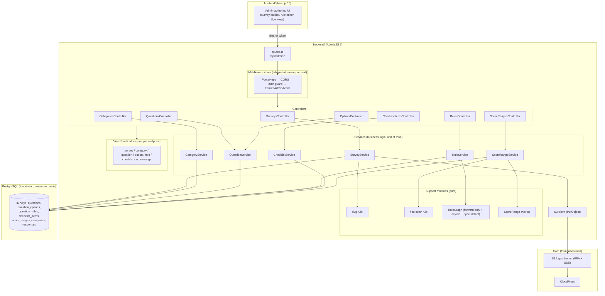
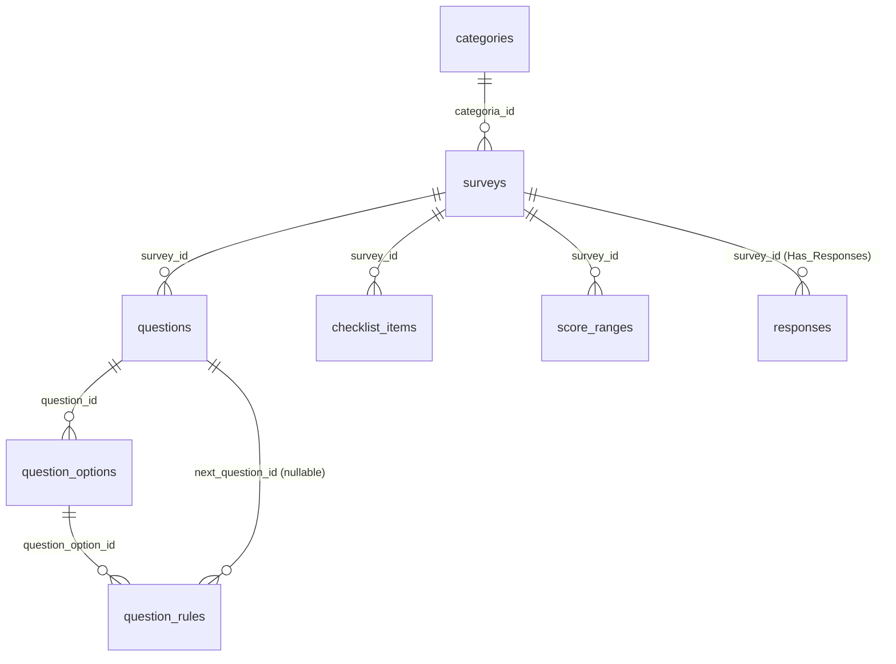

# Design Document

## Overview

This design specifies **survey-authoring** (spec 3 of 7 for BouCheck): the administrative capabilities for authoring surveys and everything that composes their structure — surveys and their visual identity, the category catalog, questions and answer options, the checklist catalog, conditional (cascade) navigation rules with config-time acyclic validation, and maturity score ranges.

It realizes master requirements **REQ-ADM-002** (survey management), **REQ-ADM-003** (manual question authoring), **REQ-ADM-005** (checklist configuration), **REQ-ADM-006** (conditional-logic configuration), plus the two survey-configuration concerns the master document files under reporting — **REQ-REP-001.2** (per-survey maturity score ranges) and **REQ-REP-001.3** (the `dimensao` field on questions) — and the section 9 admin API contracts for `surveys`, `categories`, `questions`, `options`, `rules`, `checklist-items`, `score-ranges`, and logo upload.

### Consumed specs (reused as-is, not redefined here)

- **foundation-data-model** (spec 1 of 7): all tables and Lucid models used here already exist — `surveys`, `questions`, `question_options`, `question_rules`, `checklist_items`, `score_ranges`, `categories`, `responses` — along with their columns, `CHECK`-backed ENUM domains (`surveys.status`, `questions.tipo`, `checklist_items.grupo`), the `surveys.config_visual` JSONB column, the `version`/`survey_version` versioning columns, and the `logos` S3 bucket (Block Public Access + SSE, served via CloudFront). This design **queries only through the ORM_Model_Layer** and adds **no migration and no schema change**.
- **admin-auth-users** (spec 2 of 7): every route in this spec is an authenticated admin route under `/api/admin`. The middleware chain (`ForceHttps → CORS → auth guard → EnsureAdminActive`), the controller→service→validator layering, the VineJS-per-endpoint convention, and the typed-domain-error → HTTP-status exception handler are **reused as-is and not redefined here**. This spec only adds new controllers, services, and validators that plug into that established chain.

### Scope boundaries

In scope: **config-time** authoring and validation. The cascade rule graph is *validated* here to be acyclic and forward-only (REQ-ADM-006); the **runtime navigation engine** that consumes the graph belongs to the public-response-flow spec. Score ranges and `dimensao` are *configured* here but *consumed* by the reporting spec.

Out of scope: AI question generation (REQ-ADM-004), the public respondent flow and runtime navigation (REQ-PUB-*), response management, dashboards, report/score execution (REQ-ADM-007/008, REQ-REP-*), and the authentication mechanism itself (owned by admin-auth-users).

### Key design decisions

| Decision | Choice | Rationale |
|---|---|---|
| Layering | Reuse the admin-auth-users **controller → service → validator** split verbatim | Controllers shape HTTP only; services own all rules and are the unit of property testing; VineJS validators own input shape. Consistency across specs. |
| Rule graph model | Validate **forward-only + acyclic** purely from `questions.ordem` at config time | A rule is legal iff its destination question has strictly greater `ordem`. A forward-only edge set over a total order is *inherently* acyclic, but we still run explicit cycle detection as defense-in-depth and to cover flagged/legacy rows. |
| Cycle detection | Kahn topological sort over the rule-induced DAG | Linear, returns the offending nodes on failure, no recursion depth risk. |
| Structure versioning | Compute `Has_Responses` on the fly; **alert-then-confirm**, then increment `version` and stamp new/edited `questions.survey_version` | Existing `responses.survey_version` rows are never touched, keeping historical responses interpretable (foundation decision). |
| Duplicate | Deep copy in one transaction with an **id-remap table**; rewrite `question_rules.next_question_id` through the map | The only cross-row reference inside a survey's structure is `next_question_id`; remapping it is the crux of copy fidelity. |
| Invalid-destination handling | A rule is **flagged invalid** (computed, not a stored column) when its destination is deleted or reorder breaks forward-only | Foundation `question_rules` has no `invalid` column and is not changed here; invalidity is derived at validation/activation time. |
| Logo storage | Multipart → validate type/size → S3 `PutObject` to the foundation `logos` bucket → store `logo_s3_key` in `config_visual` | Reuses the private-by-default bucket; CloudFront serves it (REQ-NFR-001.5). |
| Validation library | **VineJS**, one validator per endpoint, shared rules for slug/hex/enum | Matches admin-auth-users; 422 with offending fields. |
| Score-range overlap | Half-open interval intersection test against sibling ranges | Deterministic, order-independent, easy to property-test. |

## Architecture



### Layering (reused from admin-auth-users)

- **Controllers** parse/validate input via VineJS, invoke exactly one service method, and shape the HTTP response. No business rules.
- **Services** own all business logic and are the unit of property testing. Their only side-effecting collaborators are the Lucid models (repository) and the S3 client — both injected/mockable.
- **Support modules** (`slug` rule, `hex-color` rule, `RuleGraph`, `ScoreRange overlap`) are pure functions, property-tested in isolation and reused by validators and services.
- **Validators** are VineJS compiled schemas, one per endpoint; failures surface as HTTP 422 with the offending fields.

### Directory additions (within `backend/`)

```
backend/app/
├── controllers/
│   ├── surveys_controller.ts
│   ├── categories_controller.ts
│   ├── questions_controller.ts
│   ├── options_controller.ts
│   ├── rules_controller.ts
│   ├── checklist_items_controller.ts
│   └── score_ranges_controller.ts
├── services/
│   ├── survey_service.ts
│   ├── category_service.ts
│   ├── question_service.ts
│   ├── rule_service.ts
│   ├── checklist_service.ts
│   └── score_range_service.ts
├── support/
│   ├── rule_graph.ts          # forward-only + acyclic validation, cycle detection, flagging
│   ├── score_range_overlap.ts # interval overlap detection
│   └── logo_upload.ts         # S3 PutObject helper for the logos bucket
└── validators/
    ├── survey_validators.ts
    ├── category_validators.ts
    ├── question_validators.ts
    ├── option_validators.ts
    ├── rule_validators.ts
    ├── checklist_validators.ts
    └── score_range_validators.ts
```

## Components and Interfaces

### Shared validation rules (VineJS)

```ts
// validators/shared.ts
import vine from '@vinejs/vine'

// Req 2.1, 2.2 — lowercase letters, digits, hyphens only
export const SLUG_REGEX = /^[a-z0-9-]+$/
export const slugRule = vine.string().trim().regex(SLUG_REGEX)

// Req 7.3, 21.6 — CSS hexadecimal color (#rgb, #rrggbb, #rrggbbaa)
export const HEX_COLOR_REGEX = /^#([0-9a-fA-F]{3}|[0-9a-fA-F]{6}|[0-9a-fA-F]{8})$/
export const hexColorRule = vine.string().trim().regex(HEX_COLOR_REGEX)
```

### Per-resource validators

```ts
// validators/survey_validators.ts
export const createSurveyValidator = vine.compile(vine.object({
  nome: vine.string().trim().minLength(1).maxLength(255),
  slug: slugRule,                                   // Req 2.1
  categoria_id: vine.number().positive(),
  mensagem_objetivo: vine.string().maxLength(1000).optional(), // Req 1.4 (rich text within 1000, Req 1.6)
  tempo_estimado_min: vine.number().positive().optional(),
  link_agendamento: vine.string().url().optional(),
  email_notificacao: vine.string().email().optional(),          // Req 1.5
}))

export const updateSurveyValidator = vine.compile(vine.object({
  nome: vine.string().trim().minLength(1).maxLength(255).optional(),
  slug: slugRule.optional(),
  categoria_id: vine.number().positive().optional(),
  mensagem_objetivo: vine.string().maxLength(1000).optional(),
  tempo_estimado_min: vine.number().positive().optional(),
  link_agendamento: vine.string().url().optional(),
  email_notificacao: vine.string().email().optional(),
}))

export const setStatusValidator = vine.compile(vine.object({
  status: vine.enum(['rascunho', 'ativo', 'inativo', 'arquivado'] as const), // Req 3.1
}))

export const duplicateSurveyValidator = vine.compile(vine.object({
  slug: slugRule,                                   // Req 6.3 — new slug required
}))

export const visualIdentityValidator = vine.compile(vine.object({
  cor_primaria: hexColorRule.optional(),            // Req 7.3
  cor_secundaria: hexColorRule.optional(),
  cor_fundo: hexColorRule.optional(),
}))

// validators/question_validators.ts
export const createQuestionValidator = vine.compile(vine.object({
  texto: vine.string().trim().minLength(1).maxLength(500),   // Req 10.4
  descricao: vine.string().maxLength(300).nullable().optional(), // Req 10.5, 10.6
  tipo: vine.enum(['escolha_unica', 'multipla_escolha', 'aberta'] as const), // Req 10.3
  obrigatoria: vine.boolean().optional(),
  ordem: vine.number(),
  peso: vine.number(),                                        // Req 10.7
  dimensao: vine.string().maxLength(255).nullable().optional(), // Req 10.8
}))

export const reorderQuestionsValidator = vine.compile(vine.object({
  ordem: vine.array(vine.object({ id: vine.number(), ordem: vine.number() })).minLength(1),
}))

// validators/option_validators.ts — Req 11.1, 11.2
export const optionValidator = vine.compile(vine.object({
  texto: vine.string().trim().minLength(1),
  pontuacao: vine.number(),                          // numeric incl. zero (Req 11.2)
  ordem: vine.number(),
}))

// validators/rule_validators.ts — Req 16
export const ruleValidator = vine.compile(vine.object({
  question_option_id: vine.number().positive(),
  next_question_id: vine.number().positive().nullable().optional(),
  finalizar: vine.boolean().optional(),
  priority: vine.number().optional(),                // default = option ordem (Req 20.2)
}))

// validators/checklist_validators.ts — Req 14
export const checklistItemValidator = vine.compile(vine.object({
  nome: vine.string().trim().minLength(1).maxLength(255),
  grupo: vine.enum(['servico_cloud', 'fabricante', 'solucao'] as const), // Req 14.2
}))
export const importChecklistValidator = vine.compile(vine.object({
  source_survey_id: vine.number().positive(),        // Req 15
}))

// validators/score_range_validators.ts — Req 21
export const scoreRangeValidator = vine.compile(vine.object({
  nome: vine.string().trim().minLength(1).maxLength(255),
  min: vine.number(),                                // Req 21.3
  max: vine.number(),
  descricao: vine.string().maxLength(300).nullable().optional(),
  cor: hexColorRule.optional(),                      // Req 21.6
}))
```

> Note: `min ≤ max` (Req 21.4) and overlap (Req 21.5) are cross-field/cross-row invariants enforced in `ScoreRangeService`, not expressible in a single-field VineJS rule. Slug uniqueness (Req 2.3), option-count bounds (Req 11.3/11.4), and rule graph validity (Req 17) are likewise service-layer invariants.

### SurveyService interface

```ts
interface SurveyView { id: number; slug: string; nome: string; categoria_id: number | null
  status: SurveyStatus; version: number; mensagem_objetivo: string | null
  tempo_estimado_min: number | null; link_agendamento: string | null
  email_notificacao: string | null; config_visual: ConfigVisual | null }

interface StructureChangeOptions { confirmed: boolean } // alert-then-confirm (Req 5.1)

class SurveyService {
  create(input: CreateSurveyInput): Promise<SurveyView>          // Req 1.1 (status=rascunho, version=1)
  update(id: number, input: UpdateSurveyInput): Promise<SurveyView> // Req 1.3; slug uniqueness Req 2.3
  setStatus(id: number, status: SurveyStatus): Promise<SurveyView>  // Req 3, 18.3 activation guard
  archive(id: number): Promise<SurveyView>                       // Req 4 (status=arquivado, retains all)
  duplicate(id: number, newSlug: string): Promise<SurveyView>    // Req 6 (deep copy, new draft)
  setVisualIdentity(id: number, colors: Partial<ConfigVisual>): Promise<SurveyView> // Req 7
  uploadLogo(id: number, file: MultipartFile): Promise<SurveyView>  // Req 8

  // Structure-versioning gate used by QuestionService/RuleService/OptionsController mutations (Req 5, 13.2)
  applyStructureChange<T>(surveyId: number, opts: StructureChangeOptions, mutate: () => Promise<T>): Promise<T>
  hasResponses(surveyId: number): Promise<boolean>               // Has_Responses
}
```

#### Activation guard logic (Req 3.2, 3.3, 11.3, 18.3)

`setStatus(id, 'ativo')` runs `assertActivatable(survey)` before persisting:

1. Count questions of the survey (current version). If `0` → 422 "requires at least one question" (Req 3.2).
2. For every `Choice_Question` (`tipo ∈ {escolha_unica, multipla_escolha}`), count options. If any `< 2` → 422 identifying the offending question (Req 11.3).
3. Compute invalid rules via `RuleGraph.flagInvalid(...)` (below). If any rule is flagged invalid → 422 listing them (Req 18.3).
4. Otherwise set `status = 'ativo'` (Req 3.3).

Setting any other status performs no structural precondition (Req 3.1, 4.1).

#### Structure versioning logic (Req 5, 13)

`applyStructureChange(surveyId, { confirmed }, mutate)`:

1. Load the survey. Determine `hasResponses = await hasResponses(surveyId)`.
2. **If not `hasResponses`** → run `mutate()` directly; do **not** touch `version` (Req 5.4). Physical question deletion is allowed here (Req 13.1).
3. **If `hasResponses` and `status = 'ativo'`**:
   - If `confirmed === false` → throw `StructureChangeRequiresConfirmationError` (HTTP 409) carrying the alert that existing responses reference the previous Structure (Req 5.1). No change applied.
   - If `confirmed === true` → in one transaction: run `mutate()`, then `version = version + 1` and stamp the new/edited `questions.survey_version = version` (Req 5.2). Existing `responses` rows and their `survey_version` are left untouched (Req 5.3).
   - A physical question deletion request on a `Has_Responses` survey is rejected as a physical delete and routed through this versioning path instead (Req 13.2).

#### Duplicate logic (Req 6)

`duplicate(sourceId, newSlug)` in one transaction (Req 6.4 copies structure only):

1. Validate `newSlug` present and unique (else 422, Req 6.3).
2. Insert a new `surveys` row: copy descriptive fields + `config_visual`, set `status = 'rascunho'`, `version = 1` (Req 6.1).
3. Copy `questions` → build `questionIdMap: Map<oldQId, newQId>`, stamping `survey_id = new`, `survey_version = 1`.
4. Copy `question_options` → build `optionIdMap: Map<oldOptId, newOptId>`.
5. Copy `question_rules`: for each source rule attached to a copied option, insert a new rule with `question_option_id = optionIdMap.get(old)` and **`next_question_id = old === null ? null : questionIdMap.get(old)`** — the critical remap so branches point at the new survey's questions, never the source's (Req 6.2). `finalizar` and `priority` are copied verbatim.
6. Copy `checklist_items` (`nome`, `grupo`) under the new survey (Req 6.2). No `score_ranges`, `responses`, `response_*` are copied (Req 6.4).

### CategoryService interface

```ts
class CategoryService {
  list(): Promise<CategoryView[]>                    // Req 9.3
  create(nome: string): Promise<CategoryView>        // Req 9.1
  update(id: number, nome: string): Promise<CategoryView> // Req 9.2
  delete(id: number): Promise<void>                  // Req 9.4 — in-use guard
}
```

`delete(id)` counts `surveys WHERE categoria_id = id`; if `> 0` → 422 "category is in use" (Req 9.4).

### QuestionService interface

```ts
class QuestionService {
  create(surveyId: number, input: QuestionInput, o: StructureChangeOptions): Promise<QuestionView> // Req 10
  update(id: number, input: Partial<QuestionInput>, o: StructureChangeOptions): Promise<QuestionView>
  delete(id: number, o: StructureChangeOptions): Promise<void>       // Req 13 (draft delete vs version)
  reorder(surveyId: number, ordem: {id:number;ordem:number}[], o: StructureChangeOptions): Promise<QuestionView[]> // Req 12

  addOption(questionId: number, input: OptionInput, o: StructureChangeOptions): Promise<OptionView>   // Req 11
  updateOption(id: number, input: Partial<OptionInput>, o: StructureChangeOptions): Promise<OptionView>
  deleteOption(id: number, o: StructureChangeOptions): Promise<void>
}
```

- **Option count bounds (Req 11.3, 11.4):** `addOption` rejects with 422 when the target Choice_Question already has 10 options (max 10). Options on an `aberta` question are rejected with 422 (Req 11.5). The lower bound (≥2) is not enforced per-write (a question legitimately passes through 1 option while being built) but is enforced at activation by the activation guard (Req 11.3).
- **Reorder (Req 12):** persists submitted `ordem` per question; the service rejects a reorder that would produce duplicate `ordem` values within the same survey+version (Req 12.2). After any reorder, rules are re-evaluated for forward-only validity and flagged if broken (Req 18.2).
- All mutations funnel through `SurveyService.applyStructureChange` so versioning (Req 5, 13.2) applies uniformly.

### RuleService interface and the RuleGraph module

```ts
// support/rule_graph.ts — pure
interface QuestionNode { id: number; ordem: number }
interface RuleEdge { id: number; ownerQuestionId: number; nextQuestionId: number | null; finalizar: boolean }

interface GraphValidation { ok: boolean; violations: RuleViolation[] } // forward/self/cycle
type RuleViolation =
  | { rule: number; kind: 'self' }        // Req 17.2
  | { rule: number; kind: 'backward' }    // Req 17.1
  | { rule: number; kind: 'cycle'; cycle: number[] } // Req 17.3

class RuleGraph {
  // Single-rule legality against question ordem (Req 16.1, 17.1, 17.2)
  static classifyEdge(owner: QuestionNode, dest: QuestionNode | null): 'forward' | 'self' | 'backward'
  // Whole-survey validation: forward-only + acyclic (Req 17.3)
  static validate(questions: QuestionNode[], rules: RuleEdge[]): GraphValidation
  // Compute which rules are currently invalid: dangling destination or non-forward after edits (Req 18.1, 18.2)
  static flagInvalid(questions: QuestionNode[], rules: RuleEdge[]): number[] // rule ids
}

class RuleService {
  create(input: RuleInput): Promise<RuleView>        // Req 16, 17, 20.2 priority default
  update(id: number, input: Partial<RuleInput>): Promise<RuleView>
  delete(id: number): Promise<void>
  flow(surveyId: number): Promise<FlowNode[]>        // Req 19 visualization
}
```

#### Rule engine config-time validation (Req 16, 17)

A `Cascade_Rule` may only attach to an option of a `Choice_Question` (Req 16.3) — else 422. On `create`/`update`, `RuleService`:

1. If `finalizar === true` → persist with `next_question_id = null` (Req 16.2); no destination checks.
2. Else resolve owner question (via option → question) and destination question (`next_question_id`) within the **same survey**.
   - `classifyEdge`: `dest.ordem === owner.ordem` → `self` → 422 "cannot target its own question" (Req 17.2); `dest.ordem < owner.ordem` → `backward` → 422 "rules must point forward" (Req 17.1); `dest.ordem > owner.ordem` → `forward`, candidate accepted (Req 16.1).
3. Build the prospective rule set (existing + this change) and run `RuleGraph.validate`. Accept **only** if `ok === true` — no cycle (Req 17.3).

**`validate` algorithm** — forward-only + acyclic:
- Each non-`finalizar` rule contributes a directed edge `ownerQuestion → nextQuestion`.
- First pass: classify every edge; any `self`/`backward` → violation.
- Second pass (defense-in-depth): run **Kahn's topological sort** over the edge set. Compute in-degrees, repeatedly remove zero-in-degree nodes; if any node remains, the leftover strongly-connected nodes form a cycle → `cycle` violation listing them. Because forward-only edges over the `ordem` total order can never form a cycle, a cycle detected here signals a stale/flagged edge and blocks activation.

#### Invalid-destination flagging (Req 18)

`flagInvalid(questions, rules)` returns rule ids that are currently invalid:
- **Dangling destination (Req 18.1):** a rule whose `next_question_id` refers to a question no longer present (deleted).
- **Broken forward-only (Req 18.2):** a rule whose destination still exists but whose `dest.ordem ≤ owner.ordem` after a reorder.

Flagging is *computed*, not stored (foundation `question_rules` has no `invalid` column). It is recomputed on question delete/reorder and at activation; `setStatus('ativo')` calls it and refuses activation while any id is returned (Req 18.3).

#### Rule priority (Req 20)

On `create`, if `priority` is omitted, `RuleService` sets `priority = ordem of the owning option` (Req 20.2). Stored as a plain integer where lower = higher precedence for the future runtime engine (Req 20.1, 20.3); this spec only persists it.

#### Flow visualization (Req 19)

`flow(surveyId)` returns an ordered, indentation-ready structure: questions in ascending `ordem`, each with its outgoing branches (or none), so the client can render an indented list.

```ts
interface FlowBranch {
  rule_id: number
  option_id: number
  option_texto: string
  priority: number
  kind: 'goto' | 'finalizar'
  next_question_id: number | null   // null when kind = 'finalizar'
  invalid: boolean                  // true if flagged by flagInvalid (Req 18)
}
interface FlowNode {
  question_id: number
  ordem: number
  texto: string
  tipo: QuestionTipo
  depth: number                     // indentation level for the list view (Req 19.1)
  branches: FlowBranch[]            // empty for questions with no outgoing rule (Req 19.2)
}
// Response shape: { nodes: FlowNode[] }
```

Every question appears exactly once in `ordem` sequence, including those with no outgoing rule (Req 19.2); each `Cascade_Rule` appears as a `goto` branch to its destination or a `finalizar` early-termination (Req 19.1).

### ChecklistService interface

```ts
class ChecklistService {
  create(surveyId: number, nome: string, grupo: ChecklistGrupo): Promise<ChecklistView> // Req 14.1, 14.2
  update(id: number, input: Partial<{nome:string;grupo:ChecklistGrupo}>): Promise<ChecklistView> // Req 14.3
  delete(id: number): Promise<void>                  // Req 14.3
  list(surveyId: number): Promise<ChecklistView[]>   // (zero items is valid, Req 14.4)
  import(targetSurveyId: number, sourceSurveyId: number): Promise<ChecklistView[]> // Req 15
}
```

`import`: if `sourceSurveyId` does not exist → 404 (Req 15.2). Otherwise copy each source `checklist_items` row as a new item of the target preserving `nome`/`grupo` (Req 15.1), leaving the source unchanged (Req 15.3).

### ScoreRangeService interface and overlap module

```ts
// support/score_range_overlap.ts — pure
interface Interval { id?: number; min: number; max: number }
// Two ranges overlap iff a.min <= b.max AND b.min <= a.max (closed intervals)
export function overlaps(a: Interval, b: Interval): boolean
// Returns the first sibling that overlaps `candidate`, else null (excludes candidate.id on edit)
export function firstOverlap(candidate: Interval, siblings: Interval[]): Interval | null

class ScoreRangeService {
  create(surveyId: number, input: ScoreRangeInput): Promise<ScoreRangeView> // Req 21.1
  update(id: number, input: Partial<ScoreRangeInput>): Promise<ScoreRangeView> // Req 21.2
  delete(id: number): Promise<void>                  // Req 21.2
  list(surveyId: number): Promise<ScoreRangeView[]>
}
```

`create`/`update` enforce, in order: `min ≤ max` else 422 (Req 21.4); `firstOverlap` against the survey's other ranges is `null` else 422 identifying the overlap (Req 21.5). `cor`, when supplied, is hex-validated by the validator (Req 21.6).

### Logo upload (Req 8)

`support/logo_upload.ts` + `SurveyService.uploadLogo`:
- Controller receives `multipart/form-data`; the file is read as a `MultipartFile`.
- **Type check (Req 8.2):** allowed MIME/extensions PNG (`image/png`), SVG (`image/svg+xml`), JPG (`image/jpeg`); else 422.
- **Size check (Req 8.3):** `file.size ≤ 2 MB (2 * 1024 * 1024)`; else 422.
- `PutObject` to the foundation `logos` bucket (Block Public Access + SSE) under a deterministic key, e.g. `surveys/{surveyId}/logo-{uuid}.{ext}` (Req 8.4).
- Merge `logo_s3_key` into `surveys.config_visual` JSONB (Req 8.1). Served via CloudFront (REQ-NFR-001.5). VineJS validates the multipart file constraints; the S3 client is injected/mockable for tests.

## Data Models

This spec **adds no tables and no columns**. It consumes the foundation `surveys`, `questions`, `question_options`, `question_rules`, `checklist_items`, `score_ranges`, `categories`, and `responses` tables and their Lucid models as-is. See the foundation-data-model ERD; the relevant slice is reproduced below for reference only.

### Relationship slice used by this spec (reference — defined by foundation)



### Fields this spec reads/writes (all pre-existing)

| Table | Fields written by this spec | Notes |
|---|---|---|
| `surveys` | `slug`, `nome`, `categoria_id`, `status`, `version`, `mensagem_objetivo`, `tempo_estimado_min`, `config_visual` (`cor_primaria`, `cor_secundaria`, `cor_fundo`, `logo_s3_key`), `link_agendamento`, `email_notificacao` | `status` ∈ {rascunho,ativo,inativo,arquivado}; `config_visual` is JSONB (`ConfigVisual` type from foundation) |
| `questions` | `survey_id`, `survey_version`, `texto`, `descricao`, `tipo`, `obrigatoria`, `ordem`, `peso`, `dimensao` | `tipo` ∈ {escolha_unica,multipla_escolha,aberta}; `survey_version` stamped on version bump |
| `question_options` | `question_id`, `texto`, `pontuacao`, `ordem` | 2–10 per Choice_Question (activation/write guards) |
| `question_rules` | `question_option_id`, `next_question_id`, `finalizar`, `priority` | `next_question_id` null ⇔ `finalizar = true`; remapped on duplicate |
| `checklist_items` | `survey_id`, `nome`, `grupo` | `grupo` ∈ {servico_cloud,fabricante,solucao} |
| `score_ranges` | `survey_id`, `nome`, `min`, `max`, `descricao`, `cor` | `min ≤ max`, non-overlapping per survey |
| `categories` | `nome` | delete guarded by in-use check |
| `responses` | (read-only) | `Has_Responses` and untouched `survey_version` on version bump |

### ConfigVisual (foundation type, extended usage)

```ts
interface ConfigVisual {
  cor_primaria?: string   // hex (Req 7)
  cor_secundaria?: string // hex (Req 7)
  cor_fundo?: string      // hex (Req 7)
  logo_s3_key?: string    // set by logo upload (Req 8.1)
}
```

## API Endpoints

All paths are under `/api/admin`, behind the reused middleware chain (`ForceHttps → CORS → auth guard → EnsureAdminActive`); any request without a valid access token is rejected by the auth guard from admin-auth-users (Req 22.7). Validation failures return 422 with offending fields.

| Method | Path | Purpose | Success | Failure |
|---|---|---|---|---|
| POST | `/surveys` | Create survey (draft, v1) | 201 | 422 |
| GET | `/surveys` | List surveys | 200 | — |
| GET | `/surveys/{id}` | Read survey | 200 | 404 |
| PUT | `/surveys/{id}` | Edit descriptive fields | 200 | 404, 409, 422 |
| PUT | `/surveys/{id}/status` | Set lifecycle status (activation guard) | 200 | 404, 422 |
| POST | `/surveys/{id}/archive` | Archive (soft) | 200 | 404 |
| POST | `/surveys/{id}/duplicate` | Deep-copy into new draft | 201 | 404, 422 |
| PUT | `/surveys/{id}/visual` | Set colors | 200 | 404, 422 |
| POST | `/surveys/{id}/logo` | Upload logo (multipart) | 200 | 404, 422 |
| GET/POST | `/categories` `/categories/{id}` (PUT/DELETE) | Category CRUD | 200/201 | 422 (in-use on delete) |
| POST | `/surveys/{id}/questions` | Create question | 201 | 404, 409, 422 |
| PUT/DELETE | `/questions/{id}` | Edit / delete question | 200/204 | 404, 409, 422 |
| PUT | `/surveys/{id}/questions/reorder` | Reorder questions | 200 | 404, 409, 422 |
| POST | `/questions/{id}/options` | Add option | 201 | 404, 409, 422 |
| PUT/DELETE | `/options/{id}` | Edit / delete option | 200/204 | 404, 409, 422 |
| POST | `/options/{id}/rules` | Create cascade rule | 201 | 404, 422 |
| GET | `/rules/{id}` · PUT/DELETE | Read / edit / delete rule | 200/204 | 404, 422 |
| GET | `/surveys/{id}/flow` | Flow visualization | 200 | 404 |
| GET/POST | `/surveys/{id}/checklist-items` | List / create checklist item | 200/201 | 404, 422 |
| PUT/DELETE | `/checklist-items/{id}` | Edit / delete checklist item | 200/204 | 404, 422 |
| POST | `/surveys/{id}/checklist-items/import` | Import from source survey | 201 | 404, 422 |
| GET/POST | `/surveys/{id}/score-ranges` | List / create score range | 200/201 | 404, 422 |
| PUT/DELETE | `/score-ranges/{id}` | Edit / delete score range | 200/204 | 404, 422 |

### Representative request/response shapes

**POST `/surveys`**
```jsonc
// request
{ "nome": "Diagnóstico Cloud", "slug": "diagnostico-cloud", "categoria_id": 3,
  "mensagem_objetivo": "<b>Bem-vindo</b>", "tempo_estimado_min": 15,
  "email_notificacao": "ana@beonup.com.br" }
// 201
{ "id": 12, "slug": "diagnostico-cloud", "nome": "Diagnóstico Cloud", "categoria_id": 3,
  "status": "rascunho", "version": 1, "mensagem_objetivo": "<b>Bem-vindo</b>",
  "config_visual": null }
// 422 { "errors": [{ "field": "slug", "rule": "regex", "message": "invalid slug format" }] }
// 422 { "error": "Slug already in use", "field": "slug" }   (Req 2.3)
```

**PUT `/surveys/{id}/status`** (activation)
```jsonc
// request { "status": "ativo" }
// 200    { "id": 12, "status": "ativo", "version": 1, ... }
// 422    { "error": "Survey requires at least one question to be activated" }  (Req 3.2)
// 422    { "error": "Choice question has fewer than 2 options", "question_id": 45 }  (Req 11.3)
// 422    { "error": "Invalid cascade rules must be corrected", "rule_ids": [88, 91] }  (Req 18.3)
```

**PUT `/surveys/{id}`** (structure/edit on a survey with responses)
```jsonc
// request { "nome": "Novo nome", "confirmed": false }
// 409    { "error": "Existing responses reference the previous structure",
//          "requiresConfirmation": true }   (Req 5.1)
// request { "nome": "Novo nome", "confirmed": true }
// 200    { "id": 12, "version": 2, ... }    (Req 5.2; responses' survey_version untouched, Req 5.3)
```

**POST `/surveys/{id}/duplicate`**
```jsonc
// request { "slug": "diagnostico-cloud-copia" }
// 201    { "id": 30, "slug": "diagnostico-cloud-copia", "status": "rascunho", "version": 1, ... }
// 422    { "error": "Slug already in use" }   (Req 6.3)
```

**POST `/options/{id}/rules`**
```jsonc
// request (forward goto)     { "question_option_id": 501, "next_question_id": 46 }
// request (early terminate)  { "question_option_id": 501, "finalizar": true }
// 201  { "id": 88, "question_option_id": 501, "next_question_id": 46,
//        "finalizar": false, "priority": 2 }   (priority defaulted to option ordem, Req 20.2)
// 422  { "error": "Rules must point forward" }                 (Req 17.1)
// 422  { "error": "A rule cannot target its own question" }    (Req 17.2)
// 422  { "error": "Rule set would form a cycle", "cycle": [46, 47] }  (Req 17.3)
```

**GET `/surveys/{id}/flow`** → `200`
```jsonc
{ "nodes": [
  { "question_id": 45, "ordem": 1, "texto": "...", "tipo": "escolha_unica", "depth": 0,
    "branches": [
      { "rule_id": 88, "option_id": 501, "option_texto": "Sim", "priority": 1,
        "kind": "goto", "next_question_id": 47, "invalid": false },
      { "rule_id": 89, "option_id": 502, "option_texto": "Não", "priority": 2,
        "kind": "finalizar", "next_question_id": null, "invalid": false } ] },
  { "question_id": 46, "ordem": 2, "texto": "...", "tipo": "aberta", "depth": 1, "branches": [] }
] }
```

**POST `/surveys/{id}/score-ranges`**
```jsonc
// request { "nome": "Inicial", "min": 0, "max": 40, "descricao": "...", "cor": "#ff8800" }
// 201     { "id": 7, "survey_id": 12, "nome": "Inicial", "min": 0, "max": 40, "cor": "#ff8800" }
// 422     { "error": "min cannot be greater than max" }                    (Req 21.4)
// 422     { "error": "Range overlaps an existing range", "conflict_id": 5 }  (Req 21.5)
```

## Correctness Properties

*A property is a characteristic or behavior that should hold true across all valid executions of a system — essentially, a formal statement about what the system should do. Properties serve as the bridge between human-readable specifications and machine-verifiable correctness guarantees.*

This spec is a strong fit for property-based testing: its core is input-varying logic — slug/hex validation over arbitrary strings, forward-only/acyclic graph validation over arbitrary question orderings and rule sets, deep-copy fidelity over arbitrary structures, versioning invariants over arbitrary response sets, and interval non-overlap over arbitrary score ranges. Routing/wiring, auth-guard transport, S3 upload plumbing, and enum/length/format field checks that do not vary meaningfully with logic are covered by example, edge-case, and smoke tests in the Testing Strategy. The prework consolidated the testable criteria into the twenty-one non-redundant properties below.

### Property 1: Slug validity

*For any* string `s`, the slug rule accepts `s` if and only if `s` is non-empty and consists solely of lowercase letters `a`–`z`, digits `0`–`9`, and hyphens (matches `/^[a-z0-9-]+$/`); any string containing any other character is rejected with HTTP 422.

**Validates: Requirements 2.1, 2.2**

### Property 2: Slug uniqueness

*For any* set of surveys and *any* create or edit request whose `slug` equals the `slug` of a different existing survey, the request is rejected with HTTP 422 identifying the conflict; a request whose `slug` matches no other survey is accepted.

**Validates: Requirements 2.3**

### Property 3: Hex color validity

*For any* string `s` submitted as a Visual_Identity color (`cor_primaria`/`cor_secundaria`/`cor_fundo`) or as a score-range `cor`, the value is accepted if and only if `s` is a valid CSS hexadecimal color (matches `/^#([0-9a-fA-F]{3}|[0-9a-fA-F]{6}|[0-9a-fA-F]{8})$/`); otherwise the request is rejected with HTTP 422.

**Validates: Requirements 7.3, 21.6**

### Property 4: Visual identity round-trip

*For any* survey and *any* set of valid hex colors, submitting them stores each color under `surveys.config_visual` and reading the survey back yields exactly those color values.

**Validates: Requirements 7.1, 7.2**

### Property 5: Activation guard

*For any* survey, a request to set `status` to `ativo` succeeds if and only if the survey has at least one question, every `Choice_Question` has at least 2 options, and no `Cascade_Rule` is flagged invalid; when any of those conditions fails the activation is rejected with HTTP 422 identifying the failure (empty survey, offending under-optioned question, or the invalid rules), and the status is left unchanged.

**Validates: Requirements 3.2, 3.3, 11.3, 18.3**

### Property 6: Archive preserves all rows

*For any* survey together with its questions, options, rules, checklist items, score ranges, and any `responses`, `response_answers`, `response_checklist`, and `response_events` rows, archiving the survey sets its `status` to `arquivado` and leaves every one of those rows present and unchanged.

**Validates: Requirements 4.1, 4.2, 4.3**

### Property 7: Structure versioning invariant

*For any* survey, applying a confirmed Structure alteration increments `version` by exactly 1 when the survey is `ativo` and Has_Responses and otherwise leaves `version` unchanged; in all cases every existing `responses` row and its persisted `survey_version` value is left unchanged; and a physical question deletion requested on a Has_Responses survey performs no physical removal and is routed through this versioning path instead.

**Validates: Requirements 5.2, 5.3, 5.4, 13.2**

### Property 8: Structure-change alert-then-confirm

*For any* `ativo` survey that Has_Responses, an unconfirmed Structure alteration returns the alert that existing responses reference the previous Structure and applies no change (the survey and its structure are left exactly as before).

**Validates: Requirements 5.1**

### Property 9: Duplicate deep-copy fidelity

*For any* source survey with an arbitrary set of questions, options, cascade rules, and checklist items, duplicating it with a new slug produces a new survey with `status = rascunho` and `version = 1` whose questions, options, rules, and checklist items are structurally isomorphic to the source; every copied rule's `question_option_id` and non-null `next_question_id` reference ids belonging to the new survey (never the source's), preserving each branch's forward relationship and each `finalizar`/`priority`; and the new survey has no `responses`, `response_answers`, `response_checklist`, or `response_events` rows.

**Validates: Requirements 6.1, 6.2, 6.4**

### Property 10: Category in-use delete guard

*For any* set of categories and surveys, a request to delete a category is rejected with HTTP 422 if and only if at least one survey references that category; an unreferenced category is deleted.

**Validates: Requirements 9.4**

### Property 11: Question create round-trip

*For any* valid question input (valid `texto`, `tipo`, and the remaining fields), creating it under a survey associates the question with that survey and persists `texto`, `descricao`, `tipo`, `obrigatoria`, `ordem`, `peso`, and `dimensao` exactly as supplied, with a null `descricao`/`dimensao` when none is supplied.

**Validates: Requirements 10.1, 10.2, 10.6, 10.8**

### Property 12: Question edit round-trip

*For any* existing question and *any* valid partial edit, applying the edit persists exactly the addressed fields and leaves the other fields unchanged.

**Validates: Requirements 1.3, 10.1**

### Property 13: Option count bounds

*For any* `Choice_Question` holding `k` options, submitting an additional option is accepted when `k < 10` and rejected with HTTP 422 when `k = 10`; and *for any* `Open_Question`, submitting an option is rejected with HTTP 422.

**Validates: Requirements 11.4, 11.5**

### Property 14: Reorder persists distinct ordem

*For any* survey and *any* reorder assignment of `ordem` values to its questions, the assignment is persisted per question when all assigned values are distinct, and is rejected when it would introduce duplicate `ordem` values within the same survey and version.

**Validates: Requirements 12.1, 12.2**

### Property 15: Draft question deletion cascades

*For any* survey that is not Has_Responses, deleting a question removes that question together with all of its answer options and all cascade rules attached to those options.

**Validates: Requirements 13.1**

### Property 16: Checklist import fidelity

*For any* source survey checklist and *any* target survey, importing creates in the target one checklist item per source item preserving `nome` and `grupo`, and leaves the source survey's checklist items unchanged.

**Validates: Requirements 15.1, 15.3**

### Property 17: Forward-only acyclic rule validation

*For any* set of questions (each with a distinct `ordem`) and *any* prospective set of cascade rules attached to options of choice questions, a rule configuration is accepted if and only if every non-terminating rule's destination question has strictly greater `ordem` than the question owning the rule's option (forward-only, rejecting both self-references and backward references) and the resulting edge set contains no cycle; otherwise it is rejected with HTTP 422 identifying the violation.

**Validates: Requirements 16.1, 16.3, 17.1, 17.2, 17.3**

### Property 18: Early-termination rule shape

*For any* cascade rule created with `finalizar` set to `true`, the persisted rule has `finalizar = true` and `next_question_id = null`.

**Validates: Requirements 16.2**

### Property 19: Invalid-destination flagging

*For any* rule set, deleting a question flags every cascade rule whose `next_question_id` referenced the deleted question as invalid, and a question reorder flags every cascade rule whose destination `ordem` is no longer strictly greater than its owner's `ordem` as invalid; a rule remains unflagged exactly when its destination still exists and is still a Forward_Reference.

**Validates: Requirements 18.1, 18.2**

### Property 20: Flow visualization completeness

*For any* survey, the flow visualization lists every question exactly once in ascending `ordem` sequence, each carrying a branch entry for each of its outgoing cascade rules (a `goto` to the destination question or an early `finalizar` termination) and an empty branch set when it has no outgoing rule.

**Validates: Requirements 19.1, 19.2**

### Property 21: Rule priority default

*For any* cascade rule created without an explicit `priority`, its persisted `priority` equals the `ordem` of the rule's owning answer option; and *for any* rule created with an explicit `priority`, that value is persisted unchanged.

**Validates: Requirements 20.2**

### Property 22: Score-range validity and non-overlap

*For any* survey with an existing set of score ranges and *any* candidate range, creating or editing the candidate is accepted if and only if its `min ≤ max` and its `[min, max]` interval does not overlap any other range of the same survey; otherwise it is rejected with HTTP 422 identifying the `min`/`max` error or the overlapping range.

**Validates: Requirements 21.4, 21.5**

## Error Handling

### HTTP status mapping

| Condition | Status | Requirements |
|---|---|---|
| Missing / expired / unknown token; inactive admin | 401 | 22.7 (guard from admin-auth-users) |
| Resource id not found (survey, question, option, rule, category, checklist item, score range); import source missing | 404 | 15.2, and read/update of nonexistent ids |
| Unconfirmed structure change on an `ativo` Has_Responses survey | 409 | 5.1 |
| Validation failure: bad slug format, invalid hex, invalid email, enum violation, length overflow (`mensagem_objetivo`>1000, `texto`>500, `descricao`>300), bad logo type/size, duplicate slug, category in-use, empty-survey activation, <2 options, invalid rules on activation, backward/self/cyclic rule, 11th option, option on open question, min>max, overlapping range | 422 | 1.4, 1.5, 2.2, 2.3, 3.2, 6.3, 7.3, 8.2, 8.3, 9.4, 10.3–10.5, 11.3–11.5, 14.2, 17.1–17.3, 18.3, 21.4–21.6 |

A single exception-handling layer (reused from admin-auth-users) maps typed domain errors to these statuses. Services throw typed errors — `SlugConflictError`, `HexColorError`, `EmptySurveyActivationError`, `InsufficientOptionsError`, `InvalidRulesError`, `BackwardRuleError`, `SelfRuleError`, `CyclicRuleError`, `OptionLimitError`, `OptionOnOpenQuestionError`, `DuplicateOrdemError`, `CategoryInUseError`, `ScoreRangeBoundsError`, `ScoreRangeOverlapError`, `StructureChangeRequiresConfirmationError` (409), `NotFoundError` (404) — and the handler translates them. VineJS failures surface as 422 with the offending fields.

### Transactional integrity

- **Duplicate (Property 9):** the entire deep copy — new survey row, questions, options, rules (with `next_question_id` remap), checklist items — runs in one transaction, so a failure mid-copy leaves no partial survey and no cross-survey `next_question_id` reference can ever be committed.
- **Structure versioning (Properties 7, 8):** the mutation and the `version` increment + `questions.survey_version` stamping run in one transaction; existing `responses` rows are never written, guaranteeing their `survey_version` is untouched.
- **Reorder (Property 14):** the distinctness check and the per-question `ordem` writes run in one transaction, and rules are re-flagged in the same unit, so a reorder never commits duplicate `ordem` or leaves stale flags.
- **Activation (Property 5):** the guard checks (question count, per-question option counts, invalid-rule flagging) and the `status` write run in one transaction so a concurrent structural edit cannot slip an invalid survey into `ativo`.
- **Score range (Property 22):** the `min ≤ max` check, the overlap scan against siblings, and the insert/update run in one transaction to prevent a concurrent insert from creating an overlap.

### External failure modes

- **S3 PutObject failure (logo upload):** the upload is rejected with a server error and `config_visual.logo_s3_key` is not written, so a survey never records a key for an object that was not stored. Type/size validation (422) happens before any S3 call, so oversized/invalid files never reach the bucket.
- **Rich text (`mensagem_objetivo`):** stored verbatim within the 1000-character limit; no server-side re-rendering, so formatting round-trips exactly (Req 1.6).

## Testing Strategy

A dual approach: property-based tests for the input-varying logic (Properties 1–22) and example / edge-case / smoke tests for CRUD round-trips, field validation, transport, and configuration.

### Property-based tests

- **Library:** `fast-check` with the backend test runner (Japa), matching the foundation and admin-auth-users specs. Do not hand-roll generators.
- **Iterations:** each property test runs a minimum of 100 iterations (`fc.assert(..., { numRuns: 100 })`).
- **Tagging:** each property test carries a comment referencing its design property:
  `// Feature: survey-authoring, Property {number}: {property_text}`
- **Isolation & backends:** pure-logic properties (1 slug, 3 hex, 17 forward-only/acyclic, 18 finalizar shape, 19 flagging, 20 flow, 22 overlap) run in-memory against the `RuleGraph`, `slug`, `hex`, and `overlap` modules with no database. Persistence properties (2 slug uniqueness, 4 visual round-trip, 5 activation, 6 archive, 7/8 versioning, 9 duplicate, 10 category guard, 11/12 question round-trips, 13 option bounds, 14 reorder, 15 draft delete, 16 checklist import, 21 priority default) run against a real PostgreSQL 16 test database (matching foundation), each iteration in a rolled-back transaction or with truncation between runs. The S3 client is mocked. Each property maps 1:1 to a single property-based test.
- **Generators:** custom `fast-check` arbitraries for a survey structure (questions with distinct `ordem`, choice/open mix, options, forward/backward/self/cyclic rule sets) drive Properties 5, 6, 9, 17, 19, 20; a score-range-set arbitrary drives Property 22; unicode/whitespace/edge strings drive Properties 1 and 3.

### Example and edge-case tests

- Field length boundaries: `mensagem_objetivo` >1000 (Req 1.4), `texto` >500 (Req 10.4), `descricao` >300 (Req 10.5) → 422; at-limit accepted.
- Invalid `email_notificacao` → 422 (Req 1.5); valid email accepted.
- Enum rejections: `status` (Req 3.1), `tipo` (Req 10.3), `grupo` (Req 14.2) invalid values → 422; each valid value accepted.
- `pontuacao = 0`, negative, and decimal accepted (Req 11.2); `peso` decimal accepted (Req 10.7); numeric `min`/`max` accepted (Req 21.3).
- Optional fields: omitted `descricao`/`dimensao` stored null (Req 10.6, 10.8); zero checklist items is a valid survey (Req 14.4).
- Duplicate/missing slug on duplicate → 422 (Req 6.3); import from nonexistent source → 404 (Req 15.2).
- Logo type not PNG/SVG/JPG → 422 (Req 8.2); logo >2 MB → 422 (Req 8.3); at-limit accepted.
- CRUD round-trips for categories (Req 9.1–9.3), checklist items (Req 14.1, 14.3), score ranges (Req 21.1–21.3), and options (Req 11.1).
- `mensagem_objetivo` rich-text markup ≤1000 chars round-trips identically (Req 1.6).

### Integration tests

- Logo upload with a mocked S3 client: a valid file triggers exactly one `PutObject` to the foundation `logos` bucket and persists `config_visual.logo_s3_key` (Req 8.1). 1–2 representative files.

### Smoke tests

- Route table: each resource (`surveys`, `categories`, `questions`, `options`, `rules`, `checklist-items`, `score-ranges`) exposes its required operations under `/api/admin` (Req 22.1–22.6).
- An unauthenticated request to any survey-authoring route is rejected by the reused auth guard with 401 (Req 22.7).
- The logo bucket target is the foundation `logos` bucket configured with Block Public Access, served via CloudFront (Req 8.4).
- Priority ordering semantics (lower = higher precedence) are documented and exercised only through storage assertions (Req 20.1, 20.3).

### Requirements not covered by properties

Requirements 1.4, 1.5, 1.6, 3.1, 6.3, 8.1, 8.2, 8.3, 8.4, 9.1, 9.2, 9.3, 10.3, 10.5, 10.6, 10.7, 11.1, 11.2, 14.1, 14.2, 14.3, 14.4, 15.2, 20.1, 20.3, 21.1, 21.2, 21.3, 22.1–22.7 are field-format/enum/length validation, CRUD round-trips, one-time configuration, transport, or external-service plumbing whose outcome does not vary meaningfully with logic; they are verified by the example, edge-case, integration, and smoke tests above, per the classification in the prework.
