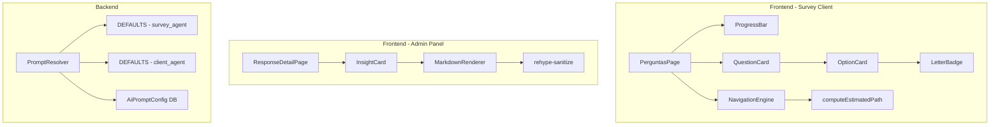
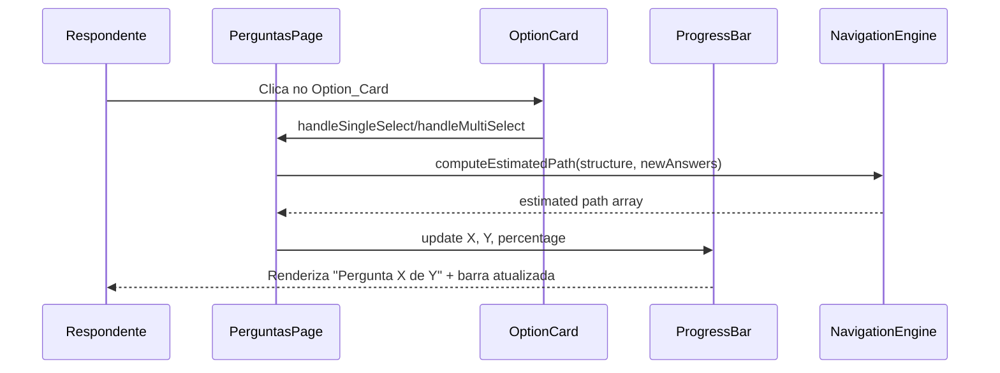

# Design Document: Survey Client UX Redesign

## Overview

Este design detalha a reestruturação visual da interface de perguntas do survey respondida pelo cliente (`/{slug}/perguntas`), incluindo:

- **Option_Card com Letter_Badge**: Alternativas apresentadas como cards com indicador de letra (A, B, C...) ao invés de inputs nativos de radio/checkbox.
- **Destaque visual de seleção**: Feedback claro com cores do design system ao selecionar uma alternativa.
- **Progress_Bar redesenhada**: Barra de progresso centralizada com texto "Pergunta X de Y" dinâmico baseado no `computeEstimatedPath`.
- **Insight_Card com Markdown**: Renderização estruturada de conteúdo Markdown nos insights gerados pela IA no painel admin.
- **Prompt padrão melhorado**: Instruções explícitas de formatação Markdown nos prompts dos agentes de IA.
- **Acessibilidade**: Conformidade com WCAG 2.1 AA para todos os novos componentes.

### Decisões de Design

| Decisão | Escolha | Justificativa |
|---------|---------|---------------|
| Markdown rendering | `react-markdown` + `rehype-sanitize` | Biblioteca leve, segura e compatível com React Server Components; sanitização built-in remove XSS |
| Letter sequence >26 | AA, AB, AC... | Extensão natural do alfabeto, raramente necessária na prática |
| Progress display | Texto + barra horizontal | Mais informativo que apenas barra; "Pergunta X de Y" dá contexto numérico ao respondente |
| Keyboard navigation | roving tabindex pattern | Padrão WAI-ARIA para radio groups; garante navegação com Arrow keys |
| Transição de seleção | 300ms ease-in-out | Balanceia fluidez visual com responsividade percebida |

## Architecture



### Fluxo de Dados - Survey Client



## Components and Interfaces

### 1. LetterBadge

**Localização:** `frontend/components/survey/letter-badge.tsx`

```typescript
interface LetterBadgeProps {
  index: number          // posição 0-indexed da opção (após sort por ordem)
  selected: boolean      // se a opção está selecionada
  darkMode?: boolean     // se o tema escuro está ativo
}
```

**Responsabilidades:**
- Converte índice numérico para letra(s): 0→A, 1→B, ..., 25→Z, 26→AA, 27→AB
- Renderiza badge circular de 32×32px
- Altera estilos conforme estado `selected` e `darkMode`

**Função de conversão:**
```typescript
export function indexToLetter(index: number): string {
  let result = ''
  let n = index
  do {
    result = String.fromCharCode(65 + (n % 26)) + result
    n = Math.floor(n / 26) - 1
  } while (n >= 0)
  return result
}
```

### 2. OptionCard

**Localização:** `frontend/components/survey/option-card.tsx`

```typescript
interface OptionCardProps {
  option: Option
  index: number                    // posição 0-indexed para letter badge
  selected: boolean
  questionType: 'escolha_unica' | 'multipla_escolha'
  onSelect: (optionId: number) => void
  darkMode?: boolean
}
```

**Responsabilidades:**
- Renderiza card com LetterBadge + texto da opção
- Oculta visualmente input nativo (radio/checkbox) mantendo no DOM
- Aplica estilos de seleção usando design tokens (`primary-light`, `brand-blue`)
- Implementa `role="radio"` ou `role="checkbox"` conforme `questionType`
- Gerencia `aria-checked`, ativação via Enter/Space
- Suporta navegação via Arrow keys (delegada pelo container)

### 3. ProgressBar (redesenhada)

**Localização:** `frontend/components/survey/progress-bar.tsx`

```typescript
interface ProgressBarProps {
  currentIndex: number     // posição 1-indexed da questão atual no estimated path
  totalEstimated: number   // Y = comprimento do array de computeEstimatedPath
  darkMode?: boolean
}
```

**Responsabilidades:**
- Exibe texto "Pergunta X de Y" centralizado acima da barra
- Calcula percentual: `Math.round((currentIndex / totalEstimated) * 100)`  (clamped 0-100)
- Renderiza barra horizontal de 8px com cor `brand-orange`
- CSS transition de 300ms ease-in-out para mudanças de largura
- Atributos ARIA: `role="progressbar"`, `aria-valuenow`, `aria-valuemin`, `aria-valuemax`, `aria-label`
- Caso Y=0: exibe "Pergunta 0 de 0" com progresso 0%

### 4. InsightCard (reestruturado)

**Localização:** `frontend/components/admin/insight-card.tsx` (refatoração)

```typescript
interface InsightCardProps {
  conteudo: string         // Markdown raw da análise
  createdAt: string        // ISO date string
}
```

**Responsabilidades:**
- Renderiza Markdown usando `react-markdown` com plugins `remark-gfm` e `rehype-sanitize`
- Sanitiza HTML: remove `<script>`, `<iframe>`, `<object>`, `<embed>`
- Aplica tipografia hierárquica (headings ##/### com tamanhos proporcionais)
- Espaçamento de 16px entre seções com divisor visual
- Não renderiza quando `conteudo` está vazio ou só whitespace

### 5. MarkdownRenderer (utilitário)

**Localização:** `frontend/components/admin/markdown-renderer.tsx`

```typescript
interface MarkdownRendererProps {
  content: string
  className?: string
}
```

**Responsabilidades:**
- Wrapper reutilizável sobre `react-markdown`
- Configuração centralizada de sanitização e plugins
- Estilização via classes Tailwind para cada elemento Markdown

### 6. PromptResolver (backend - modificação)

**Localização:** `backend/app/services/prompt_resolver.ts`

**Modificação:** Atualizar `DEFAULTS` para incluir instruções de formatação Markdown:
- Instruir uso de `##` para seções
- Instruir `**bold**` para termos-chave
- Instruir listas `-` para 3+ itens
- Limitar parágrafos a 4 frases
- Linguagem direcionada a gestores (sem siglas não explicadas)

## Data Models

### Componentes de Estado (Frontend)

Não há novos modelos de dados persistidos. As alterações são puramente visuais e de UX. Os modelos existentes são reutilizados:

```typescript
// Já existente em frontend/lib/navigation/types.ts
interface Option {
  id: number
  texto: string
  ordem: number      // usado para ordenar e determinar a letra do badge
  rules: Rule[]
}

// Novo estado derivado no PerguntasPage
interface ProgressState {
  currentIndex: number      // posição 1-indexed no estimated path
  totalEstimated: number    // length do computeEstimatedPath result
  percentage: number        // Math.round(currentIndex/totalEstimated * 100), clamped [0,100]
}
```

### Schema de Sanitização (InsightCard)

```typescript
// Configuração do rehype-sanitize
const sanitizeSchema = {
  ...defaultSchema,
  tagNames: defaultSchema.tagNames?.filter(
    (tag) => !['script', 'iframe', 'object', 'embed'].includes(tag)
  ),
}
```

### AiPromptConfig (Backend - sem alteração de schema)

O modelo `AiPromptConfig` existente permanece inalterado. Apenas o conteúdo dos prompts `DEFAULTS` no `PromptResolver` é atualizado.

```typescript
// Existente em backend/app/models/ai_prompt_config.ts
interface AiPromptConfig {
  id: number
  tipo: 'survey_agent' | 'client_agent'
  conteudo: string
  created_at: DateTime
  updated_at: DateTime
}
```

## Correctness Properties

*A property is a characteristic or behavior that should hold true across all valid executions of a system—essentially, a formal statement about what the system should do. Properties serve as the bridge between human-readable specifications and machine-verifiable correctness guarantees.*

### Property 1: Index-to-letter mapping correctness

*For any* non-negative integer index, `indexToLetter(index)` SHALL produce a unique uppercase alphabetical string that is monotonically increasing in lexicographic order relative to index order (0→A, 1→B, ..., 25→Z, 26→AA, 27→AB...), and for any two distinct indices i < j, `indexToLetter(i)` SHALL differ from `indexToLetter(j)`.

**Validates: Requirements 1.1, 1.2, 1.6**

### Property 2: Progress percentage computation

*For any* currentIndex (≥ 0) and totalEstimated (≥ 0), the computed percentage SHALL equal `Math.round((currentIndex / totalEstimated) * 100)` clamped to the interval [0, 100]; and when totalEstimated is 0, the percentage SHALL be 0.

**Validates: Requirements 3.1, 3.3, 3.6**

### Property 3: Markdown sanitization removes dangerous tags

*For any* string containing HTML tags `<script>`, `<iframe>`, `<object>`, or `<embed>` (with any attributes or content), the sanitized output from the MarkdownRenderer SHALL NOT contain any of those tags in the rendered HTML.

**Validates: Requirements 6.5**

### Property 4: Empty/whitespace content produces no render

*For any* string composed entirely of whitespace characters (including empty string, spaces, tabs, newlines), the InsightCard SHALL return null (not render) rather than displaying empty content.

**Validates: Requirements 6.4**

### Property 5: Prompt resolution prioritizes custom over default

*For any* agent type (`survey_agent` or `client_agent`) and any non-empty custom prompt string stored in the database, `PromptResolver.resolve(tipo)` SHALL return the custom prompt and SHALL NOT return the hardcoded default.

**Validates: Requirements 7.4**

### Property 6: aria-checked reflects selection state

*For any* sequence of select/deselect actions on an OptionCard, the `aria-checked` attribute SHALL always equal `"true"` when the option is in the selected set, and `"false"` when it is not in the selected set, regardless of the order or number of interactions.

**Validates: Requirements 8.3**

## Error Handling

### Survey Client (Frontend)

| Cenário | Tratamento |
|---------|-----------|
| `computeEstimatedPath` retorna array vazio | ProgressBar exibe "Pergunta 0 de 0" com 0% |
| Índice de opção fora do range alfabético (>675) | `indexToLetter` continua com letras triplas (AAA...) — sem limite artificial |
| Falha no `fetchSurveyStructure` | Mensagem de erro genérica (comportamento existente mantido) |
| Token ausente | Redirect para página de identificação (comportamento existente mantido) |
| Markdown malformado no InsightCard | `react-markdown` degrada gracefully, renderizando como texto |
| Conteúdo de insight vazio/whitespace | InsightCard não é renderizado (retorna null) |
| Tags HTML perigosas no insight | Removidas pela sanitização antes da renderização |

### Backend (PromptResolver)

| Cenário | Tratamento |
|---------|-----------|
| Tabela `ai_prompt_configs` vazia para o tipo | Retorna prompt padrão hardcoded (comportamento existente mantido) |
| Erro de conexão ao banco | Exceção propagada para o caller (comportamento existente mantido) |

## Testing Strategy

### Abordagem Dual

A estratégia combina testes unitários de exemplo com testes baseados em propriedades (property-based testing) para cobertura abrangente.

### Property-Based Tests (fast-check)

**Biblioteca:** `fast-check` (já usada no projeto conforme `property_progress.spec.ts` existente)

**Configuração:** Mínimo 100 iterações por propriedade.

**Tag format:** `Feature: survey-client-ux-redesign, Property {N}: {text}`

| Propriedade | Arquivo de teste | O que gera |
|---|---|---|
| Property 1: indexToLetter | `frontend/__tests__/property_letter_badge.spec.ts` | Inteiros 0..1000 |
| Property 2: Progress percentage | `frontend/__tests__/property_progress_bar.spec.ts` | Pares (currentIndex, total) com total 0..200 |
| Property 3: Markdown sanitization | `frontend/__tests__/property_insight_sanitize.spec.ts` | Strings com tags perigosas injetadas em posições aleatórias |
| Property 4: Empty content no-render | `frontend/__tests__/property_insight_empty.spec.ts` | Strings de whitespace (espaços, tabs, newlines) |
| Property 5: Prompt resolution | `backend/tests/functional/property_prompt_resolver.spec.ts` | Combinações de AgentType + strings de prompt customizado |
| Property 6: aria-checked sync | `frontend/__tests__/property_option_aria.spec.ts` | Sequências aleatórias de select/deselect em listas de opções |

### Unit Tests (Vitest)

| Componente | Cenários |
|---|---|
| LetterBadge | Renderiza corretamente com index=0 (A), index=25 (Z), index=26 (AA); aplica estilos selected/default |
| OptionCard | Estilo selecionado/não-selecionado; tema claro/escuro; clique alterna seleção; role correto por tipo |
| ProgressBar | Renderiza "Pergunta 3 de 10"; ARIA attributes presentes; transition CSS aplicada |
| InsightCard | Renderiza headings, bold, listas; não renderiza quando vazio; sanitiza script tags |
| PromptResolver | Retorna default quando DB vazio; retorna customizado quando existe; prompts contêm instruções de Markdown |

### Integration Tests

| Fluxo | Validação |
|---|---|
| PerguntasPage completa | OptionCards renderizados com badges; seleção atualiza ProgressBar; navegação por teclado funcional |
| Insight flow (admin) | Insight gerado com Markdown; InsightCard renderiza formatado |

### Acessibilidade

- Testes automatizados com `@testing-library/jest-dom` para verificar roles, aria-attributes
- Verificação manual recomendada com NVDA/VoiceOver para fluxo completo de resposta via teclado

