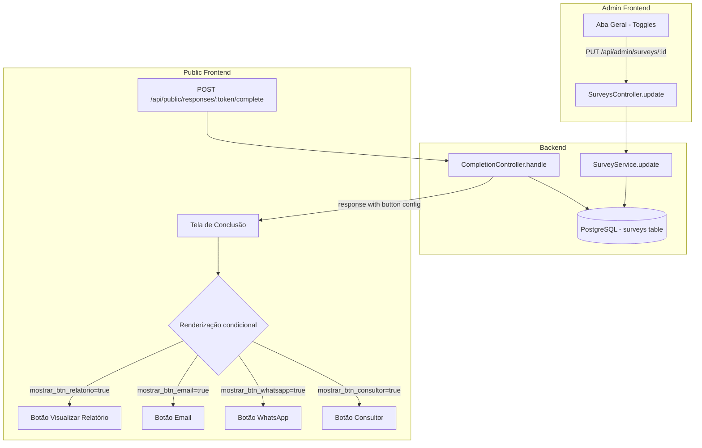

# Design Document: survey-completion-buttons-config

## Overview

Esta funcionalidade adiciona quatro campos booleanos ao modelo `Survey` para controlar a visibilidade dos botões de ação na tela de conclusão de pesquisa. O administrador configura os toggles na aba "Geral" do painel admin, e o sistema público renderiza condicionalmente cada botão com base nos valores persistidos.

A abordagem é simples e direta: quatro colunas `boolean NOT NULL DEFAULT true` na tabela `surveys`, expostas pelo endpoint de atualização existente (PUT /api/admin/surveys/:id) e retornadas na resposta de conclusão pública (POST /api/public/responses/:token/complete).

### Decisões de Design

| Decisão | Escolha | Justificativa |
|---------|---------|---------------|
| Armazenamento | 4 colunas boolean na tabela `surveys` | Simples, tipado, sem parsing JSON; permite queries diretas |
| Valor padrão | `true` em todos | Manter comportamento retrocompatível — todos os botões visíveis antes da feature |
| API admin | Reutilizar PUT /api/admin/surveys/:id existente | Evita endpoint novo; atualização parcial já suportada pelo padrão do service |
| API pública | Incluir no response de /complete | Frontend já consome essa resposta para montar a tela de conclusão |
| Migração | `ALTER TABLE ADD COLUMN ... DEFAULT true` | PostgreSQL aplica default em leitura para rows existentes sem rewrite |

## Architecture



O fluxo é unidirecional: admin configura → backend persiste → público lê e renderiza.

## Components and Interfaces

### 1. Database Migration

Nova migração adicionando 4 colunas booleanas à tabela `surveys`:

```typescript
// database/migrations/XXXXXX_add_completion_buttons_to_surveys.ts
import { BaseSchema } from '@adonisjs/lucid/schema'

export default class extends BaseSchema {
  protected tableName = 'surveys'

  async up() {
    this.schema.alterTable(this.tableName, (table) => {
      table.boolean('mostrar_btn_relatorio').notNullable().defaultTo(true)
      table.boolean('mostrar_btn_email').notNullable().defaultTo(true)
      table.boolean('mostrar_btn_whatsapp').notNullable().defaultTo(true)
      table.boolean('mostrar_btn_consultor').notNullable().defaultTo(true)
    })
  }

  async down() {
    this.schema.alterTable(this.tableName, (table) => {
      table.dropColumn('mostrar_btn_relatorio')
      table.dropColumn('mostrar_btn_email')
      table.dropColumn('mostrar_btn_whatsapp')
      table.dropColumn('mostrar_btn_consultor')
    })
  }
}
```

### 2. Survey Model (atualização)

Adicionar 4 propriedades `@column()` ao modelo `Survey`:

```typescript
// Adições em app/models/survey.ts
@column({ columnName: 'mostrar_btn_relatorio' })
declare mostrarBtnRelatorio: boolean

@column({ columnName: 'mostrar_btn_email' })
declare mostrarBtnEmail: boolean

@column({ columnName: 'mostrar_btn_whatsapp' })
declare mostrarBtnWhatsapp: boolean

@column({ columnName: 'mostrar_btn_consultor' })
declare mostrarBtnConsultor: boolean
```

### 3. Validator (atualização)

Adicionar campos opcionais ao `updateSurveyValidator`:

```typescript
// Adições em app/validators/survey_validators.ts (updateSurveyValidator)
mostrar_btn_relatorio: vine.boolean().optional(),
mostrar_btn_email: vine.boolean().optional(),
mostrar_btn_whatsapp: vine.boolean().optional(),
mostrar_btn_consultor: vine.boolean().optional(),
```

### 4. Survey Service (atualização)

**`UpdateSurveyInput` interface** — adicionar os 4 campos opcionais:

```typescript
export interface UpdateSurveyInput {
  // ... campos existentes ...
  mostrar_btn_relatorio?: boolean
  mostrar_btn_email?: boolean
  mostrar_btn_whatsapp?: boolean
  mostrar_btn_consultor?: boolean
}
```

**`SurveyView` interface** — adicionar os 4 campos:

```typescript
export interface SurveyView {
  // ... campos existentes ...
  mostrar_btn_relatorio: boolean
  mostrar_btn_email: boolean
  mostrar_btn_whatsapp: boolean
  mostrar_btn_consultor: boolean
}
```

**`toView` function** — mapear os novos campos:

```typescript
function toView(survey: Survey): SurveyView {
  return {
    // ... campos existentes ...
    mostrar_btn_relatorio: survey.mostrarBtnRelatorio,
    mostrar_btn_email: survey.mostrarBtnEmail,
    mostrar_btn_whatsapp: survey.mostrarBtnWhatsapp,
    mostrar_btn_consultor: survey.mostrarBtnConsultor,
  }
}
```

**`update` method** — atribuir se presente:

```typescript
if (input.mostrar_btn_relatorio !== undefined)
  survey.mostrarBtnRelatorio = input.mostrar_btn_relatorio
if (input.mostrar_btn_email !== undefined)
  survey.mostrarBtnEmail = input.mostrar_btn_email
if (input.mostrar_btn_whatsapp !== undefined)
  survey.mostrarBtnWhatsapp = input.mostrar_btn_whatsapp
if (input.mostrar_btn_consultor !== undefined)
  survey.mostrarBtnConsultor = input.mostrar_btn_consultor
```

**`duplicate` method** — copiar valores no INSERT:

```typescript
// Na seção de insert do duplicate, adicionar:
mostrar_btn_relatorio: source.mostrarBtnRelatorio,
mostrar_btn_email: source.mostrarBtnEmail,
mostrar_btn_whatsapp: source.mostrarBtnWhatsapp,
mostrar_btn_consultor: source.mostrarBtnConsultor,
```

### 5. Completion Controller (atualização)

Modificar o response do `POST /api/public/responses/:token/complete` para incluir os campos de config de botões:

```typescript
// Em CompletionController.handle, após marcar completo:
const survey = await Survey.findOrFail(session.surveyId)

return response.ok({
  completed: true,
  completed_at: now.toISO(),
  mostrar_btn_relatorio: survey.mostrarBtnRelatorio,
  mostrar_btn_email: survey.mostrarBtnEmail,
  mostrar_btn_whatsapp: survey.mostrarBtnWhatsapp,
  mostrar_btn_consultor: survey.mostrarBtnConsultor,
})
```

### 6. Frontend Admin — Componente de Toggles

Componente React na aba "Geral" da pesquisa com 4 toggles individuais:

```typescript
interface CompletionButtonsConfig {
  mostrar_btn_relatorio: boolean
  mostrar_btn_email: boolean
  mostrar_btn_whatsapp: boolean
  mostrar_btn_consultor: boolean
}

// Labels para cada toggle
const BUTTON_LABELS: Record<keyof CompletionButtonsConfig, string> = {
  mostrar_btn_relatorio: 'Visualizar relatório',
  mostrar_btn_email: 'Receber relatório por e-mail',
  mostrar_btn_whatsapp: 'Receber relatório por WhatsApp',
  mostrar_btn_consultor: 'Falar com um consultor',
}
```

Comportamento:
- Ao alterar toggle → PUT /api/admin/surveys/:id com o campo alterado
- Sucesso → feedback visual (toast/check)
- Falha → revert do toggle + mensagem de erro

### 7. Frontend Público — Renderização Condicional

Na tela de conclusão (`/{slug}/concluido`), usar os campos retornados pela API:

```typescript
interface CompletionResponse {
  completed: boolean
  completed_at: string
  mostrar_btn_relatorio: boolean
  mostrar_btn_email: boolean
  mostrar_btn_whatsapp: boolean
  mostrar_btn_consultor: boolean
}

// Lógica de renderização
const hasAnyButton = config.mostrar_btn_relatorio
  || config.mostrar_btn_email
  || config.mostrar_btn_whatsapp
  || config.mostrar_btn_consultor

// Se nenhum botão ativo, não renderizar seção de ações
```

## Data Models

### Tabela `surveys` — Colunas Adicionais

| Coluna | Tipo | Nullable | Default | Descrição |
|--------|------|----------|---------|-----------|
| `mostrar_btn_relatorio` | `boolean` | NOT NULL | `true` | Visibilidade do botão "Visualizar relatório" |
| `mostrar_btn_email` | `boolean` | NOT NULL | `true` | Visibilidade do botão "Receber relatório por e-mail" |
| `mostrar_btn_whatsapp` | `boolean` | NOT NULL | `true` | Visibilidade do botão "Receber relatório por WhatsApp" |
| `mostrar_btn_consultor` | `boolean` | NOT NULL | `true` | Visibilidade do botão "Falar com um consultor" |

### Impacto em Operações Existentes

| Operação | Comportamento |
|----------|---------------|
| `create` | Campos recebem default `true` do banco (não precisa setar explicitamente) |
| `update` | Atualiza apenas campos fornecidos (partial update) |
| `duplicate` | Copia valores exatos da survey original |
| `archive` | Nenhuma alteração nos campos (apenas status muda) |
| `setStatus` | Nenhuma alteração nos campos |

## Correctness Properties

*A property is a characteristic or behavior that should hold true across all valid executions of a system — essentially, a formal statement about what the system should do. Properties serve as the bridge between human-readable specifications and machine-verifiable correctness guarantees.*

### Property 1: Default values on creation

*For any* valid survey creation input that does not explicitly set button config fields, the resulting survey SHALL have `mostrar_btn_relatorio`, `mostrar_btn_email`, `mostrar_btn_whatsapp`, and `mostrar_btn_consultor` all equal to `true`.

**Validates: Requirements 1.2**

### Property 2: Persistence round-trip

*For any* combination of 4 boolean values (representing the 16 possible states), updating a survey with those values and then reading it back SHALL return the exact same combination of values.

**Validates: Requirements 1.3**

### Property 3: Validation rejects non-boolean values

*For any* non-boolean value (string, number, object, array) submitted as a button config field in the update endpoint, the API SHALL return HTTP 422 with a response body containing the invalid field name.

**Validates: Requirements 3.1, 3.2**

### Property 4: Partial update independence

*For any* initial state of the 4 boolean fields and any non-empty proper subset of fields included in an update request, after the update, the provided fields SHALL have their new values and the omitted fields SHALL retain their previous values.

**Validates: Requirements 3.3**

### Property 5: Public API faithful exposure

*For any* survey with any combination of button config values, when the associated response session is completed, the completion response SHALL include all four boolean fields with values identical to those stored in the survey.

**Validates: Requirements 4.1, 4.2**

### Property 6: Conditional button rendering

*For any* button field and its boolean value, the corresponding button element SHALL be present in the DOM if and only if the value is `true`.

**Validates: Requirements 5.1, 5.2, 5.3, 5.4**

### Property 7: Actions section visibility

*For any* combination of the 4 boolean fields, the actions section (header + button area) SHALL be rendered in the DOM if and only if at least one of the four fields is `true`.

**Validates: Requirements 5.5, 5.6**

### Property 8: Duplication preserves button config

*For any* survey with any combination of button config values, duplicating the survey SHALL produce a new survey with the exact same 4 boolean values as the original.

**Validates: Requirements 6.1, 6.3**

### Property 9: Archiving preserves button config

*For any* survey with any combination of button config values, archiving the survey SHALL not change any of the 4 boolean field values.

**Validates: Requirements 6.2**

## Error Handling

| Cenário | HTTP Status | Resposta | Ação do Frontend |
|---------|-------------|----------|------------------|
| Campo de botão com valor não-booleano | 422 | `{ errors: [{ field: "mostrar_btn_X", message: "O campo mostrar_btn_X deve ser verdadeiro ou falso" }] }` | Exibir mensagem de erro, manter toggle no estado anterior |
| Falha na persistência (timeout/DB error) | 500 | `{ error: "Internal server error" }` | Exibir toast de erro, reverter toggle ao estado anterior |
| Falha no carregamento da aba Geral | 500 | — | Exibir mensagem "Falha ao carregar configurações de botões" na área dos toggles |
| Survey não encontrada na atualização | 404 | `{ error: "Survey not found" }` | Redirecionar para lista de surveys |

### Estratégia de Rollback no Frontend Admin

1. Ao clicar no toggle, armazena estado anterior localmente
2. Otimisticamente atualiza o toggle visualmente
3. Dispara PUT para o backend
4. Se falhar: reverte ao estado anterior + mostra toast de erro
5. Se sucesso: mostra feedback de confirmação (check icon ou toast)

## Testing Strategy

### Unit Tests (Backend)

- **Validator**: Rejeita valores não-booleanos para cada campo
- **Service.create**: Verifica defaults (todos true quando não fornecidos)
- **Service.update**: Atualização parcial preserva campos não fornecidos
- **Service.duplicate**: Copia valores exatos dos campos de botão
- **Service.archive**: Não altera campos de botão
- **toView**: Inclui os 4 campos no output

### Property-Based Tests (Backend)

Biblioteca: **fast-check** (já utilizada em testes existentes do projeto)

Configuração: mínimo 100 iterações por propriedade.

Propriedades a implementar:
1. **Persistence round-trip** (Property 2): Gerar combinações aleatórias de 4 booleans, persistir via service.update, ler via service.read, verificar igualdade.
2. **Partial update independence** (Property 4): Gerar estado inicial aleatório + subconjunto aleatório de campos a atualizar, verificar campos omitidos inalterados.
3. **Duplication preservation** (Property 8): Gerar combinações aleatórias, duplicar, verificar igualdade.

Tag format: `Feature: survey-completion-buttons-config, Property {N}: {text}`

### Unit Tests (Frontend)

- **Admin toggles**: Renderiza 4 toggles com estados corretos, labels corretos
- **Admin toggle error**: Reverte toggle em caso de falha na API
- **Completion screen**: Renderiza botões condicionalmente baseado nos campos
- **Completion screen (all false)**: Não renderiza seção de ações

### Integration Tests

- **Migration**: Executar em DB com surveys existentes, verificar defaults
- **API E2E**: PUT com campos de botão → GET retorna valores atualizados
- **Complete flow**: Criar survey → configurar botões → completar resposta → verificar response
